# Daikin – 970×250 interaktif masthead serisi

[daikin.com.tr](https://www.daikin.com.tr/) için hazırlanmış, **gerçek marka varlıklarıyla** (sitedeki logo ve ürün fotoğrafları) derlenmiş, imleci izleyen animasyonlu tek dosyalık mastheadler:

| Dönem | Ürün | Dosya |
|---|---|---|
| Yaz – "Serinliği yüzünde hisset" | Emura III klima | **`index.html`** (≈63 KB) |
| Kış – "Sıcaklığı evinde hisset" | NDJ Premix tam yoğuşmalı kombi | **`kombi/index.html`** (≈62 KB) |
| Rich media – Yaz + Kış, detay katmanlı | Emura III + NDJ Premix | **`rich/index.html`** (≈250 KB) |

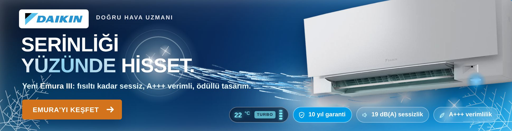
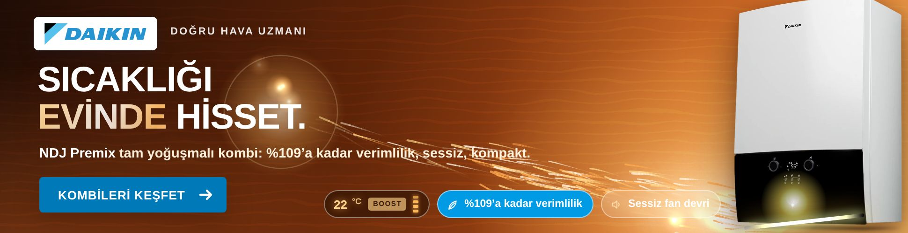

## Rich media sürümü (`rich/index.html`) – 970×250 içinde, Yaz + Kış tek dosyada

Sinematik, sade bir görsel dil: koyu lacivert/bakır zemin, ürünün arkasında yumuşak spot ışığı, süzülen ışık tozu, üründen imlece doğru akan geniş ve yumuşak **hava/ısı şeritleri** (çizgi yerine bezier şeritler), ters (beyaz) Daikin logosu, ince tipografi (Open Sans 300 + 800). Tüm etkileşim **970×250 alanının içinde** kalır; genişleme yoktur.

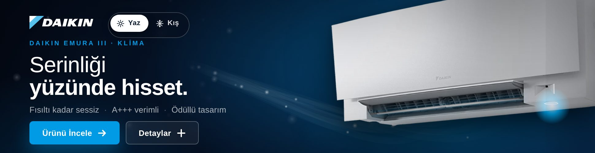
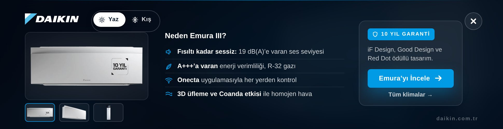
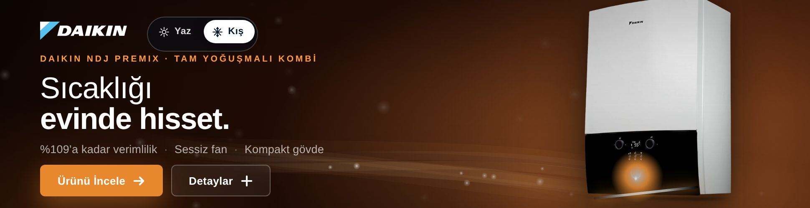

- **Yaz / Kış anahtarı** (logonun yanında): sahne, ürün (Emura III ↔ NDJ Premix), metinler, renkler ve şeritler birbirine akarak değişir; CTA adresi de mevsime göre değişir.
- **Detaylar**: aynı alanın içinde, sahnenin üzerine cam bir katman açılır: 3 görsellik ürün galerisi (ürün sayfasındaki gerçek fotoğraflar: ön, yan, kumanda / kesit), "Neden Emura III? / Neden NDJ Premix?" özellik listesi (ürün sayfasındaki ifadeler), rozet (10 yıl garanti / KIWA onaylı kalite) ve CTA. × ya da Esc ile kapanır.
- **İmleç**: şeritler imlece doğru bükülür, imlecin etrafında yumuşak bir serinlik/sıcaklık halesi oluşur.
- Klavye: Enter = çıkış, Boşluk = detaylar, ← → = mevsim. `clickTag` (yaz) ve `clickTagKis` (kış) reklam ağı değişkenleri desteklenir; `Enabler` varsa `Enabler.exit('Klima'|'Kombi')`.
- Dosya ≈ 250 KB (8 gerçek ürün fotoğrafı WebP olarak gömülü; küçük resimler ana görsellerden üretilir). Derleme: `node tools/build-rich.js` (şablon `src/daikin/rich-media.html`, görseller `assets/daikin/rich/`).

## Alternatif mekanikler (`alt/`)

Aynı gerçek varlıklarla iki farklı etkileşim; her biri yaz (klima) ve kış (kombi) sürümüyle. Karşılaştırma sayfası: **`alt/index.html`** (altı bannerı bir arada gösterir); kontak şit: `alt/onizleme.jpg`.

| Mekanik | Yaz | Kış | Ne yapar |
|---|---|---|---|
| **1 · Kaydır ve Hisset** | `alt/kaydir/klima/index.html` | `alt/kaydir/kombi/index.html` | Sürüklenebilir dikey çizgi "önce/sonra"yı ayırır: solda bunaltıcı sıcak (ya da kar/buz), sağda Daikin konforu. Çizgi imleci izler; ürünün ürettiği hava çizgiye çarparak halka ve kıvılcımlar üretir; çizgi boyunca soğuk/sıcak sınır ışığı. Giriş kurgusunda çizgi sağdan kayarak Daikin tarafını açar. Klavye ← → ile de kayar. |
| **2 · Termostat** | `alt/termostat/klima/index.html` | `alt/termostat/kombi/index.html` | Ortada döndürülebilir termostat kadranı (270° yay, çentikler, mavi→turuncu skala). Ayar (büyük sayı) ile oda sıcaklığı (küçük "oda 28°") ayrıdır: oda, ayara gecikmeyle yaklaşır; fark büyüdükçe cihazın hava akımı güçlenir, zemin sıcak/soğuk arasında karışır, kışta kar ayar yükseldikçe diner. Kadran sürüklenerek, dokunarak ya da ← → ile çevrilir; giriş kurgusunda kadran kendiliğinden 34°→22° (kışta 5°→22°) döner. |

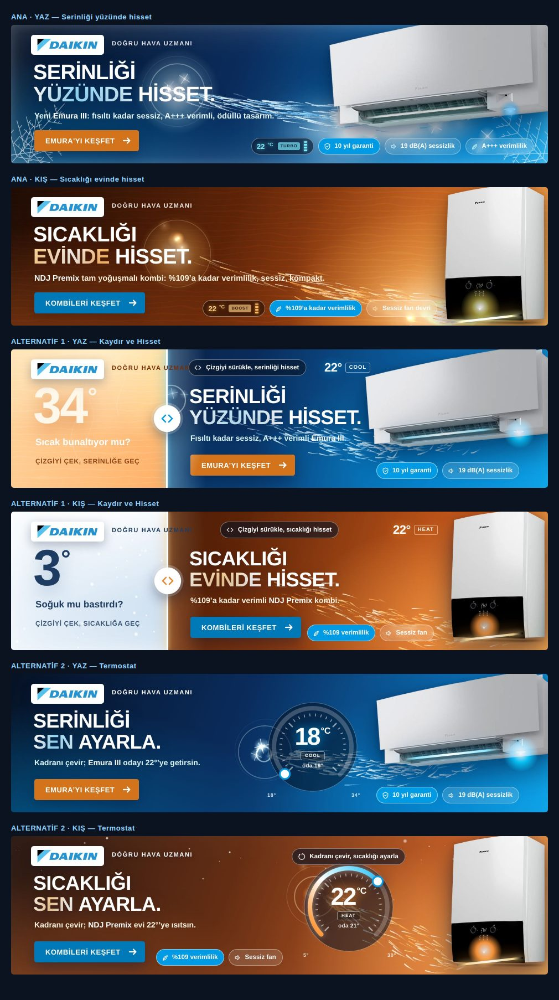

Derleme: `node tools/build-daikin.js --variant=kaydir-klima,kaydir-kombi,termostat-klima,termostat-kombi` (ya da `--variant=all`). Metinler ve ürün ayarları `tools/build-daikin.js` → `PRODUCTS`, yerleşimler → `LAYOUTS`; şablonlar `src/daikin/alt-kaydir.html` ve `src/daikin/alt-termostat.html`.

## Kış sürümü – kombi (`kombi/index.html`)

Yaz kurgusunun tersi: **karlı, buzlu soğuk sahne** (kar taneleri, köşelerde buz kristalleri, cam buğusu, büyük **3°** ve "Soğuk mu bastırdı?") → 1,3 sn'de NDJ Premix kombi devreye girer: paneldeki halka ışığı alev gibi yanar, kombiden sıcak ışık yayılır, zemin bakır–amber tonlarına ısınır, buz kristalleri erir, kar taneleri seyrekleşip erir, sayı **3 → 22**'ye yükselir → "SICAKLIĞI / EVİNDE HİSSET." başlığı, ürün sayfasındaki gerçek bilgilerle alt metin (%109'a kadar verimlilik, sessiz fan, kompakt) ve Daikin mavisi **"KOMBİLERİ KEŞFET"** CTA'sı → termostat çipi (22 °C · HEAT/BOOST) ve özellik çipleri. Her 7 sn'de kombiden bir sıcak hava dalgası yayılır.

**Etkileşim:** Fare bannerın üzerindeyken kombiden çıkan sıcak hava (altın/turuncu çizgiler, yükselen korlar) imlece yönelir ve imlece ulaşınca sıcak halkalar, kor kıvılcımları ve buğuyla "dokunur"; **imlecin yakınındaki kar taneleri erir**; kombi BOOST moda geçer (alev hızlanır, ışık şeridi parlar). Dokunmatik, klavye, `clickTag` / `Enabler` ve azaltılmış hareket desteği yaz sürümüyle aynıdır.

**Gerçek varlıklar:** `assets/daikin-kombi/` – NDJ Premix 24 kW (D2CND024) ürün sayfasındaki 3/4 fotoğraf (kırpılmış, `unit-kombi.webp`, 21 KB), diğer 6 kombi sayfasının görselleri, ekran görüntüleri ve `report.md`. Derleme: `node tools/build-daikin.js --variant=kombi` (yerleşim ve metinler `tools/build-daikin.js` → `VARIANTS.kombi`; isteğe bağlı `src/daikin/kombi.config.json` ile üzerine yazılabilir). Varlıkları yeniden çekmek için workflow'u `keywords=kombi,yogusmal,d2cnd`, `models=d2cnd,d2tnd`, `out=assets/daikin-kombi` girdileriyle çalıştırın.

---

## Yaz sürümü – klima (`index.html`)

## Kurgu (≈6 sn giriş, sonra sürekli)

1. **Sıcak faz (0–1,3 sn)** – Turuncu, güneş parlamalı, ısı titremeli zemin; solda büyük **34°** ve "Sıcak bunaltıyor mu?".
2. **Daikin devrede (1,3 sn)** – Emura III sağdan süzülür, LED yanar, kanat altındaki mavi ışık şeridi belirir (sitedeki ana görseldeki gibi) ve kanattan hava akımı çıkmaya başlar; zemin lacivert–Daikin mavisine soğur, sayı **34 → 22**'ye düşer, metin "Daikin devrede." olur.
3. **Başlık (3,9 sn)** – "SERİNLİĞİ / YÜZÜNDE HİSSET." kelime kelime, buzlu parıltıyla esintiyle gelir; ardından alt metin ve sitenin turuncu düğme stilinde **"EMURA'YI KEŞFET"** CTA'sı.
4. **Detaylar (5,3 sn)** – Köşelerde buz kristalleri büyür, cam buğusu oluşur; sağ altta ürün sayfasından alınan gerçek özellik çipleri (10 yıl garanti · 19 dB(A) sessizlik · A+++) ve canlı termostat çipi (22 °C · COOL/TURBO).
5. **Esinti dalgaları** – Her 7 sn'de bir kanattan tüm bannerı süpüren soğuk hava dalgası; başlık hafifçe ürperir.

## Etkileşim – "serinliği yüzünde hisset"

- **İmleç = yüz:** Fare bannerın üzerindeyken hava akımı imlece yönelir; hava çizgileri imlece ulaşınca **halka dalgaları, buz kıvılcımları ve soğuk buğu** ile "yüze çarpar", imleç etrafında serin bir hale belirir.
- **TURBO:** Üzerine gelince ünite turbo moda geçer: akım hızlanır ve yoğunlaşır, ışık şeridi parlar, termostat çipi "TURBO" yazar, fan çubukları dolar.
- **Otomatik salınım:** İmleç yokken akım sol taraftaki başlık bölgesinde yavaşça gezer (görünmez bir yüze çarpıyormuş gibi halkalar oluşur).
- **Dokunmatik:** Dokunulan noktaya 2,6 sn boyunca hava akımı yönelir.
- **Tıklama / klavye:** Bannerın tamamı tıklanabilir (Enter/Boşluk dâhil). `clickTag` tanımlıysa o, `Enabler` varsa `Enabler.exit`, yoksa daikin.com.tr Emura III kategori sayfası (UTM'li) açılır.
- `prefers-reduced-motion` açıksa parçacık döngüsü çalışmaz, son kare doğrudan gösterilir.

## Gerçek varlıklar (siteden otomatik)

Bulut oturumunun ağ politikası daikin.com.tr'ye erişemediği için varlıklar **GitHub Actions** üzerinde indirildi (`.github/workflows/fetch-assets.yml` → `tools/fetch-daikin.js`) ve `assets/daikin/` altına push'landı:

| Varlık | Kaynak |
|---|---|
| Logo (SVG, orijinal renkler) | daikin.com.tr üst bilgi logosu → `assets/daikin/logo/logo-1.svg` |
| Ürün fotoğrafı | Emura III 9000 BTU/h FTXJ25AW9 ürün sayfası, kanadı açık 3/4 görünüm (şeffaf PNG) → kırpılıp `assets/daikin/unit-emura.webp` (2x, 23 KB) |
| Renkler | Site CSS'i: Daikin mavisi `#009ae5`; CTA turuncusu `#e7882e` (ana sayfadaki "HEMEN İNCELEYİN" düğmesi) |
| Tipografi | Sitede kullanılan **Open Sans** (Google Fonts) |
| Metin/özellikler | Sitenin başlık sloganı "Doğru Hava Uzmanı"; Emura III sayfasındaki 10 yıl garanti, 19 dB(A), A+++ bilgileri |
| Referans | `assets/daikin/shots/` – ana sayfa ve ürün sayfalarının ekran görüntüleri; `assets/daikin/report.md` – bulunan her şeyin dökümü |

Yeniden çekmek için: *Actions* → "Daikin – siteden logo ve ürün görsellerini çek" → *Run workflow* (`keywords`, `models`, `out` ve isteğe bağlı `urls` girdileriyle). Farklı bir ürün fotoğrafı kullanmak için `tools/optimize-daikin.js --src=<png>` ile kırpıp `tools/build-daikin.js` içindeki `LAYOUT.vent / led` oranlarını fotoğrafa göre güncelleyin.

## Derleme ve özelleştirme

```bash
node tools/build-daikin.js                 # klima: src/daikin/masthead.html + assets/daikin → index.html
node tools/build-daikin.js --variant=kombi # kombi: src/daikin/masthead-kombi.html + assets/daikin-kombi → kombi/index.html
node tools/build-daikin.js --variant=all   # ana + alternatif sürümlerin tamamı (6 dosya)
NODE_PATH=$(npm root -g) node tools/optimize-daikin.js   # ürün fotoğrafını yeniden kırp/optimize et (Playwright)
node tools/build-daikin.js --png           # WebP yerine PNG göm (eski tarayıcılar; dosya ~350 KB)
```

- Metinler, çipler ve CTA `src/daikin/masthead.html` içinde; ürün konumu, kanat/LED oranları ve tıklama adresi `tools/build-daikin.js` → `LAYOUT` altında.
- Zamanlama `at(ms, …)` satırlarında; parçacık yoğunluğu `MAX_STREAK / MAX_MIST`, esinti aralığı `setInterval(gust, 7000)`.
- `<meta name="ad.size">`, `role="link"`, klavye odağı ve `aria-label` mevcuttur; Google Ads/DV360 için `clickTag` ve `Enabler` desteği hazırdır.

---

# İlaçsız Yaşam – Gıda Takviyesi Banner Serisi

[ilacsizyasam.com](https://ilacsizyasam.com/) için hazırlanmış, gıda takviyeleri özelinde **animasyonlu, ürün slider'lı ve tıklanabilir HTML5 display reklam seti**.

| Boyut | IAB adı | Dosya | Paket |
|---|---|---|---|
| 300 × 250 | Medium Rectangle | `dist/300x250/index.html` | `dist/zip/ilacsizyasam-300x250.zip` |
| 300 × 600 | Half Page | `dist/300x600/index.html` | `dist/zip/ilacsizyasam-300x600.zip` |
| 970 × 250 | Billboard | `dist/970x250/index.html` | `dist/zip/ilacsizyasam-970x250.zip` |

Tek dosyalık teslim: `release/index.html` (üç banner içine gömülü; açınca doğrudan animasyonlu çalışır, her bannerın kendi index.html'i sayfadan indirilir). Sunum sayfası: `preview/index.html` (üç boyutu bir arada gösterir; "Yayın simülasyonu" görünümü bannerları örnek bir haber sayfası içinde konumlandırır).

## Ekran görüntüleri

| 970 × 250 – ürün kartı | 970 × 250 – kapanış |
|---|---|
|  | 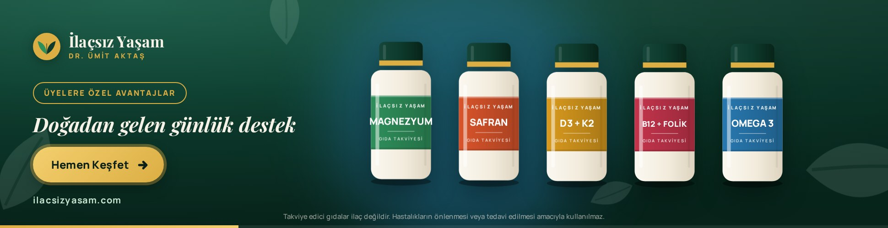 |

| 300 × 250 – açılış | 300 × 250 – ürün kartı | 300 × 250 – kapanış |
|---|---|---|
| 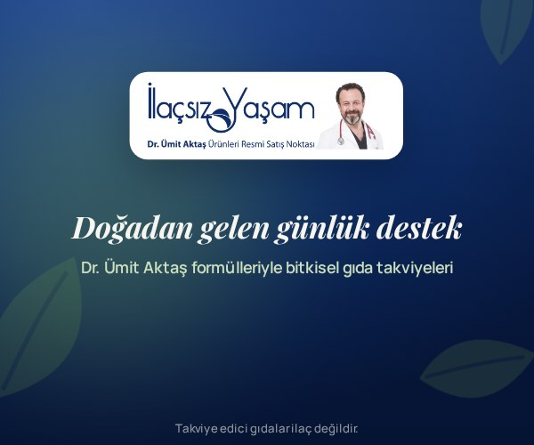 | 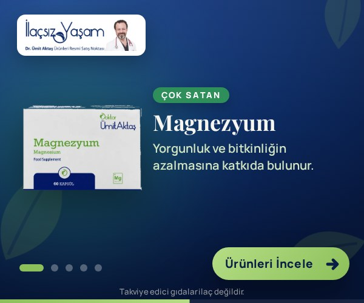 | 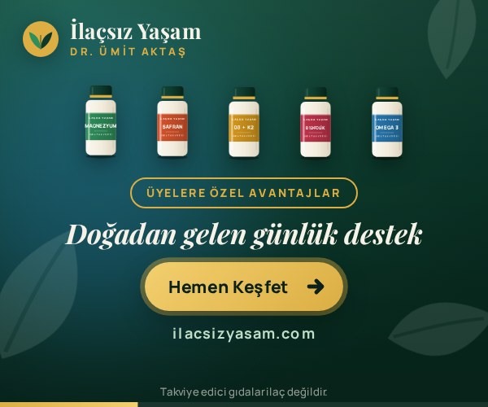 |

| 300 × 600 – ürün kartı | 300 × 600 – üzerine gelme | 300 × 600 – kapanış |
|---|---|---|
| 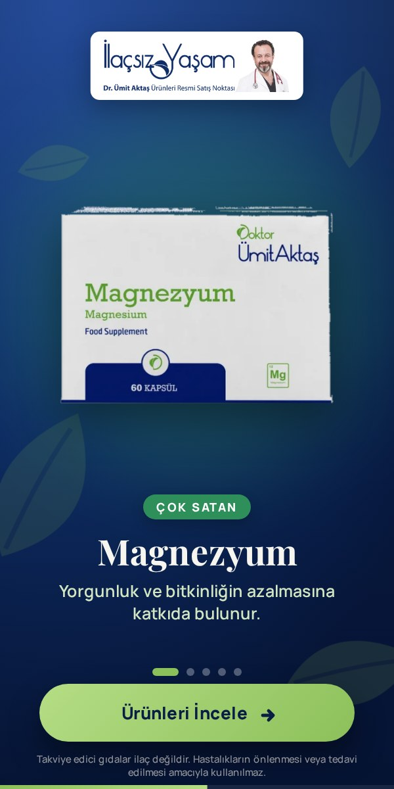 | 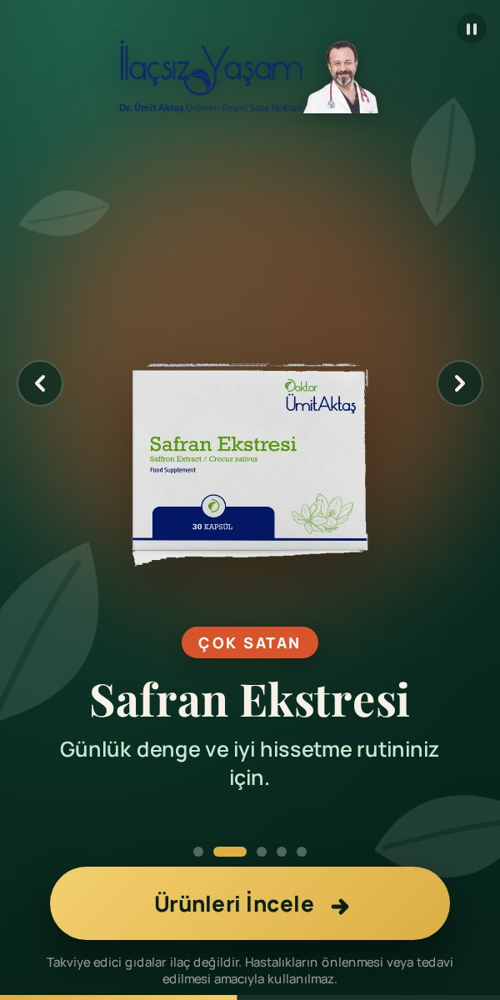 | 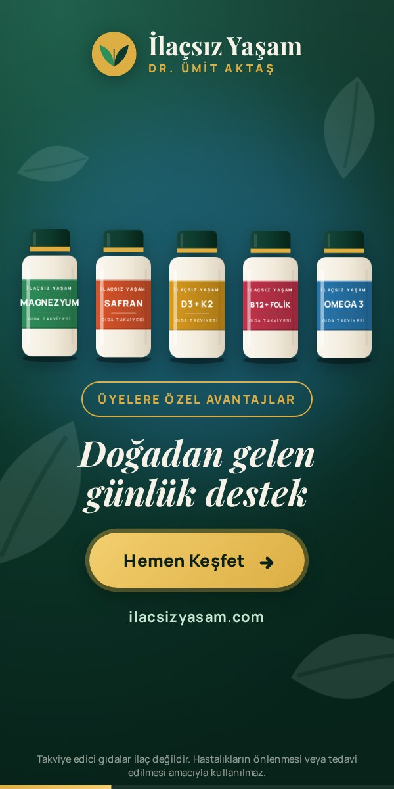 |

## Kurgu

1. **Açılış (2,6 sn)** – Logo ortada büyür, slogan ("GDO'SUZ · GLUTENSİZ / Vitrini keşfet, favorini seç! / Dr. Ümit Aktaş imzalı takviyeler") kelime kelime belirir, ardından logo köşeye küçülür.
2. **Ürün slider'ı (5 × 3,2 sn)** – Her ürünün orijinal ambalaj fotoğrafı yükselerek girer, rozet / ürün adı / fayda cümlesi sırayla gelir, arka plan ışığı ürün rengine döner. 970×250'de komşu ürünler kenarlarda gölge olarak görünür (coverflow).
3. **Kapanış (3,6 sn)** – Ürün ailesi tek karede sıralanır, slogan ve nabız efektli CTA gösterilir; kupon görünür kalır.
4. Döngü 30 saniyeye kadar sürer; sonra son karede (CTA) durur. Google Ads'in 30 sn animasyon kuralına uygundur.

### Yeni üye kuponu (%10)

Referans çalışmadaki indirim bölümü üç boyuta uyarlandı: 970×250'de sağda kırmızı kupon paneli, 300×600'de yatay kupon bileti, 300×250'de sağ üstte kompakt kupon çipi. Kod (`YENİUYE10`) tıklanınca panoya kopyalanır ve "Kopyalandı!" geri bildirimi verilir. Metinler, kod ve renkler `src/data.js` → `coupon` altında; `enabled: false` ile bölüm tamamen kaldırılır.

## Etkileşim

- **Üzerine gelme:** Slider duraklar, ileri/geri okları belirir, sağ üstte duraklatma göstergesi çıkar.
- **Noktalar ve oklar:** Ürünler arasında serbest gezinme.
- **Klavye:** Odaktayken ← → ile ürün değiştirme, Enter ile tıklama.
- **Mobil:** Sağa/sola kaydırma ile ürün değiştirme.
- **Kupon:** İndirim kodu tıklanınca panoya kopyalanır (Clipboard API, yoksa execCommand yedeği); kontrol tıklaması reklam çıkışını tetiklemez.
- **Tıklama:** Bannerın tamamı tıklanabilir. `window.clickTag` tanımlıysa o kullanılır (Google Ads / DCM), `Enabler` varsa `Enabler.exit` çağrılır (Studio / DV360); ikisi de yoksa `src/data.js` içindeki UTM'li ürün sayfası açılır. Kontroller (nokta, ok) tıklamayı yutar.
- `prefers-reduced-motion` açıksa animasyonlar kısaltılır.

## Teknik özellikler

- Tek dosya, satır içi CSS + JS; ürün fotoğrafları ve logo base64 olarak gömülü. Her boyut ~140 KB (Google Ads sınırı 150 KB); vektör modda ~30 KB.
- Tipografi: Google Fonts üzerinden *Playfair Display* (başlık) ve *Manrope* (metin). Google Fonts, Google Ads ve DV360'ta izinli kaynaktır. Harici font kabul etmeyen ağlar için `@font-face` ile gömülebilir (bkz. aşağıda).
- `<meta name="ad.size">` etiketi, `role="link"`, aria etiketleri ve klavye odağı mevcuttur.
- Yasal ibare ("Takviye edici gıdalar ilaç değildir…") üç boyutta da yer alır.
- Görseller: 5 ürünün sitedeki orijinal ambalaj fotoğrafları (şeffaflaştırılmış WebP) ve sitenin logosu.
- Ürün fayda cümleleri EFSA onaylı sağlık beyanlarına yaslanacak şekilde yumuşatılmıştır (magnezyum–yorgunluk, D vitamini–kemik/bağışıklık, B12–enerji metabolizması, EPA/DHA–kalp). Yayın öncesi markanın regülasyon onayı önerilir.

## Gerçek ürün görselleri ve logo (siteden otomatik)

Bannerlar iki modda derlenir:

- **Fotoğraf modu** – `assets/manifest.json` varsa sitedeki gerçek ürün fotoğrafları, logo ve ürün sayfası bağlantıları kullanılır (varsayılan).
- **Vektör modu** – `assets/` yoksa veya `node build.js --vector` denirse şablondaki çizim şişeler kullanılır.

Depodaki `assets/` klasörü ve `dist/` bannerları **sitedeki gerçek ürün fotoğrafları, logo ve fiyatlarla** derlenmiştir (kaynak: ilacsizyasam.com, Shopify). Görselleri güncellemenin iki yolu var:

**1. GitHub Actions (önerilen, kurulum gerektirmez):** Depoda *Actions* sekmesi → "Siteden görselleri çek ve derle" → *Run workflow*. İş akışı siteden güncel görselleri indirir, optimize eder, bannerları derler, ekran görüntülerini ve teslim zip'ini üretir ve sonucu dala push'lar (`.github/workflows/fetch-assets.yml`).

**2. Yerel bilgisayarda** (normal internet erişimi, Node 18+):

```bash
node tools/fetch-assets.js       # ilacsizyasam.com → assets/ (ürün fotoğrafları, logo, fiyatlar, ürün adresleri, tema renk adayları)
npm run optimize-assets          # (önerilir) beyaz fonu şeffaflaştırır, kırpar, küçültür, WebP'ye çevirir; koyu logoyu beyaza çevirmek üzere işaretler
node build.js                    # gerçek görsellerle derler; boyut 150 KB'ı aşarsa uyarır
```

- Ürün eşleştirmesi `src/data.js` içindeki `handle` alanıyla yapılır (`ilacsizyasam.com/products/<handle>`); handle bulunamazsa ürün adındaki kelimelerle başlık araması yapılır.
- `optimize-assets` adımı Playwright + Chromium ister (`npm i -D playwright && npx playwright install chromium`). Atlanırsa fotoğraflar indirildiği gibi (640 px JPEG) gömülür; sunum için yeterlidir, Google Ads için boyut sınırı aşılabilir.
- Arka planı düz beyaz olmayan fotoğraflar otomatik olarak krem renkli "kart" içinde gösterilir.
- Logo koyu renkliyse (İlaçsız Yaşam logosu lacivert) beyaz bir plaka üzerine alınır; tek renkli koyu logolar için `manifest.json` → `logo.invert: true` ile beyaza çevirme de mümkündür (`logo.plate: false` plakayı kapatır).
- Banner paleti sitenin kimliğine göre lacivert (#0e2e68) zemin + yeşil (#79a64e) vurgu olarak ayarlanmıştır; `src/template.js` içindeki `:root` değişkenleriyle değiştirilir.
- `brand.showPrice: true` yapılırsa ürün kartında güncel fiyat, `brand.deepLink: true` ise ürün kartındayken tıklama ilgili ürün sayfasına gider (clickTag tanımlıysa yine clickTag kullanılır).
- Görselleri elle eklemek isterseniz: `assets/products/<key>.png` ve `assets/logo.png` dosyalarını koyup `assets/manifest.json` içinde ilgili `file` alanlarını göstermeniz yeterlidir (örnek yapı için betiğin ürettiği manifest'e bakın).

> Not: Bu depo Claude Code'un yalıtılmış ortamında hazırlandı; o ortamın ağ politikası ilacsizyasam.com ve Shopify CDN'e erişime izin vermediği için görseller GitHub Actions üzerinden indirildi.

## Özelleştirme

Tüm metinler (slogan dahil), kupon, ürünler, renkler ve süreler tek dosyadadır: **`src/data.js`**.

```js
products: [
  { name: 'Magnezyum', short: 'MAGNEZYUM', claim: '…', badge: 'Çok Satan', color: '#2f8f5b', accent: '#bfe3cc' },
  // ürün ekleyin / sırasını değiştirin
]
```

Düzenledikten sonra:

```bash
node build.js          # dist/ altındaki 3 HTML + zip paketlerini yeniden üretir
node tools/package.js  # release/index.html (tek dosya) ve release/ilacsizyasam-banner-seti.zip üretir
npm run capture        # (isteğe bağlı) preview/screens/ altına ekran görüntüleri alır
npm run capture:video  # (isteğe bağlı) preview/video/ altına kısa kayıt alır
npm test               # (isteğe bağlı) etkileşim duman testi (Playwright)
```

`build.js` yalnızca Node.js ister; ek paket kurulumu gerekmez. `capture` komutları için Playwright + Chromium gerekir.

### Marka varlıklarını yerleştirme

- **Logo:** `src/template.js` içindeki `MARK` sabiti (yaprak işareti) resmi logonun SVG'siyle değiştirilebilir.
- **Ürün fotoğrafları:** `bottle()` fonksiyonu vektör şişe üretir. Gerçek ürün görselleri için bu fonksiyonun döndürdüğü SVG yerine `` verilebilir; ölçüler `--bw` değişkeniyle yönetilir.
- **Renkler:** `:root` altındaki `--forest`, `--gold`, `--mint`, `--cream` değişkenleri marka paletine göre ayarlanır.
- **Fontları gömme:** Ağ harici font kabul etmiyorsa Google Fonts `<link>` satırını kaldırıp `.woff2` dosyalarını base64 `@font-face` olarak `<style>` içine ekleyin (dosya boyutu ~120 KB'a çıkar, hâlâ sınır altındadır).

## Yükleme notları

- **Google Ads (HTML5):** `dist/zip/*.zip` dosyalarını doğrudan yükleyin. `ad.size` meta etiketi ve `clickTag` desteği hazırdır.
- **Campaign Manager 360 / DV360:** Aynı zipler kullanılabilir; `Enabler` algılanırsa çıkış `Enabler.exit('CTA')` üzerinden yapılır. Studio'ya yüklenecekse `<script src="https://s0.2mdn.net/ads/studio/Enabler.js"></script>` satırını `<head>` içine ekleyin.
- **Diğer ağlar (Adform, Xandr vb.):** Genellikle `clickTag` yeterlidir; ağın kendi makrosu farklıysa `openLink()` fonksiyonundaki `window.clickTag` satırı ilgili makroya çevrilir.

## Klasör yapısı

```
src/data.js              Marka metinleri, ürünler (handle), süreler
src/template.js          Ortak motor + 3 yerleşim (rect / tall / wide)
build.js                 dist/ üretici (fotoğraf / vektör modu)
assets/                  Siteden çekilen gerçek görseller + manifest.json
dist/<boyut>/            Yüklemeye hazır bannerlar
dist/zip/                Zip paketleri
release/                 Teslim: index.html (tek dosya) + zip
preview/index.html       Sunum sayfası
preview/screens/         Ekran görüntüleri
tools/fetch-assets.js    Siteden görsel/logo/fiyat çekme
tools/optimize-assets.js Görsel optimizasyonu (şeffaflaştırma, WebP)
tools/package.js         Teslim zip'i
tools/capture.js         Playwright ile görüntü/video alma
tools/smoke.js           Etkileşim duman testi
```
