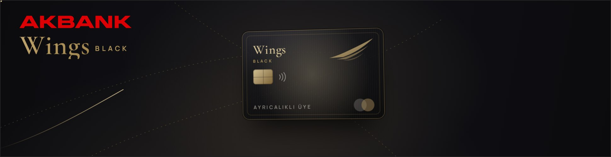
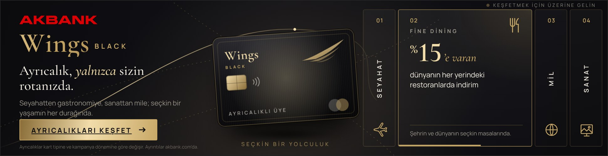
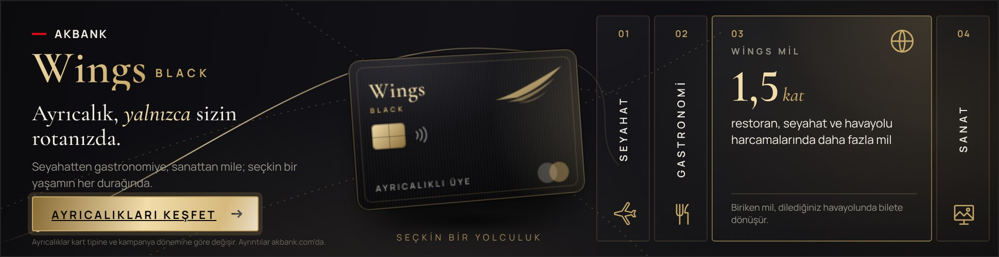
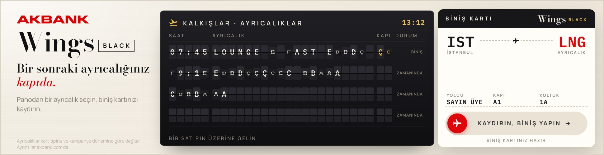
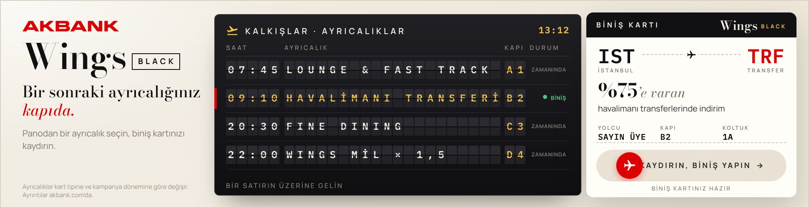
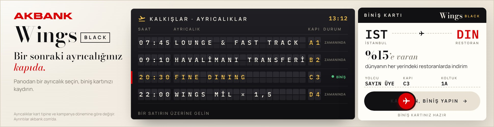
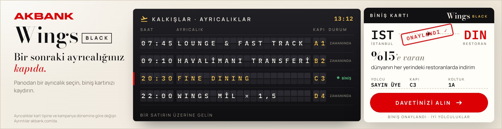
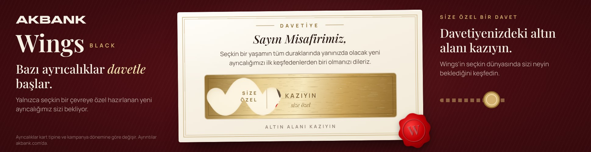
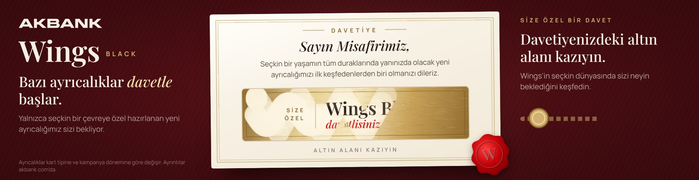
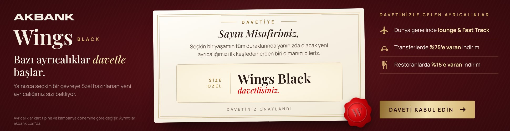

# Wings – Q4 lansman, 970×250 interaktif masthead

İki ayrı konsept var:

| Konsept | Dosya | Fikir |
|---|---|---|
| **A · Siyah & Altın** | `970x250/index.html` | Koyu zemin, imlece göre eğilen 3B kart, açılıp kapanan 4 ayrıcalık paneli |
| **B · Biniş Kartı** | `970x250-binis-karti/index.html` | Açık zemin, havalimanı kalkış panosu (split-flap) ve "kaydır, biniş yap" etkileşimli biniş kartı |
| **C · Davetiye** | `970x250-davetiye/index.html` | Bordo zemin, mühürlü davetiye kartı, kazınınca "Wings Black davetlisiniz" mesajını açan altın varak |

---

## Konsept A · Siyah & Altın

`970x250/index.html`: tek dosya, satır içi CSS + JS, görsel dosyası yok (kart ve ikonlar vektör). Boyutu yaklaşık 20 KB; fontlar Google Fonts'tan geliyor.

| Açılış | Otomatik döngü (Fine Dining) | Üzerine gelme (Mil) |
|---|---|---|
|  |  |  |

## Kurgu
1. **0–2 sn:** Altın uçuş rotası çizilir. Kart sağdan dönerek gelir, *Wings* yazısı ve başlık kelime kelime belirir.
2. **2 sn sonrası:** Sağda 4 ayrıcalık paneli açılır (Seyahat · Gastronomi · Mil · Sanat). Her panel 3,4 sn açık kalır ve alttaki altın çubuk ilerlemeyi gösterir.
3. **30 sn:** Döngü durur ve banner ilk panelde kalır (Google Ads / DV360'ın 30 sn kuralına uygun).

## Etkileşim
- **İmleç:** Kart imlece göre 3B eğilir. Metalik parlama ve arka plan ışığı imleci izler.
- **Panel üzerine gelme:** Panel genişler, döngü duraklar. Kapalı bir panele tıklamak paneli açar, çıkış tetiklemez.
- **Dokunmatik:** Sağa/sola kaydırarak panel değiştirilir. **Klavye:** ← → ile panel değişir, Enter çıkış yapar.
- **Çıkış:** Önce `Enabler.exit` (Studio) denenir, sonra `clickTag` (Google Ads / CM360). İkisi de yoksa `CONFIG.landing` UTM'li olarak açılır ve `utm_content` alanına o an açık olan panel yazılır.
- **Ölçüm:** `track()` ile `hover`, `panel_<ad>` ve `exit` olayları gönderilir (Enabler varsa sayaç olarak).
- `prefers-reduced-motion` seçiliyse animasyonlar kısaltılır.

## Düzenleme
Bütün metinler, rakamlar, kart seviyesi (`tier`), hedef URL ve süreler dosyadaki `CONFIG` nesnesinde.
**Not:** akbank.com bu ortamdan erişilemedi. Ayrıcalık rakamları (transferde %75'e varan, restoranda %15'e varan, 1,5 kat mil, son dakika bilet) Wings'in kamuya açık mevcut ayrıcalıklarından alındı ve **yer tutucu** olarak kullanıldı. Lansman ürününün kesin metinleri ve hukuk onayı ile güncellenmelidir. Kart üzerindeki kanat işareti soyut bir yer tutucudur, yayından önce resmi Wings logosuyla değiştirilmelidir.

## Akbank logosu
Logo, `https://www.akbank.com/SiteAssets/img/logo.svg` adresindeki resmi dosyadır. `tools/embed-logo.js` bu dosyayı masthead'deki `LOGO:START` / `LOGO:END` işaretlerinin arasına satır içi SVG olarak gömer. Böylece banner tek dosya olarak kalır. Koyu zeminde okunsun diye koyu/siyah dolgular fildişine çevrilir, kırmızı alanlar olduğu gibi korunur. İşaretin sonuna eklenen mod her çalışmanın zeminine göre seçilir: `LOGO:START` koyu zemin (A), `LOGO:START:light` açık zeminde orijinal renkler (B), `LOGO:START:mono` tek renk fildişi / negatif logo (C).

Bulut oturumu akbank.com'a erişemediği için indirme işi GitHub Actions'ta yapılır (`.github/workflows/akbank-wings-logo.yml`). İş akışı gömme betiği değiştiğinde kendiliğinden çalışır, *Actions → "Wings masthead – Akbank logosunu çek ve göm" → Run workflow* ile elle de başlatılabilir. Logo gömülene kadar banner'da yazı ile "Akbank" görünür.

Yerelde (normal internet erişimiyle): `node akbank-wings/tools/embed-logo.js`

Ekran görüntülerini yenilemek için: `NODE_PATH=$(npm root -g) node akbank-wings/tools/capture.js`

Hedefleme önerileri: [HEDEFLEME.md](HEDEFLEME.md)

---

## Konsept B · Biniş Kartı (`970x250-binis-karti/index.html`)

| Pano dönüyor | Otomatik döngü | Kaydırma | Biniş onaylandı |
|---|---|---|---|
|  |  |  |  |

Açık fildişi zemin, Bodoni başlık ve Akbank kırmızısıyla editoryal bir dil. Bu çalışmada logo kendi kırmızısıyla, olduğu gibi kullanılır.

**Kurgu**
1. **0–2 sn:** Ortadaki kalkış panosunun harfleri tek tek dönerek (split-flap) ayrıcalıkları yazar: Lounge & Fast Track, Havalimanı Transferi, Fine Dining, Wings Mil × 1,5. Biniş kartı sağdan kayarak gelir.
2. **Otomatik döngü:** Her 3,6 sn'de bir sonraki satır "BİNİŞ" durumuna geçer. Biniş kartındaki varış kodu (LNG / TRF / DIN / MIL), ayrıcalık metni ve kapı numarası bu satıra göre değişir. Döngü 30 sn'de durur.
3. **Kaydır, biniş yap:** Kart koçanındaki kırmızı uçak tutamacı sağa kaydırılınca (ya da tıklanınca) kart "ONAYLANDI" damgasını alır ve tutamacın yerine **"Davetinizi alın"** CTA'sı gelir.

**Etkileşim**
- **Pano:** Satırın üzerine gelinince ya da odaklanınca o ayrıcalık seçilir. Kapalı bir satıra tıklamak onu seçer, çıkış tetiklemez.
- **Tutamaç:** Fare, dokunmatik ve kalemle sürüklenebilir (Pointer Events), klavyede → ya da Enter ile çalışır. Sürükleme yolun %82'sini geçmezse geri yaylanır.
- **Saat:** Panodaki saat, izleyicinin yerel saatini gösterir.
- **Çıkış:** Çıkış adları `Wings_Binis_Exit` ve CTA'dan sonra `Wings_Binis_CTA`. UTM'deki `utm_content` alanına seçili ayrıcalık yazılır, biniş yapıldıysa sonuna `_binis` eklenir.
- **Ölçüm:** `hover`, `row_<ad>`, `drag_start`, `boarded_<ad>` ve `exit` olayları gönderilir.

İçerik ve süreler dosyadaki `CONFIG.rows` altında. Pano satır başına en fazla 20 karakter gösterir.

Ekran görüntüleri ve etkileşim testi (sürükleme + CTA): `NODE_PATH=$(npm root -g) node akbank-wings/tools/capture.js 970x250-binis-karti`

---

## Konsept C · Davetiye (`970x250-davetiye/index.html`)

| Davetiye | Kazınıyor | Davet açıldı |
|---|---|---|
|  |  |  |

Bordo kadife zemin üzerinde mühürlü, fildişi bir davetiye kartı. Logo bu zeminde kırmızı okunmadığı için tek renk fildişi (negatif) kullanılır.

**Kurgu**
1. **0–1,5 sn:** Davetiye hafif dönerek yerine oturur ve Akbank kırmızısı mühür kartın köşesine basılır.
2. **2,6 sn:** Kazıma alanını tanıtmak için altın varakta otomatik olarak kısa bir kavis kazınır. Sağdaki metin ve madeni para animasyonu kullanıcıyı kazımaya çağırır.
3. **Kazıma:** Fareyle üzerinden geçmek (masaüstü) ya da parmakla sürmek (mobil) varağı kazır; imleç madeni para şeklindedir. Varağın %50'si kazınınca kalanı erir, altın pullar saçılır ve **"Wings Black davetlisiniz."** mesajı açılır.
4. **Açılış sonrası:** Sağda üç ayrıcalık sırayla belirir ve **"Daveti kabul edin"** CTA'sı gelir.
5. **Etkileşim olmazsa:** Kimse kazımazsa davetiye 14. saniyede kendiliğinden açılır, böylece etkileşime girmeyen izleyici de mesajı görür. Kullanıcı kazımaya başladıysa otomatik açılma iptal edilir.

**Etkileşim ve ölçüm**
- Kazıma alanındaki tıklamalar reklam çıkışını tetiklemez. Klavyede kazıma alanına odaklanıp Enter'a basmak davetiyeyi açar.
- Çıkış adları `Wings_Davetiye_Exit` ve `Wings_Davetiye_CTA`. UTM'deki `utm_content` alanı `kapali`, `kazindi` ya da `otomatik` olur; böylece kazıyan kullanıcı ile otomatik açılanı görenler ayrı ölçülür.
- Olaylar: `hover`, `scratch_start`, `reveal_user`, `reveal_auto`, `exit`.
- `CONFIG` ayarları: `revealAt` (açılma eşiği), `demoAt` (ipucu zamanı), `autoRevealMs` (otomatik açılma, 0 = kapalı), `perks` (ayrıcalık listesi).

Ekran görüntüleri ve etkileşim testi (kazıma, CTA, otomatik açılma): `NODE_PATH=$(npm root -g) node akbank-wings/tools/capture.js 970x250-davetiye`
