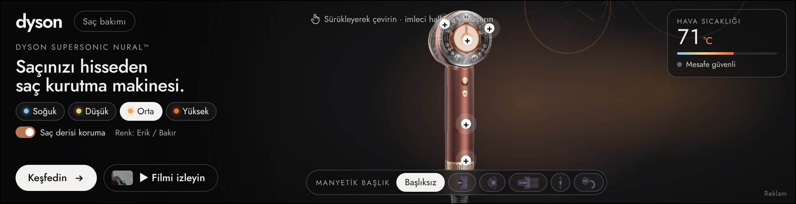
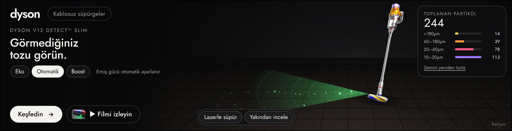
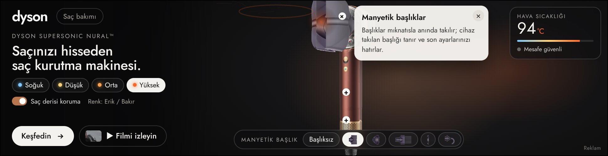
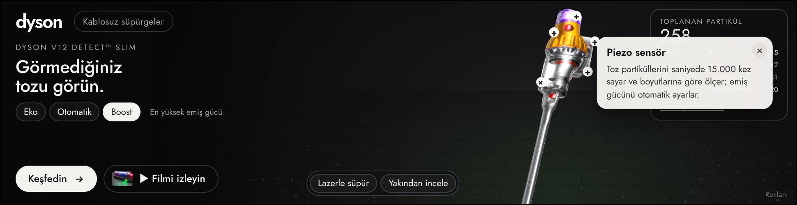
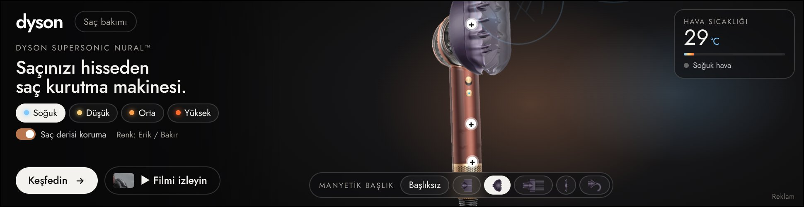
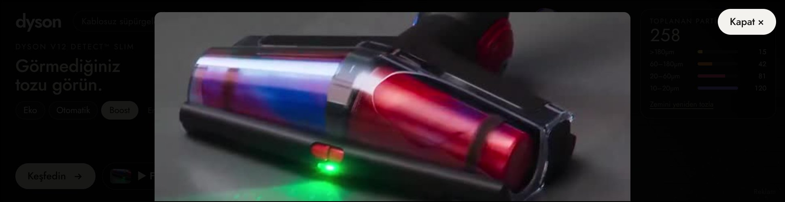

# Dyson – Etkileşimli Masthead (970 × 250)

Dyson Türkiye için iki ayrı, birbirinden bağımsız **970×250 Billboard** masthead. Her biri kendi `index.html` dosyasındadır, tek bir ürünü anlatır. Ürünler **dyson.com.tr'deki orijinal fotoğraflardan üretilmiş 3D modellerdir**: fotoğraftan çıkarılan derinlik haritasıyla hacim kazanır, kaplamaları fotoğrafın kendisidir ve gerçek zamanlı ışıkla gölgelenir.

| Masthead | Dosya | Tıklama adresi | Paket |
|---|---|---|---|
| Saç bakımı – Dyson Supersonic Nural™ | `dist/haircare/index.html` | https://www.dyson.com.tr/products/hair-care | `dist/zip/dyson-haircare-970x250.zip` (filmli, 813 KB) · `…-lite.zip` (89 KB) |
| Kablosuz süpürge – Dyson V12 Detect™ Slim | `dist/cordfree/index.html` | https://www.dyson.com.tr/products/cord-free | `dist/zip/dyson-cordfree-970x250.zip` (filmli, 1,3 MB) · `…-lite.zip` (49 KB) |

**Tek dosyalık teslim:** `teslim/haircare/index.html` ve `teslim/cordfree/index.html` – film dahil her şey dosyanın içinde, çift tıklayınca tarayıcıda çalışır.

Tıklama adresleri **parametresizdir** (UTM / takip parametresi yok). İkisini yan yana görmek için: `preview/index.html`.

## Ekran görüntüleri

| Saç bakımı | Kablosuz süpürge |
|---|---|
|  |  |
|  |  |
|  |  |

## Etkileşimler

**Saç bakımı (Supersonic Nural™ – Erik/Bakır, fotoğraftan 3D)**
- 3D model sürükleyerek çevrilir (±60°, esnek sınır), bırakınca öne döner; boştayken salınır, imleci takip eder. Hava halkası derinliği olan bir silindir, sap yuvarlak gövde olarak şekillenir.
- Hava akışı halkanın 3D yönünü takip eder: ürün döndükçe akış da döner.
- **Isı ayarı** (Soğuk 28°C / Düşük 60°C / Orta 80°C / Yüksek 100°C): hava çıkış halkasından fışkıran hava akışının ve ısıtıcı ışığının rengi değişir.
- **Manyetik başlıklar** – setteki 5 başlık (Yoğunlaştırıcı, Difüzör, Geniş dişli tarak, Nazik hava, Kabarma önleyici) kendi orijinal fotoğraflarından 3D modellenmiştir. Seçilen başlık önden gelip hava çıkışına mıknatıs gibi yaylanarak **takılır**; ürün profili gösterecek şekilde yana döner, hava akışı başlığın ağzından ve başlığa özgü biçimde çıkar. Başka başlık seçilince önce mevcut başlık çıkar; "Başlıksız" çıkarır.
- **Saç derisi koruma (Nural™)**: imleç halkaya (başa) yaklaştıkça sıcaklık göstergesi otomatik düşer.
- **Özellik noktaları (+)** fotoğrafın üzerinde: Air Multiplier™, akıllı ısı kontrolü, Nural™ sensör, Hyperdymium™ motor, çıkarılabilir filtre.

**Kablosuz süpürge (V12 Detect™ Slim, fotoğraftan 3D)**
- **Lazerle süpür**: 3D süpürge zeminde imleci (mobilde parmağı) takip eder, hareket yönüne göre başlık ekseninde döner; başlıktaki yeşil lazer görünmeyen tozu ortaya çıkarır, başlık tozu emer. Dokunulmazsa kendiliğinden gezinir.
- **Piezo sensör sayacı**: toplanan partiküller boyutlarına göre (>180µm … 10–20µm) canlı sayılır.
- **Eko / Otomatik / Boost**: emiş genişliği değişir.
- **Yakından incele**: model büyür, sürükleyerek çevrilir; lazer, piezo sensör, LCD, motor, batarya, HEPA noktaları.

**Ortak**
- **Film**: dyson.com.tr kategori sayfalarındaki resmi filmler ("▶ Filmi izleyin"), masthead içinde açılır.
- Harici kütüphane yoktur: 3D çizim saf WebGL (~6 KB, `src/product3d.js`), efektler 2D canvas; filmsiz paketler 49–89 KB'tır.
- Klavye ile gezinme, `Esc` ile kapatma, `prefers-reduced-motion` desteği; ekranda değilken çizim durur.

## Siteden alınan materyaller

Bulut ortamının ağ politikası dyson.com.tr'ye izin vermediği için materyaller GitHub Actions üzerinde gerçek bir Chromium ile indirildi (`.github/workflows/dyson-assets.yml`, `tools/fetch-dyson-assets.js`). Ham çıktı `assets/raw/` altındadır (görseller, filmler, `index.json` içinde kaynak URL ve alt metinleri).

Kullanılanlar (`assets/selection.json` → `assets/selected/`):
- Saç bakımı: `plp-updated-hairdryers` filmi (11 sn) + filmden poster/küçük görsel; sayfadaki Supersonic Nural™ "Erik/Bakır" rengi.
- Kablosuz süpürge: `PLP-Cordfree_MegaEdit` filmi (19 sn) + lazer başlık karesinden poster/küçük görsel; sayfada öne çıkan V12 Detect™ Slim.

Ürün fotoğrafları Dyson'ın görsel sunucusundan şeffaf PNG olarak alınır (`tools/fetch-dyson-products.js` → `assets/products/`): Supersonic Nural™ seti (492345) ve V12 Detect™ Slim (494876). `tools/cut-products.py` ana ürünü ve başlıkları ayırır, fotoğraftaki hazır tozu/aksesuarları temizler. `tools/depth-maps.py` 3D için yüksek çözünürlüklü doku ve derinlik haritası üretir (ürün ve 5 başlık) (borular silindir kesitli, Nural halkası öne doğru silindir). Dyson'ın Türkiye ürün sayfalarında AR/3D model dosyası bulunmadığı `tools/fetch-dyson-3d.js` ile doğrulandı.

## Derleme

```bash
cd dyson
npm install                    # esbuild
python3 tools/cut-products.py  # (fotoğraflar değişirse) ürün/başlık kesimleri
python3 tools/depth-maps.py    # 3D doku + derinlik haritaları
node build.mjs                 # dist/haircare, dist/cordfree, dist/zip/*, teslim/*
node tools/capture.mjs # ekran görüntüleri + etkileşim testi (Playwright + Chromium)
```

Kaynaklar: `src/data.js` (metinler, adresler, özellik kartları ve fotoğraf üzerindeki konumları, başlıklar), `src/product3d.js` (fotoğraftan 3D model, WebGL), `src/main.js` (efektler ve etkileşim), `src/template.html` (yerleşim ve stil).

## Yayın notları

- **Boyut:** filmsiz zip'ler 49–89 KB'tır; Google Ads'in 150 KB HTML5 sınırının rahatça altındadır. Filmli sürümler (video `media/film.mp4`) doğrudan yayıncı alımları, DV360 / CM360 rich media gibi daha geniş sınırlı yerleşimler içindir.
- **clickTag:** her dosyada `var clickTag = "<parametresiz adres>"` tanımlıdır; reklam sunucusu kendi değerini atarsa o kullanılır. Studio'da `Enabler` varsa `Enabler.exit` çağrılır.
- **Yazı tipi:** Google Fonts – Jost (Dyson'ın Futura çizgisine yakın). Harici font kabul etmeyen ağlarda `@font-face` ile gömülebilir.
- **Ürün iddiaları** (110.000 / 125.000 rpm, saniyede 40'tan fazla sıcaklık ölçümü, saniyede 15.000 partikül sayımı, %99,99 / 0,3 mikron, 60 dk) Dyson'ın kamuya açık ürün bilgilerine dayanır; yayın öncesi marka onayı önerilir. Isı derece değerleri Supersonic ailesinin resmi kademeleridir.
