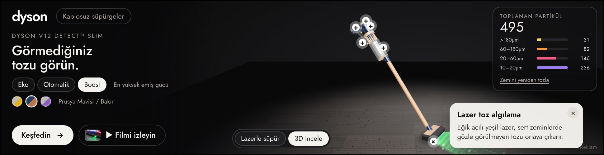

# Dyson – Etkileşimli 3D Masthead (970 × 250)

Dyson Türkiye için iki ayrı, birbirinden bağımsız **970×250 Billboard** masthead. Her biri kendi `index.html` dosyasındadır ve tek bir ürünü anlatır.

| Masthead | Dosya | Tıklama adresi | Paket |
|---|---|---|---|
| Saç bakımı – Dyson Supersonic Nural™ | `dist/haircare/index.html` | https://www.dyson.com.tr/products/hair-care | `dist/zip/dyson-haircare-970x250.zip` (filmli, 872 KB) · `…-lite.zip` (146 KB) |
| Kablosuz süpürge – Dyson V12 Detect™ Slim | `dist/cordfree/index.html` | https://www.dyson.com.tr/products/cord-free | `dist/zip/dyson-cordfree-970x250.zip` (filmli, 1,4 MB) · `…-lite.zip` (146 KB) |

**Tek dosyalık teslim:** `teslim/haircare/index.html` ve `teslim/cordfree/index.html` – film dahil her şey dosyanın içinde, çift tıklayınca tarayıcıda çalışır.

Tıklama adresleri **parametresizdir** (UTM / takip parametresi yok). İkisini yan yana görmek için: `preview/index.html`.

## Ekran görüntüleri

| Saç bakımı | Kablosuz süpürge |
|---|---|
|  |  |
|  |  |
|  |  |

## Etkileşimler

**Saç bakımı (Supersonic Nural™)**
- Gerçek zamanlı **3D model** (three.js): sürükleyerek döndürülür, imleci takip eder, boştayken yavaşça salınır.
- **Isı ayarı** (Soğuk 28°C / Düşük 60°C / Orta 80°C / Yüksek 100°C): hava akışı parçacıklarının rengi, cihazın arkasındaki ısı LED'leri ve sahne ışığı değişir.
- **Manyetik başlıklar**: Yoğunlaştırıcı, Pürüzsüzleştirici, Difüzör modele "manyetik" olarak takılır; hava akışının biçimi başlığa göre değişir (yassı jet, geniş yumuşak akış vb.).
- **Saç derisi koruma (Nural™)**: İmleç hava akışına (başa) yaklaştıkça sağ üstteki sıcaklık göstergesi otomatik düşer.
- **5 renk seçeneği** (sitedeki Erik/Bakır dahil): model malzemesi ve arka plan ışığı anında değişir.
- **Özellik noktaları (+)**: Air Multiplier™, akıllı ısı kontrolü, Nural™ sensör, Hyperdymium™ motor, manyetik başlıklar.

**Kablosuz süpürge (V12 Detect™ Slim)**
- **Lazerle süpür** oyunu: imleç (mobilde parmak) zeminde gezdirilir, süpürge başlığı takip eder; yeşil lazer yelpazesi görünmeyen tozu ortaya çıkarır, başlık tozu emer.
- **Piezo sensör / LCD**: Toplanan partiküller boyutlarına göre (>180µm, 60–180µm, 20–60µm, 10–20µm) sayılır; hem sağ üstteki panelde hem de 3D modelin LCD ekranında canlı gösterilir.
- **Eko / Otomatik / Boost**: emiş alanı genişler, LCD'deki mod ve batarya göstergesi güncellenir.
- **3D incele**: sürükleyerek döndürme ve lazer, piezo sensör, LCD, motor, batarya, HEPA özellik noktaları.
- Kullanıcı dokunmazsa süpürge kendiliğinden gezinir (çekici mod).

**Ortak**
- **Film**: dyson.com.tr kategori sayfalarındaki resmi filmler ("▶ Filmi izleyin"), masthead içinde açılır.
- Klavye: tüm kontroller sekme ile gezilebilir, `Esc` kartı/filmi kapatır. `prefers-reduced-motion` desteklenir.
- Masthead ekranda değilse veya sekme gizliyse çizim durur (performans).

## Siteden alınan materyaller

Bulut ortamının ağ politikası dyson.com.tr'ye izin vermediği için materyaller GitHub Actions üzerinde gerçek bir Chromium ile indirildi (`.github/workflows/dyson-assets.yml`, `tools/fetch-dyson-assets.js`). Ham çıktı `assets/raw/` altındadır (görseller, filmler, `index.json` içinde kaynak URL ve alt metinleri).

Kullanılanlar (`assets/selection.json` → `assets/selected/`):
- Saç bakımı: `plp-updated-hairdryers` filmi (11 sn) + filmden poster/küçük görsel; sayfadaki Supersonic Nural™ "Erik/Bakır" rengi.
- Kablosuz süpürge: `PLP-Cordfree_MegaEdit` filmi (19 sn) + lazer başlık karesinden poster/küçük görsel; sayfada öne çıkan V12 Detect™ Slim.

3D modeller siteden indirilmez; kodla (prosedürel) üretilir, böylece dış dosya gerektirmez ve her renkte/başlıkta yeniden çizilebilir.

## Derleme

```bash
cd dyson
npm install            # three + esbuild
node build.mjs         # dist/haircare, dist/cordfree, dist/zip/*
node tools/capture.mjs # ekran görüntüleri + etkileşim testi (Playwright + Chromium)
```

Kaynaklar: `src/data.js` (tüm metinler, renkler, adresler, özellik kartları), `src/models.js` (3D modeller), `src/main.js` (sahne ve etkileşim), `src/template.html` (yerleşim ve stil).

## Yayın notları

- **Boyut:** three.js satır içi olduğu için HTML ~560 KB'tır; zip'lenmiş filmsiz sürüm 146 KB'tır ve Google Ads'in 150 KB HTML5 sınırının altındadır. Filmli sürümler (video `media/film.mp4`) doğrudan yayıncı alımları, DV360 / CM360 rich media gibi daha geniş sınırlı yerleşimler içindir.
- **clickTag:** her dosyada `var clickTag = "<parametresiz adres>"` tanımlıdır; reklam sunucusu kendi değerini atarsa o kullanılır. Studio'da `Enabler` varsa `Enabler.exit` çağrılır.
- **Yazı tipi:** Google Fonts – Jost (Dyson'ın Futura çizgisine yakın). Harici font kabul etmeyen ağlarda `@font-face` ile gömülebilir.
- **Ürün iddiaları** (110.000 / 125.000 rpm, saniyede 40'tan fazla sıcaklık ölçümü, saniyede 15.000 partikül sayımı, %99,99 / 0,3 mikron, 60 dk) Dyson'ın kamuya açık ürün bilgilerine dayanır; yayın öncesi marka onayı önerilir. Isı derece değerleri Supersonic ailesinin resmi kademeleridir.
