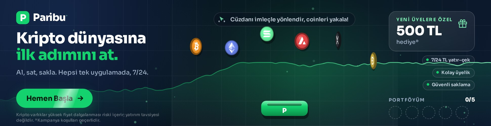
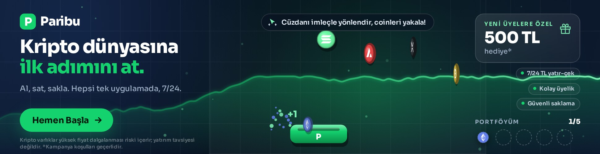
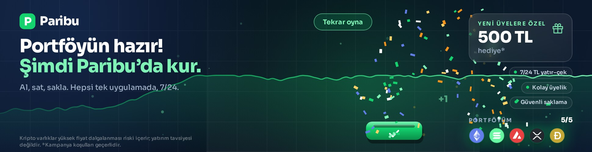

# Paribu – 970×250 İnteraktif Rich Media Masthead

[paribu.com](https://www.paribu.com/) için hazırlanmış, son tüketiciye (yatırımcıya) yönelik **oyunlaştırılmış, animasyonlu, tek dosyalık HTML5 rich media masthead** (970×250).

| Dosya | Ne |
|---|---|
| **`dist/970x250/index.html`** | Reklam ağına yüklenecek masthead (tek dosya, ~107 KB, harici istek yok) |
| `dist/zip/paribu-masthead-970x250.zip` | Aynı dosya zip içinde |
| `release/sunum.html` | Tek dosyalık sunum: masthead gömülü, yayın simülasyonu, kurgu notları, ekran görüntüleri |
| `release/paribu-masthead-teslim.zip` | dist + sunum + ekran görüntüleri + bu README |
| `preview/index.html` | Sunum sayfası (depodan açılır) · `preview/video/paribu-970x250.webm` kısa kayıt |

| Kurgu tamam | Oyun | Kazanma |
|---|---|---|
|  |  |  |

## Konsept: “Cüzdanı yönlendir, coinleri yakala”

Masthead ilk saniyede markayı ve mesajı verir, sonra izleyiciyi oyuna çeker:

1. **Giriş (0–3 sn)** – Koyu “işlem ekranı” zemini; logo sol üstte belirir, arka planda yeşil grafik çizgisi soldan sağa çizilir. “**Kripto dünyasına / ilk adımını at.**” satır satır yükselir (ikinci satır Paribu yeşili), alt metin “Al, sat, sakla. Hepsi tek uygulamada, 7/24.” ve “**Hemen Başla**” CTA’sı gelir. BTC, ETH, SOL, AVAX, XRP, DOGE sağdan uçarak oyun alanına yerleşir ve yerinde döner. Sağda “**Yeni üyelere özel 500 TL hediye**” kartı 3B dönüşle açılır; özellik çipleri (7/24 TL yatır–çek · Kolay üyelik · Güvenli saklama) ve “Portföyüm 0/5” şeridi gelir.
2. **Otomatik gösteri (3 sn →)** – İpucu: “Cüzdanı imleçle yönlendir, coinleri yakala!”. Coinler tek tek düşmeye başlar, Paribu cüzdanı kendi kendine (bazen kaçırarak) yakalar; kazanmaz, son iki coini kullanıcıya bırakır. Etkileşim olmazsa **30 sn**’de durağan kareye geçer (IAB/Google 30 sn kuralı); etkileşimle yeniden başlar.
3. **Oyun** – İmleç banner üzerine gelince cüzdan imleci izler (dokunmatikte parmak, klavyede ← →). Yakalanan her coin: +1, parçacık patlaması, cüzdan sıçraması, grafikte yeşil dalga ve portföy şeridine coin ikonu. Oyun alanına tıklama/Boşluk = **hamle**: cüzdan kısa süre genişler ve yakındaki coinleri çeker.
4. **Kazanma** – 5 coin → konfeti; başlık “**Portföyün hazır! Şimdi Paribu’da kur.**”, CTA “**Paribu’ya Katıl**” olup nabız atar, cüzdanda onay işareti, “Tekrar oyna” çıkar. 4 sn sonra oyun kendiliğinden sıfırlanır.

Arka plandaki grafik yalnızca dekoratiftir (rastgele, yukarı eğilimli yürüyüş); **gerçek fiyat/getiri gösterilmez**, sayısal vaat yoktur. Yasal ibare (“Kripto varlıklar yüksek fiyat dalgalanması riski içerir; yatırım tavsiyesi değildir.”) sabittir.

## Rich media özellikleri

- **Tıklama/çıkış:** Logo, başlık, CTA, kampanya kartı ve boş alanlar siteye gider. Oyun alanındaki tıklama çıkış değil hamledir; ağ “her yer tıklanabilir olsun” isterse `src/data.js` → `brand.clickThroughEverywhere: true`. Öncelik: `window.clickTag` → `Enabler.exit()` → `brand.url` (UTM’li).
- **Etkileşim sayaçları:** `window.adTrack(olay)` tanımlıysa çağrılır, `Enabler` varsa `Enabler.counter(olay)`. Olaylar: `interaction`, `game_start`, `coin_catch`, `coin_miss`, `boost`, `game_win`, `replay`, `cta_click`, `exit`. Ağın kendi izleme makrosu `runtime.js` → `track()` içine bir satırla bağlanır.
- **Durum API’si (QA/entegrasyon):** `window.paribuMasthead.state()` (mod, skor, coin konumları), `.spawn()`, `.reset()`.
- **Sekme gizlenince duraklar**, `postMessage('pause'|'play'|'restart')` ile dışarıdan yönetilir (sunum sayfası bunu kullanır).
- `<meta name="ad.size">`, `role="group"`, `aria-label`, klavye odağı; `prefers-reduced-motion` açıksa giriş kurgusu atlanır ve coinler yalnızca kullanıcı etkileşimiyle düşer.
- Canvas 2D (retina 2×), ses yok, genişleme yok; tüm etkileşim 970×250 içinde. **Harici istek yok** (font, ikon ve logo gömülü) – rich media ağlarının “self-contained” şartına uygundur.

> “First media” talebi, isteğin bağlamına göre **rich media** (etkileşimli, oyunlaştırılmış, ölçümlenebilir masthead) olarak yorumlandı. Belirli bir ağ/sağlayıcı (ör. “First Media” adlı bir rich media platformu) hedefleniyorsa, dosya standart HTML5 + clickTag olduğu için o ağın yükleme şablonuna uyarlanması `track()` / `openLink()` fonksiyonlarına birer satır eklemekten ibarettir.

## Gerçek marka varlıkları (siteden, GitHub Actions ile)

Claude Code’un bulut oturumunun ağ politikası paribu.com, brandfetch, seeklogo ve Wikipedia’ya erişime izin vermedi. Bu yüzden logo/sembol/renkler, önceki çalışmalarda olduğu gibi **GitHub Actions** üzerinde toplanır:

- `tools/fetch-assets.js` (Playwright): paribu.com ana sayfa (+ `net.paribu.com/medya`, blog, hub) gerçek tarayıcıda açılır; üst bilgi logosu (satır içi SVG / img), `apple-touch-icon` (sembol), `theme-color`, CTA düğme renkleri, `:root` renk değişkenleri, fontlar, H1/H2 metinleri ve basın kiti bağlantıları (svg/png/zip) toplanır → `assets/logo/`, `assets/site/`, **`assets/manifest.json`**, **`assets/report.md`**.
- `tools/optimize-logo.js`: PNG logoyu kırpar, koyu (siyah) logoyu koyu zemin için beyaza çevirir (renkli kısımlar korunur). SVG logolardaki koyu dolgular derlemede beyazlatılır.
- `build.js`: manifest varsa **sitedeki logo + sembol + marka rengi** ile derler; yoksa yer tutucu vektör logo (yeşil sembol + “Paribu” yazısı) kullanır.

Çalıştırmak için: depoda *Actions* → “Paribu – siteden logo/renkleri çek ve mastheadi derle” → *Run workflow* (`.github/workflows/fetch-assets.yml`). İş akışı varlıkları çeker, derler, ekran görüntüsü/video/paket üretir ve dala push’lar. Sonuç `assets/report.md` içinde özetlenir; logo seçimi beğenilmezse `assets/manifest.json` → `logo.file` elle başka bir adaya çevrilip `node build.js` denir.

Coin ikonları: [cryptocurrency-icons](https://www.npmjs.com/package/cryptocurrency-icons) (CC0, `assets/coins/`). Tipografi: **Sora** (Google Fonts, OFL; değişken ağırlık, latin + latin-ext gömülü ≈ 66 KB).

## Özelleştirme

Tüm metinler, kampanya kartı, renkler, coin listesi, oyun ve süre ayarları **`src/data.js`** içindedir:

```js
copy.headline: ['Kripto dünyasına', 'ilk adımını at.'],
campaign: { enabled: true, kicker: 'Yeni üyelere özel', value: '500 TL', suffix: 'hediye*' },
game: { target: 5, dropIdle: 2300, dropPlay: 1150, maxAutoplay: 30000 },
brand: { url: 'https://www.paribu.com/?utm_…', clickThroughEverywhere: false },
```

> **Kampanya kartı** ParibuLog’daki “Paribu’dan yeni üyelere özel kampanya: 500 TL hediye” duyurusuna dayanır; yayın öncesi güncelliği ve koşulları markayla teyit edin. `campaign.enabled: false` ile kart kalkar, yerine özellik çipleri büyür. Özellik çipleri ve alt metin de markanın onayından geçmelidir.

```bash
node build.js                 # dist/970x250/index.html + zip  (--placeholder-logo, --no-campaign, --no-embed-fonts)
npm run capture:video         # preview/screens/*.jpg + preview/video/*.webm (Playwright + Chromium)
npm test                      # etkileşim duman testi (30 sn sınırı dâhil; --quick ile atlanır)
node tools/package.js         # release/ (tek dosya masthead, zip, sunum.html, teslim zip)
```

## Yükleme notları

- **Rich media / masthead ağları (Adform, Sizmek/Amazon Ad Server, yayıncı özel formatları):** `index.html`’i doğrudan yükleyin; ağın clickTag makrosunu tanımlaması yeterlidir. Etkileşim sayaçları için `window.adTrack` ya da ağın API’sini `track()` içine bağlayın.
- **Google Ads / DV360 / CM360:** `ad.size` meta etiketi, `clickTag` ve `Enabler` desteği hazırdır. Google Ads standart display için 150 KB sınırı uygular; dosya ~107 KB’dır. Studio’ya yükleniyorsa `<head>` içine `<script src="https://s0.2mdn.net/ads/studio/Enabler.js"></script>` ekleyin.
- Fontu dışarıdan yüklemek (dosyayı ~40 KB küçültmek) için `node build.js --no-embed-fonts` (Google Fonts bağlantısı kullanılır).

## Klasör yapısı

```
src/data.js           Metinler, kampanya, renkler, coinler, oyun/süre ayarları
src/template.js       HTML birleştirici (stil + motor + varlıklar)
src/styles.css        Yerleşim ve giriş animasyonları
src/runtime.js        Tarayıcı motoru: canvas oyunu, grafik, parçacıklar, izleme kancaları
build.js              dist/ üretici (manifest varsa gerçek logo/renk)
assets/coins/         Coin ikonları (CC0)   assets/fonts/  Sora (OFL)   assets/logo|site|manifest.json  siteden (Actions)
tools/fetch-assets.js Siteden logo/sembol/renk/metin toplayıcı (Playwright)
tools/optimize-logo.js Logo kırpma/beyazlatma
tools/capture.js      Ekran görüntüsü + video     tools/smoke.js  Etkileşim testi     tools/package.js  Teslim paketi
preview/              Sunum sayfası, ekran görüntüleri, video
release/              Teslim dosyaları
```
