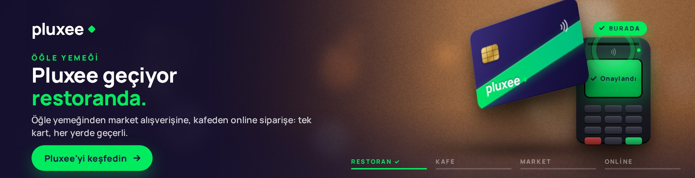
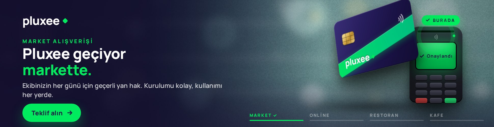
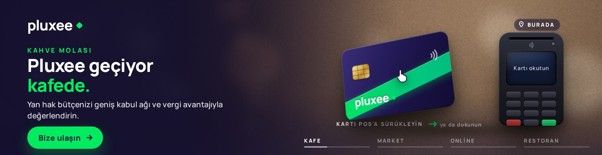

# Pluxee "Geçiyor" – Media-first interaktif masthead (970 × 250)

Media-first konsept çalışması. Kampanyanın ana fikri "Pluxee geçiyor: burada, şurada, orada". Masthead bu fikri kullanıcıya oynatır: **kullanıcı Pluxee kartını sürükleyip POS'a okutur**; restoranda, kafede, markette ve online siparişte "geçiyor". Dokunulmazsa kart bunu kendisi gösterir. Medya veri katmanının **segment** sinyali kimin izlediğini (beyaz yaka, İK, işveren), **saat** sinyali hangi sahnenin önce geldiğini belirler. Tek HTML kreatif, 12 versiyon.

| Çıktı | Dosya |
|---|---|
| **Ana teslim** – sinematik sürüm, yayına hazır tek dosya | `dist/970x250/index.html` |
| Reklam ağı paketi | `dist/zip/pluxee-970x250.zip` |
| Sunum sayfası (kreatif gömülü, tek dosya: sinyal paneli, karar zinciri, sinyal→kreatif haritası) | `preview/index.html` |
| Ekran görüntüleri | `preview/screens/` |
| İlk taslak (illüstrasyon dili, arşiv) | `dist/970x250-flat/index.html` |

## Ekran görüntüleri

| Bekleme: "Kartı POS'a sürükleyin" ipucu | Kullanıcı kartı sürüklüyor, POS uyanıyor |
|---|---|
|  |  |

| POS'a bırakınca: Onaylandı ✓, "burada" | Final: "Pluxee geçiyor her yerde." + Tekrar oyna |
|---|---|
|  |  |

| Akşam · İK – Market ile açılır, otomatik gösterim | Gece · beyaz yaka – Online ile açılır |
|---|---|
|  |  |

| Sabah · işveren – Kafe ile açılır, "Bize ulaşın" | Yağmur · İK – Online sipariş öne alınır |
|---|---|
|  |  |

## Kurgu

- **Sol sütun:** Pluxee logosu, sahne başlığı (ÖĞLE YEMEĞİ / KAHVE MOLASI / MARKET ALIŞVERİŞİ / ONLİNE SİPARİŞ), sabit başlık **"Pluxee geçiyor"** ve sahneyle değişen kinetik kelime: *restoranda. → kafede. → markette. → online siparişte.* Finalde **"her yerde."**
- **Sahne:** fotoğrafik bokeh arka plan (sahneye göre restoran, kafe, market, online atmosferi), 3B Pluxee kartı ve POS cihazı. **Kullanıcı kartı sürükleyip POS'a okutur:** POS'a yaklaşınca cihaz uyanır ("Okutun", sarı LED), bırakınca ekran **"Onaylandı"** olur, ışık halkası ve parçacıklar yayılır, sahne etiketi onaylanır: *burada ✓ → şurada ✓ → orada ✓ → orada da ✓*, finalde *her yerde ✓*. Sonra bir sonraki sahne gelir.
- **Alt gösterge:** dört sahne başlığı; aktif sahnenin çizgisi dolar, tamamlananlar yeşil ✓ olur.
- **Segment** yalnızca alt metni ve CTA'yı değiştirir: beyaz yaka "Pluxee'yi keşfedin", İK "Teklif alın", işveren "Bize ulaşın".
- **Saat** öncü sahneyi belirler: 06–10 ve 15–17 kafe, 11–14 restoran, 18–22 market, 23–05 online. Yağmur (isteğe bağlı sinyal) online siparişi öne alır.
- **Otomatik gösterim:** kullanıcı dokunmazsa 2,6 sn sonra hayalet el belirir ve kart kendi kendine POS'a gidip okutulur; dört sahne + final ≈ 23 sn (Google Ads 30 sn kuralı), sonra final karesinde durur.
- Konum, nokta sayısı ve gün içi zaman etiketleri **kullanılmaz**; dil kurumsaldır.

## Etkileşim

- **Sürükle-bırak:** kart fareyi/parmağı izler (pointer events, dokunma dahil), hıza göre eğilir; POS'a yeterince yaklaşıp bırakılınca onaylanır, uzağa bırakılırsa yerine döner. **Karta ya da POS'a dokunmak** da kartı okutur (mobil için). Kullanıcı dört sahneyi tamamlayınca final gelir, döngü yapılmaz, **"Tekrar oyna"** görünür.
- **Alt başlıklara tıklama** ilgili sahneye götürür. Fare hareketi arka planda hafif paralaks yaratır. Sahnedeki hareket ve tıklamalar reklam çıkışı **değildir**; etkileşim olarak ölçülür.
- **CTA ve sol sütun** reklam çıkışıdır: `window.clickTag` varsa o, `Enabler` varsa `Enabler.exit('CTA')`, yoksa UTM'li Pluxee sayfası.
- Klavye: ← → sahneler, boşluk kartı okutur, Enter tıklama. `prefers-reduced-motion` açıksa doğrudan final karesi.

## Sinyaller ve parametreler

| Sinyal | Parametre | Kaynak (yayında) | Kreatifte değişen |
|---|---|---|---|
| Segment | `seg=wc` (beyaz yaka) · `hr` (İK) · `emp` (işveren / karar verici) | 1. parti kitle segmenti + mecra bağlamı | Alt metin, CTA |
| Saat | `h=0-23`, `m=0-59` | Ad server saat makrosu; yoksa cihaz saati | Öncü sahne ve sahne sırası, ışık atmosferi |
| Hava | `w=sun\|rain` (isteğe bağlı) | Hava durumu API | Yağmurda online sipariş öne alınır |
| Sunum | `demo=1` | – | Sinyal çubuğu (sadece sunumda) |

Örnek: `dist/970x250/index.html?seg=hr&h=19&m=5`

- Ad server makroları doğrudan bu parametrelere bağlanır; alternatif olarak `<script>window.__PLUXEE_SIGNALS={seg:'hr'}</script>` ile enjekte edilebilir.
- Her gösterim `SEGMENT-ÖNCÜSAHNE` biçiminde bir varyant kimliği taşır (`HR-MARKET`, `WC-ONLINE-RAIN`); ölçüm etiketi olarak raporlanır.

### postMessage API (sunum ve entegrasyon)

Gelen: `{type:'pluxee:signals', signals:{seg,hour,minute,weather,demo}}`, `{type:'pluxee:replay'}`, `{type:'pluxee:demo', on:true}`.
Giden: `{type:'pluxee:state', variant, lead, order, idx, phase, hint, userPlayed, visited, total, finalState, ended, copy, signals}` ve gömülü modda tıklamada `{type:'pluxee:click', url}`. Sayfa içinden `window.PLUXEE.setSignals({...})`, `window.PLUXEE.replay()`, `window.PLUXEE.state()` da kullanılabilir.

## Kopya

Tüm metinler **`src/data.js` → `cinematic`** altındadır:

```js
scenes:   [{ key:'restoran', title:'Öğle yemeği', word:'restoranda.', label:'Restoran', tag:'burada' }, …]
segments: { hr: { sub:'Ekibinizin her günü için geçerli yan hak. …', cta:'Teklif alın' }, … }
final:    { title:'Burada, şurada, orada', word:'her yerde.' }
```

Sahne eklemek ya da metin değiştirmek için ilgili nesneyi düzenleyip `node pluxee/build.js` çalıştırmak yeterlidir. "Vergi avantajıyla" gibi ifadeler marka ve hukuk onayına tabidir.

## Derleme ve test

```bash
node pluxee/build.js                                   # dist/ ve preview/index.html
NODE_PATH=$(npm root -g) node pluxee/tools/smoke.js    # sinyal, etkileşim, tıklama, API, 30 sn kontrolü (Playwright)
NODE_PATH=$(npm root -g) node pluxee/tools/capture.js  # preview/screens/*.jpg
```

Kök `package.json` içinden: `npm run pluxee:build`, `npm run pluxee:test`, `npm run pluxee:capture`.

## Teknik notlar

- 970×250 HTML5, tek dosya; satır içi CSS + ES5 JS. Arka planlar yükleme anında canvas ile üretilir (ışık, bokeh, tane, vinyet); görsel dosyası yoktur, bu yüzden dosya ~35 KB'dır. Tek harici kaynak Google Fonts (Manrope); Google Ads ve DV360'ta izinlidir, harici font kabul etmeyen ağlar için `@font-face` ile gömülebilir.
- `<meta name="ad.size">`, `role`/`aria` etiketleri ve klavye odağı mevcuttur.
- **Google Ads / CM360:** `dist/zip/pluxee-970x250.zip` doğrudan yüklenir (`clickTag`). **DV360 / Studio:** `Enabler` algılanır; Studio'ya yüklenecekse `<head>` içine `Enabler.js` satırı eklenir. **Diğer ağlar:** `openLink()` içindeki `window.clickTag` satırı ağın makrosuna çevrilir.
- **Gerçek fotoğraf kullanımı:** sahne arka planları `PAL` paletiyle üretilir; lisanslı stok fotoğraf tercih edilirse `.bg` katmanına `` olarak yerleştirilir (sahne başına 970×250, WebP ~40 KB). Bu ortamın ağ politikası stok kaynaklara erişime izin vermediği için üretilmiş arka planlar kullanıldı.
- Marka varlıkları temsilidir (pluxee.com.tr'ye erişilemedi): logo metin olarak, palet Pluxee lacivert (#221C46) + yeşil (#00EB5E). Resmi logo SVG'si `src/template-cinematic.js` içindeki `.logo` bloğuna, resmi kart tasarımı `.card .face` bloğuna yerleştirilir.

## Masthead'in ötesi: aynı fikirden türeyen özel proje başlıkları

- **Segment bazlı teklif akışı** – İK ve karar verici segmentinde CTA, masthead içinde iki adımlık kısa forma dönüşür (çalışan sayısı → geri arama); lead doğrudan Pluxee'ye düşer.
- **Bağlam senkronu** – ağdaki tüm mastheadler öğle saatlerinde restoran, mesai sonunda market sahnesiyle açılır; kampanya ağ genelinde aynı "an"ı konuşur.
- **Mecra bağlamı** – İK ve iş dünyası içeriklerinde otomatik olarak İK/işveren versiyonu; genel haber ve yaşam içeriklerinde beyaz yaka versiyonu servis edilir.

## Klasör yapısı

```
pluxee/src/data.js               Kopya, sahneler, segmentler, süreler (cinematic + ilk taslak verisi)
pluxee/src/template-cinematic.js Ana kreatif motoru (canvas arka plan, 3B kart, POS, kinetik başlık)
pluxee/src/template.js           İlk taslak motoru (illüstrasyon), arşiv
pluxee/src/showcase.html         Sunum sayfası şablonu (build.js kreatifi içine gömer)
pluxee/build.js                  dist/ + preview/index.html üretici
pluxee/dist/970x250/             Yayına hazır kreatif (ana teslim)
pluxee/dist/970x250-flat/        İlk taslak
pluxee/dist/zip/                 Reklam ağı paketleri
pluxee/preview/                  Sunum sayfası + ekran görüntüleri
pluxee/tools/smoke.js            Duman testi (Playwright)
pluxee/tools/capture.js          Ekran görüntüleri (Playwright)
pluxee/tools/fonts.js            Google Fonts önbelleği (yalıtılmış ortamlar için)
```
