# Pluxee "Geçiyor" – Media-first interaktif masthead (970 × 250) · altı konsept

Kampanyanın ana fikri "Pluxee geçiyor: burada, şurada, orada". Aynı fikir altı farklı kurguda, her biri **animasyonlu girişle** açılan, **kullanıcı aksiyonuyla** ilerleyen, dokunulmazsa kendini oynatan tek dosyalık HTML5 kreatif olarak hazırlandı. Hiçbirinde vektör illüstrasyon yoktur: sahneler pluxee.com.tr'deki **gerçek fotoğraflar**, kart **gerçek Pluxee kart tasarımı**dır. Medya veri katmanının **segment** sinyali kimin izlediğini (beyaz yaka, İK, işveren), **saat** sinyali hangi kabul noktasının önce geldiğini belirler.

| Konsept | Fikir | Kullanıcı aksiyonu | Dosya |
|---|---|---|---|
| **Koridor** (varsayılan) | Kart, kabul noktalarının kapılarından *geçer*; her kapıda flaş ve "Geçti ✓", finalde koridor açılır | Sürükle (ileri/geri), basılı tut (hızlan), imleçle yönlendir, rota noktasına tıkla | `dist/koridor/index.html` |
| **Mercek** | Kart bir ışık merceğidir; karanlık şehirde gezdirdiğiniz yerdeki kabul noktası aydınlanır ve "geçiyor" | Kartı imleç/parmakla gezdir (ok tuşları da) | `dist/mercek/index.html` |
| **Fiş** | POS fişi satır satır yazılır: RESTORAN … GEÇİYOR ✓; toplam: HER YERDE GEÇİYOR | POS'a/karta dokunarak yazdır, satır üstüne gel, fişi çekip kopar | `dist/fis/index.html` |
| **Silme** | Kart bir *ayıraçtır*: dört fotoğraflık şeridin üstünden geçer, geçtiği yer renklenir ve "GEÇİYOR ✓" damgalanır | Kartı/şeridi sürükle (atalet), dokun (sonraki panel), ok tuşları | `dist/silme/index.html` |
| **Hikâye** | Tam kadraj fotoğraf hikâyeleri: her fotoğrafa damga vurulur, üstte hikâye çubukları; finalde dört damga | Sağa/sola dokun (ileri/geri), basılı tut (dur), kaydır, ok tuşları, boşluk | `dist/hikaye/index.html` |
| **Deste** | Açık (kağıt beyazı) zemin: fotoğraf baskıları destesi; en üstteki kaydırılınca kart baskıya dokunur, damga basılır, finalde yelpaze | Baskıyı sağa/sola kaydır, dokun, ok tuşları | `dist/deste/index.html` |

Diğer çıktılar: `dist/970x250/index.html` (varsayılan konseptin kopyası), `dist/zip/pluxee-<konsept>-970x250.zip` (reklam ağı paketleri), `preview/index.html` (altı sekmeli sunum sayfası; sinyal paneli, karar zinciri, fotoğraf kaynakları), `preview/screens/` (ekran görüntüleri), `dist/arsiv/` (önceki sürümler).

## Ekran görüntüleri

| Giriş: ışık süpürmesi ve logo açılışı (ortak) | Koridor: ipucu |
|---|---|
| 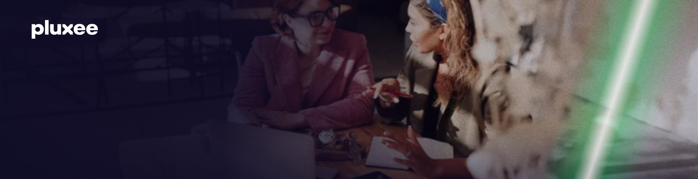 | 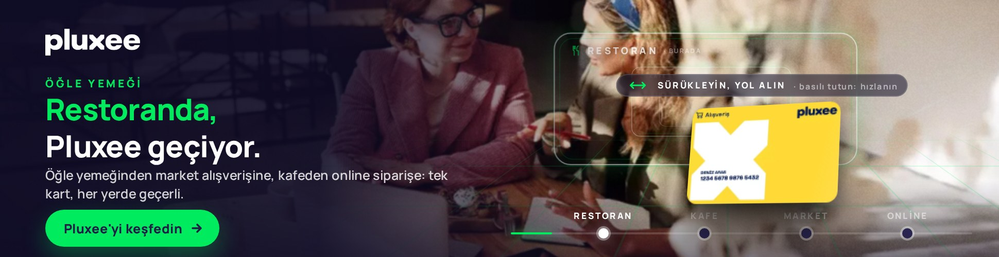 |

| Koridor: kapıdan geçiş | Koridor: final |
|---|---|
| 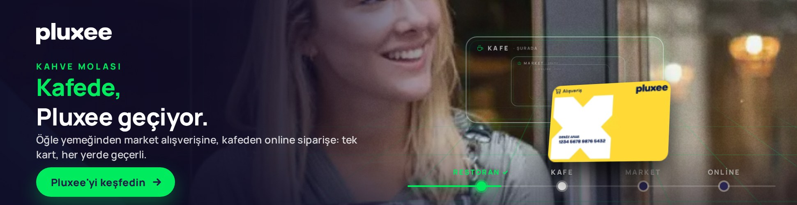 | 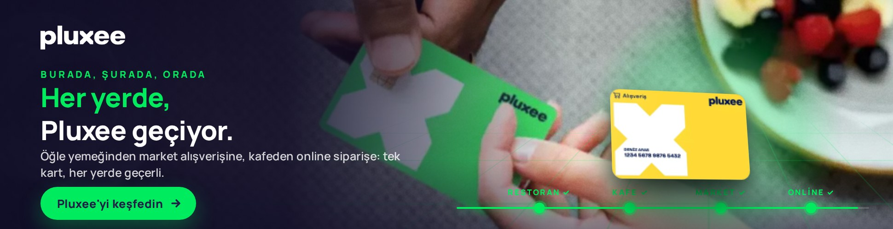 |

| Mercek: kart restoranı aydınlatıyor | Mercek: final, tüm sahne açılır |
|---|---|
| 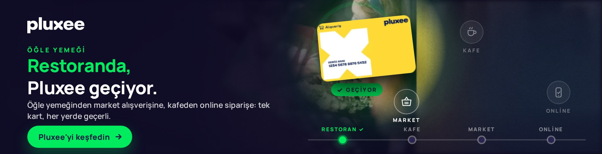 | 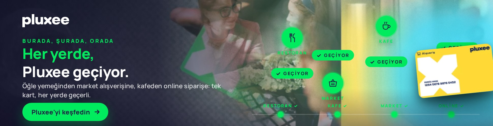 |

| Fiş: satır satır yazdırıyor | Fiş: tamam, "HER YERDE GEÇİYOR" |
|---|---|
| 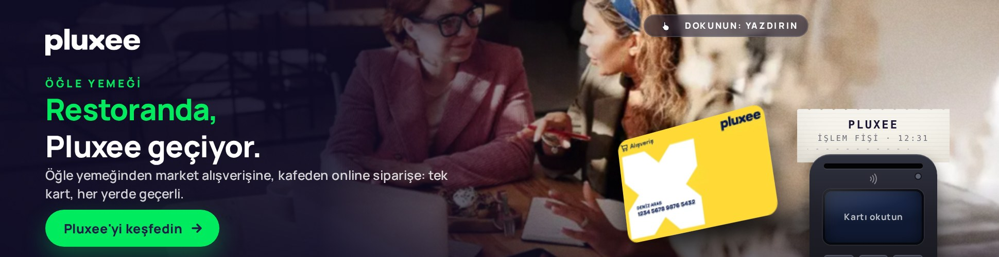 | 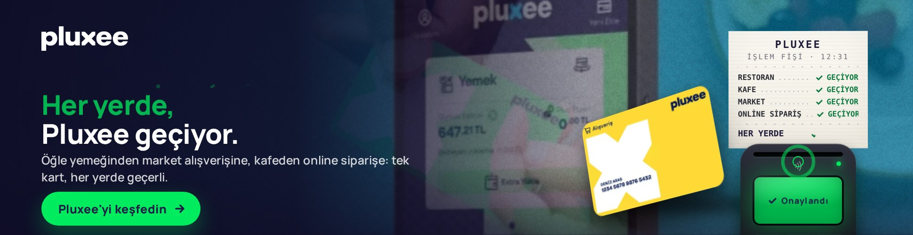 |

| Silme: kart şeridi siliyor | Silme: final, dört damga |
|---|---|
| 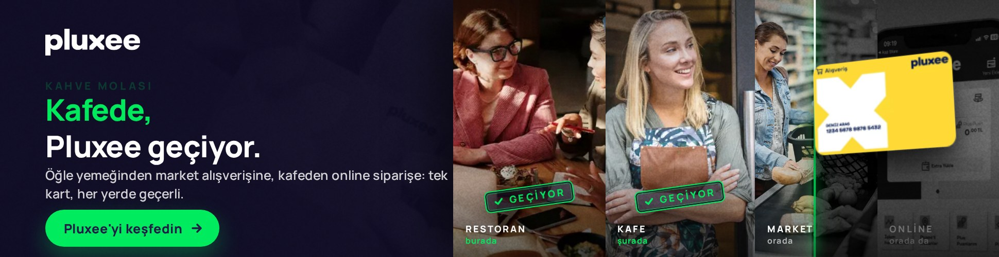 | 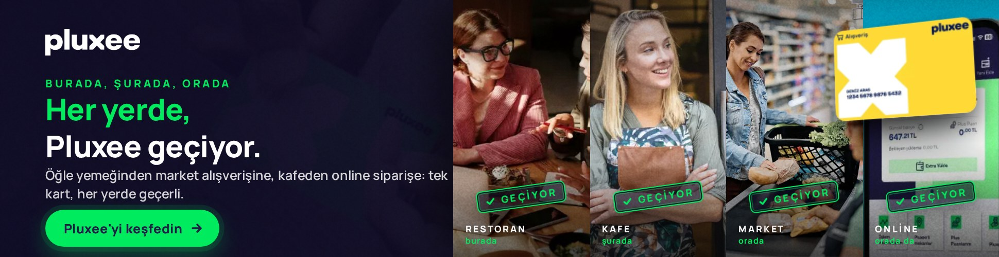 |

| Hikâye: "GEÇİYOR ✓" damgası | Hikâye: final, dört damga alt sırada |
|---|---|
| 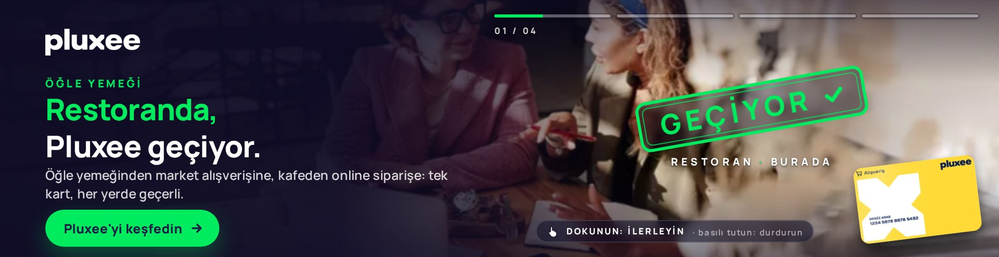 | 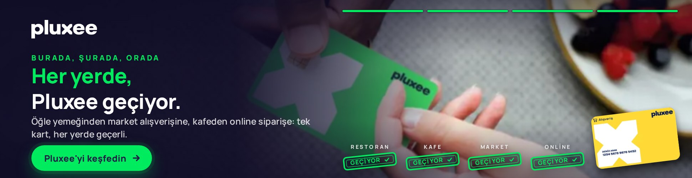 |

| Deste: baskı kaydırılıyor | Deste: final yelpazesi |
|---|---|
| 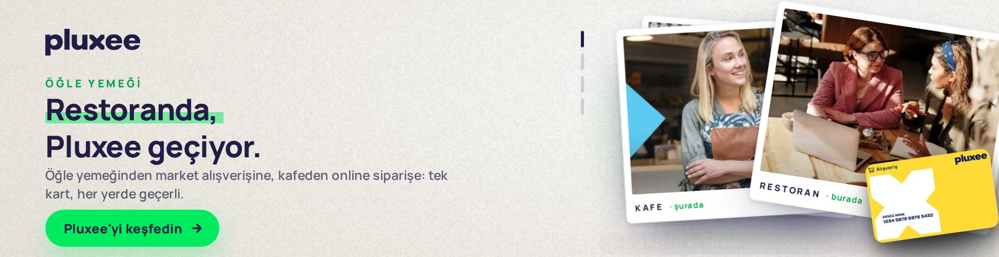 | 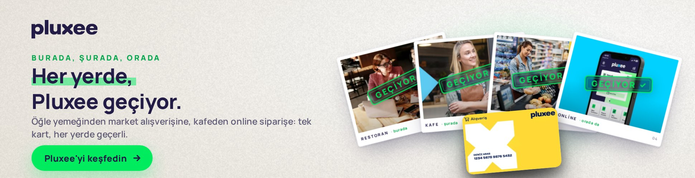 |

## Gerçek görseller: logo, kart ve sahne fotoğrafları

Kreatifler `pluxee/assets/` klasöründeki gerçek varlıkları otomatik gömer; hiçbir konseptte vektör illüstrasyon yoktur, sahneler fotoğraftır.

| Varlık | Dosya | Kullanım |
|---|---|---|
| Logo | `assets/logo.png` (siteden "Logo pluxee final.png", beyaz wordmark) | Sol üst; koyu zeminde olduğu gibi, açık zeminli Deste'de alfa maskesiyle laciverte boyanır. Koyu bir logo verilirse `manifest.json` → `"logo": {"white": true}` koyu zeminde beyaza çevirir |
| Kart | `assets/card.png` (.jpg/.webp) | 3B Pluxee kartının yüzü |
| Sahne fotoğrafları | `assets/photos/<slot>.*` + `assets/photos.json` (slot: `restoran`, `kafe`, `market`, `online`, `hero`) | Arka planlar, mercek kompoziti, fotoğraf şeritleri/kartları |

Varlıkları siteden çekmenin yolları:

1. **GitHub Actions (önerilen):** `pluxee/assets/.fetch-trigger` dosyasını değiştirip push'layın (ya da depo varsayılan dalındaysa Actions → "Pluxee – siteden logo ve kart görselini çek, derle" → *Run workflow*). İş akışı `assets/fetch.config.json` içindeki elle seçilmiş adresleri (logo, kart, sahne başına fotoğraf; isteğe bağlı `crop` ve `focal`) indirir; config yoksa pluxee.com.tr'yi tarar (logo, kart görseli, ≥ 600 px fotoğraflar; alt metin/dosya adına göre sahnelere eşler) ve `stock: false` değilse eksik sahneler için loremflickr.com'dan (Flickr CC) yedek çeker – **yedek kullanıldıysa yayın öncesi lisanslı fotoğrafla değiştirilmelidir**. Sonra optimize eder (fotoğraf 1000 px WebP, kırpma), tüm konseptleri derler, test eder ve dala push'lar (`.github/workflows/fetch-pluxee-assets.yml`). Şu anki fotoğrafların tamamı pluxee.com.tr'den alınmıştır; yedek kullanılmamıştır.
2. **Yerel bilgisayarda:** `node pluxee/tools/fetch-pluxee-assets.js [--logo=<url>] [--card=<url>] [--photo-restoran=<url> …] [--no-stock]`, ardından `node pluxee/tools/optimize-pluxee-assets.js` (Playwright) ve `node pluxee/build.js`.
3. **Elle:** dosyaları `assets/` altına koyup `assets/photos.json` içinde `slots` eşlemesini yazın (`{"slots": {"restoran": {"file": "photos/restoran.jpg", "source": "manual"}}}`).

`assets/photos.json` → `site` listesi sitede bulunan tüm fotoğrafları boyut ve etiketleriyle tutar; eşlemeyi elle değiştirip yeniden derleyebilirsiniz. Sunum sayfası her fotoğrafın kaynağını gösterir.

> Bu çalışma Claude Code'un yalıtılmış ortamında hazırlandı; ortamın ağ politikası pluxee.com.tr'ye ve stok sitelerine erişime izin vermediği için fotoğraflar ilk kez GitHub Actions iş akışıyla indirildi. Geliştirme sırasında `node tools/standin-photos.js` + `node build.js --standin` etiketli geçici görseller üretir (git'e girmez).

**Boyut notu:** fotoğraflar gömülü olduğunda her konsept ~200–300 KB olur. Bu, publisher-direct masthead ve DV360/CM360 (polite load) için uygundur; Google Ads'in 150 KB sınırı gerekiyorsa `optimize-pluxee-assets.js --photo-width=700 --photo-quality=0.62` ile fotoğraflar küçültülür ya da fotoğraflar zip içinde ayrı dosya olarak servis edilir.

## Ortak kurgu

- **Giriş (~0,6 sn):** yeşil-beyaz ışık süpürmesi soldan sağa geçer, logo maskeyle açılır, sahne başlığı / başlık / alt metin / CTA kademeli girer, sonra konseptin sahnesi kurulur.
- **Sol sütun:** logo, sahne başlığı (ÖĞLE YEMEĞİ / KAHVE MOLASI / MARKET ALIŞVERİŞİ / ONLİNE SİPARİŞ), kinetik kelime + sabit satır: *Restoranda, / Pluxee geçiyor.* → *Kafede,* → … → finalde **Her yerde, Pluxee geçiyor.**
- **Segment** alt metni ve CTA'yı belirler: beyaz yaka "Pluxee'yi keşfedin", İK "Teklif alın", işveren "Bize ulaşın". **Saat** ilk kabul noktasını belirler (06–10 ve 15–17 kafe, 11–14 restoran, 18–22 market, 23–05 online); yağmur (isteğe bağlı) online siparişi öne alır.
- **Final:** CTA nabız atar, "Tekrar" düğmesi görünür. Kullanıcı oynadıysa otomatik döngü yapılmaz. Otomatik gösterim her konseptte ≈ 18–21 sn (Google Ads 30 sn kuralı).
- Konum, nokta sayısı, gün içi zaman etiketi, UTM ve ajans adı **kullanılmaz**.

## Konseptler

**Koridor** – kaçış noktasına daralan zemin ızgarası, perspektifle yaklaşan dört kapı, hız çizgileri, sahneye göre değişen fotoğrafik bokeh. Kart bir kapıdan geçerken çerçeve flaş verir, "Geçti ✓" rozeti düşer, sahne sarsılır, rota noktası yeşile döner. Sürükleme ileri/geri götürür (atalet), basılı tutmak 3× hızlandırır, kısa dokunma sıçratır, imleç koridoru yönlendirir, rota noktaları kapı seçer. Klavye: ← →, boşluk.

**Mercek** – sahne karanlık ve bulanık bir şehir; kartın çevresindeki mercek (CSS maske) altındaki renkli katmanı gösterir. Dört kabul noktası loş simgelerle durur; mercek üstüne gelince aydınlanır, 0,3 sn kalınca "Geçiyor ✓" rozeti ve parçacıklar. Kart imleci gecikmeli izler, hıza göre eğilir. Dördü de aydınlanınca mercek tüm sahneyi kaplar. Dokunulmazsa kart noktaları sırayla dolaşır. Klavye: ok tuşları.

**Fiş** – kart POS'a dokunur, cihaz "Onaylandı" der, ısıl yazıcı fişi çıkar: PLUXEE / İŞLEM FİŞİ · saat / RESTORAN … GEÇİYOR ✓ … / HER YERDE GEÇİYOR ✓. Her satır soldan sağa basılır, kağıt yukarı kayar. POS'a ya da karta dokunmak bir sonraki satırı yazdırır; satırın üstüne gelince o yerin atmosferi ve başlığı gelir; bitince fişi çekmek (ya da dokunmak) koparır: kağıt savrulur, yuvada tırtıklı bir parça kalır. Dokunulmazsa satırlar 2,3 sn arayla yazılır ve fiş kendiliğinden kopar. Klavye: boşluk.

**Silme** – sağda dört panelli fotoğraf şeridi (restoran, kafe, market, online) soluk ve renksiz durur; kart bir ışık çizgisiyle şeridin üstünden geçer, geçtiği yer renklenir (clip-path), panelin ortasını geçince "GEÇİYOR ✓" kauçuk damgası basılır, panel genişler, sol sütun kopyası değişir. Sürükleme kenarı taşır (atalet, geri sürüklenince damga kalkar), dokunma bir sonraki panele geçirir, bırakınca 1,6 sn sonra otomatik kayma sürer; şeridin sonunda flaş ve final. Dokunulmazsa 13 sn'de şerit kendini siler. Klavye: ← →.

**Hikâye** – reklamın tamamı tam kadraj fotoğraf; dört hikâye 3,6 sn arayla akar (Ken Burns), her birinde 0,4 sn'de "GEÇİYOR ✓" damgası çakılır (beyaz flaş, hafif sarsıntı), 0,7 sn'de "RESTORAN · BURADA" etiketi gelir; üst sağda hikâye çubukları ve "01 / 04" sayacı. Sağa dokunma sonraki, sola dokunma önceki hikâye; basılı tutma durdurur ("Durduruldu"), kaydırma ileri/geri. Finalde dört mini damga alt sırada dizilir, kart imza gibi sağ altta durur. Klavye: ← →, boşluk.

**Deste** – tek açık zeminli konsept: kağıt beyazı fon, lacivert tipografi, kinetik kelimede yeşil fosforlu vurgu. Sağda dört fotoğraf baskısı (beyaz çerçeve, alt yazı: RESTORAN · burada · 01) deste hâlinde dizilir; en üstteki baskı kaydırılınca gerçek Pluxee kartı baskıya "dokunur" (kısa nabız), "GEÇİYOR ✓" damgası çakılır, baskı uçar ve sıradaki açılır. Kısa kaydırma geri yaylanır, dokunma damgalar, dokunulmazsa 2,4 sn'de bir baskı kendiliğinden damgalanır. Dördü damgalanınca baskılar yelpaze gibi açılır, kart ortaya gelir: "Her yerde, Pluxee geçiyor." Klavye: ← →.

## Sinyaller ve parametreler

| Sinyal | Parametre | Kaynak (yayında) | Kreatifte değişen |
|---|---|---|---|
| Segment | `seg=wc` · `hr` · `emp` | 1. parti kitle segmenti + mecra bağlamı | Alt metin, CTA |
| Saat | `h=0-23`, `m=0-59` | Ad server saat makrosu; yoksa cihaz saati | İlk kabul noktası ve sıra, ışık atmosferi |
| Hava | `w=sun\|rain` (isteğe bağlı) | Hava durumu API | Yağmurda online sipariş öne alınır |
| Sunum | `demo=1` | – | Sinyal çubuğu |

Örnek: `dist/mercek/index.html?seg=hr&h=19&m=5`. Alternatif: `window.__PLUXEE_SIGNALS={seg:'hr'}`. Varyant kimliği `SEGMENT-İLKNOKTA` (`HR-MARKET`) + konsept adı ölçüm etiketi olarak raporlanır; konseptler A/B olarak yayınlanabilir.

**postMessage API:** gelen `pluxee:signals`, `pluxee:replay`, `pluxee:demo`; giden `pluxee:state` (`variant, lead, order, phase, visited, total, finalState, ended, userPlayed, hint, copy, signals, concept` + konsepte özgü alanlar) ve gömülü modda `pluxee:click`. Sayfa içinden `window.PLUXEE.setSignals / replay / state`.

## Kopya ve süreler

`src/data.js`: `cinematic` (sahneler, segment metinleri, saat → ilk nokta), `corridor`, `lens`, `receipt` (konsepte özgü kelimeler, ipuçları, süreler); Silme, Hikâye ve Deste'nin kopyası ve süreleri kendi dosyalarının başındaki `COPY` nesnesindedir. Düzenleyip `node pluxee/build.js`. "Vergi avantajıyla" gibi ifadeler marka ve hukuk onayına tabidir.

## Derleme ve test

```bash
node pluxee/build.js                                   # dist/<konsept>/, zip'ler, preview/index.html
NODE_PATH=$(npm root -g) node pluxee/tools/smoke.js    # altı konsept + sunum + arşiv, gerçek fare/dokunma ile
NODE_PATH=$(npm root -g) node pluxee/tools/capture.js  # preview/screens/*.jpg
```

Kök `package.json`: `npm run pluxee:build`, `npm run pluxee:test`, `npm run pluxee:capture`.

## Teknik notlar

- 970×250 HTML5; her konsept tek dosya (fotoğraflar gömülü ≈ 250 KB, fotoğrafsız ≈ 40 KB), satır içi CSS + ES5 JS. Sahneler DOM + CSS 3B; fotoğraflar data-URI olarak gömülür (WebGL yok). Tek harici kaynak Google Fonts (Manrope); Google Ads ve DV360'ta izinlidir, gerekirse `@font-face` ile gömülür.
- `<meta name="ad.size">`, `role`/`aria`, klavye odağı; `prefers-reduced-motion` açıksa doğrudan final karesi.
- **Google Ads / CM360:** `dist/zip/*.zip` doğrudan yüklenir (`clickTag`). **DV360 / Studio:** `Enabler` algılanır. **Diğer ağlar:** `openLink()` içindeki `window.clickTag` satırı ağın makrosuna çevrilir. Tıklama hedefi `https://www.pluxee.com.tr/`.

## Klasör yapısı

```
pluxee/src/common.js             Ortak altyapı: giriş, sinyaller, logo/kart varlıkları, arka plan, API
pluxee/src/concepts/koridor.js   Konsept 1
pluxee/src/concepts/mercek.js    Konsept 2
pluxee/src/concepts/fis.js       Konsept 3
pluxee/src/concepts/silme.js     Konsept 4 (kart ayıraç: geçtiği yer renklenir)
pluxee/src/concepts/hikaye.js    Konsept 5 (tam kadraj fotoğraf hikâyeleri)
pluxee/src/concepts/deste.js     Konsept 6 (açık zemin, fotoğraf baskısı destesi)
pluxee/src/data.js               Kopya, sahneler, segmentler, süreler
pluxee/src/showcase.html         Sunum sayfası şablonu (altı sekme)
pluxee/build.js                  dist/ + preview/index.html üretici (assets/ varsa gömer)
pluxee/assets/                   Gerçek logo ve kart görseli (fetch-pluxee-assets.js / elle)
pluxee/tools/fetch-pluxee-assets.js, optimize-pluxee-assets.js, smoke.js, capture.js, fonts.js
pluxee/src/template-cinematic.js, template.js   Arşiv sürümleri
```
