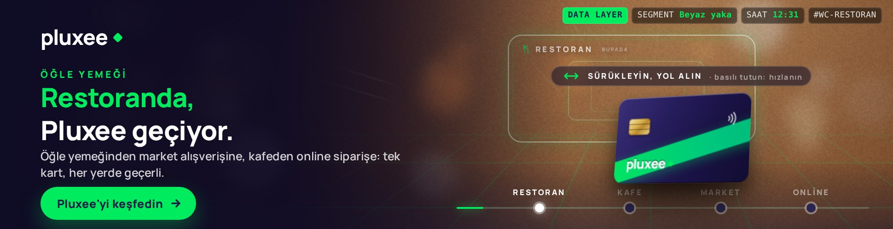
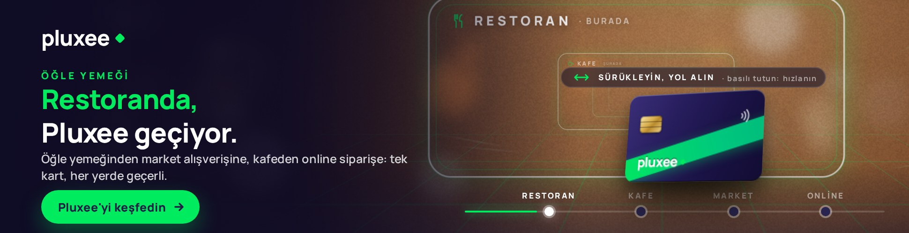
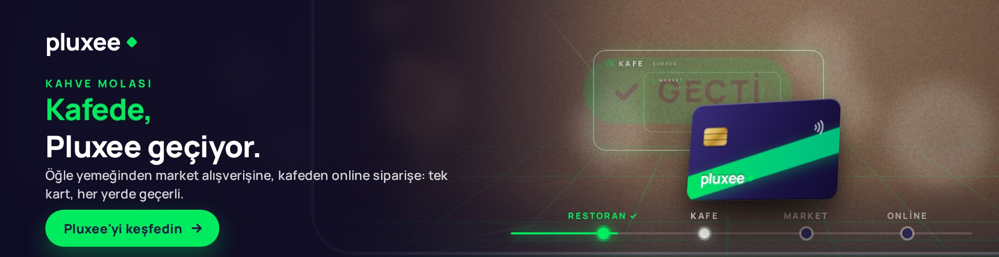
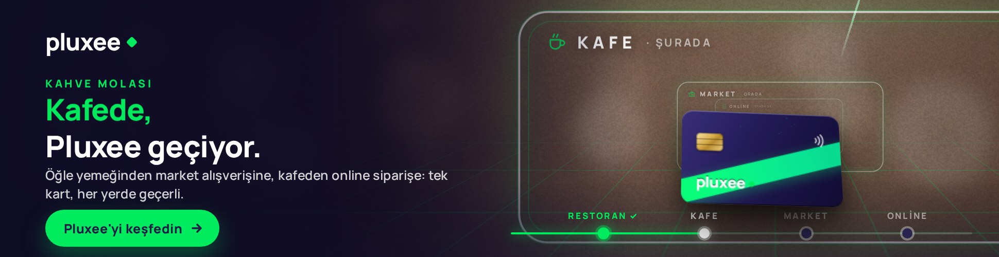
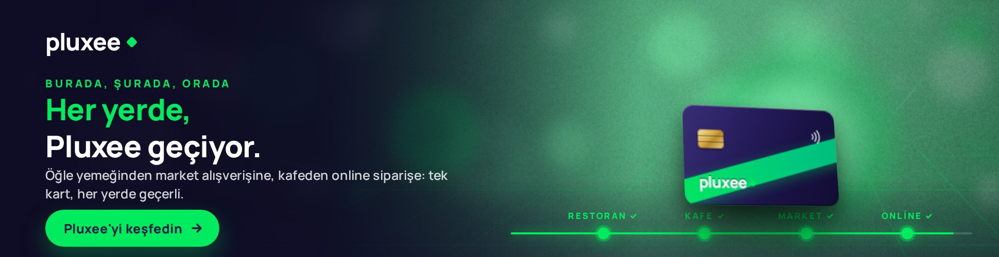
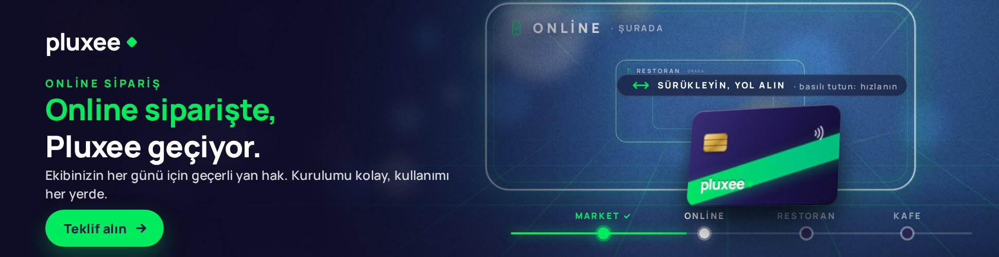
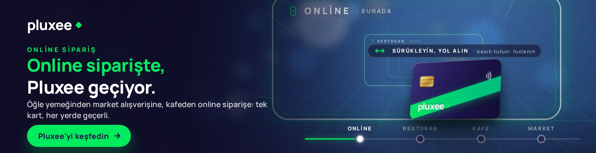
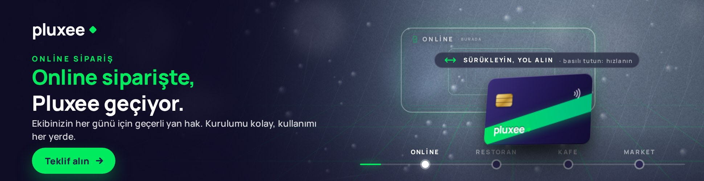

# Pluxee "Geçiyor" – Media-first interaktif masthead (970 × 250)

Media-first konsept çalışması. Kampanyanın ana fikri "Pluxee geçiyor: burada, şurada, orada". Masthead, **"geçiyor"un kelime anlamını** sahneye taşır: Pluxee kartı perspektifli bir ışık koridorunda kabul noktalarının kapılarından geçer. Kullanıcı sürükleyerek yol alır, basılı tutup hızlanır, imleçle koridoru yönlendirir; her kapıda yeşil flaş ve "Geçti ✓". Medya veri katmanının **segment** sinyali kimin izlediğini (beyaz yaka, İK, işveren), **saat** sinyali hangi kapının önce geldiğini belirler. Tek HTML kreatif, 12 versiyon.

| Çıktı | Dosya |
|---|---|
| **Ana teslim** – koridor sürümü, yayına hazır tek dosya | `dist/970x250/index.html` |
| Reklam ağı paketi | `dist/zip/pluxee-970x250.zip` |
| Sunum sayfası (kreatif gömülü, tek dosya: sinyal paneli, karar zinciri, sinyal→kreatif haritası) | `preview/index.html` |
| Ekran görüntüleri | `preview/screens/` |
| Arşiv: POS'a sürükle-okut sürümü | `dist/970x250-pos/index.html` |
| Arşiv: ilk taslak (illüstrasyon) | `dist/970x250-flat/index.html` |

## Ekran görüntüleri

| Açılış: "Sürükleyin, yol alın" ipucu | Kapıya yaklaşma |
|---|---|
|  |  |

| Kapıdan geçiş: flaş + "Geçti ✓" | Kullanıcı sürüklüyor: hız çizgileri |
|---|---|
|  |  |

| Final: koridor açılır, "Her yerde, Pluxee geçiyor." | Akşam · İK – Market kapısıyla açılır |
|---|---|
|  |  |

| Gece · beyaz yaka – Online kapısı | Yağmur · İK – Online öne alınır |
|---|---|
|  |  |

## Kurgu

- **Sol sütun:** Pluxee logosu, sahne başlığı (ÖĞLE YEMEĞİ / KAHVE MOLASI / MARKET ALIŞVERİŞİ / ONLİNE SİPARİŞ), kinetik kelime + sabit satır: *Restoranda, / Pluxee geçiyor.* → *Kafede,* → *Markette,* → *Online siparişte,* → finalde **Her yerde, Pluxee geçiyor.**
- **Koridor:** kaçış noktasına doğru daralan yeşil zemin ızgarası, perspektifle yaklaşan dört kapı (ince ışık çerçeveleri; etiket + ikon + "burada / şurada / orada / orada da"), kaçış noktasından fışkıran hız çizgileri, sahneye göre değişen fotoğrafik bokeh arka plan. Ön planda 3B Pluxee kartı hafifçe süzülür, hızlanınca öne eğilir.
- **Geçiş:** kart bir kapıdan geçerken çerçeve beyaz-yeşil flaş verir, kapının içinde büyük **"Geçti ✓"** rozeti belirip kaybolur, kartın yeşil bandı parlar, sahne kısaca sarsılır, parçacıklar yayılır, rota noktası yeşile döner. Bir sonraki kapının başlığı ve kelimesi gelir.
- **Final:** son kapıdan sonra kaçış noktasında yeşil-beyaz portal büyüyüp koridoru doldurur; başlık "Burada, şurada, orada / Her yerde, Pluxee geçiyor.", CTA nabız atar, rota tamamlanır, "Tekrar geç" görünür.
- **Otomatik gösterim:** dokunulmazsa koridor 17 sn'de kendiliğinden kat edilir, final 3 sn (toplam ≈ 21 sn, Google Ads 30 sn kuralı); sonra final karesinde durur.
- Konum, nokta sayısı ve gün içi zaman etiketleri **kullanılmaz**; dil kurumsaldır.

## Etkileşim

- **Sürükleme:** koridor alanında yatay sürükleme ileri/geri götürür (sola: ileri; 470 px ≈ tüm koridor). Bırakınca atalet ile devam eder, 1,4 sn sonra otomatik uçuşa döner. Geçilen kapılar sayılır, geri gidince sayım korunur.
- **Basılı tutma:** hareket etmeden basılı tutmak hızı 3× artırır; hız çizgileri yoğunlaşır, kart öne eğilir. **Kısa dokunma** ileri sıçratır.
- **Yönlendirme:** imleç konumu kaçış noktasını kaydırır (paralaks), kart imlece doğru eğilir.
- **Rota noktaları:** alttaki noktalara tıklamak ilgili kapının önüne götürür. Finalde **"Tekrar geç"**. Kullanıcı oynadıysa otomatik döngü yapılmaz.
- **CTA ve sol sütun** reklam çıkışıdır: `window.clickTag` varsa o, `Enabler` varsa `Enabler.exit('CTA')`, yoksa Pluxee ana sayfası (`https://www.pluxee.com.tr/`). Koridordaki hareket ve tıklamalar reklam çıkışı **değildir**; etkileşim olarak ölçülür.
- Klavye: ← → ileri/geri, boşluk hızlandırır, Enter tıklama. `prefers-reduced-motion` açıksa doğrudan final karesi.

## Sinyaller ve parametreler

| Sinyal | Parametre | Kaynak (yayında) | Kreatifte değişen |
|---|---|---|---|
| Segment | `seg=wc` (beyaz yaka) · `hr` (İK) · `emp` (işveren / karar verici) | 1. parti kitle segmenti + mecra bağlamı | Alt metin, CTA |
| Saat | `h=0-23`, `m=0-59` | Ad server saat makrosu; yoksa cihaz saati | İlk kapı ve kapı sırası, ışık atmosferi |
| Hava | `w=sun\|rain` (isteğe bağlı) | Hava durumu API | Yağmurda online sipariş kapısı öne alınır |
| Sunum | `demo=1` | – | Sinyal çubuğu (sadece sunumda) |

Örnek: `dist/970x250/index.html?seg=hr&h=19&m=5`

- Ad server makroları doğrudan bu parametrelere bağlanır; alternatif olarak `<script>window.__PLUXEE_SIGNALS={seg:'hr'}</script>` ile enjekte edilebilir.
- Her gösterim `SEGMENT-İLKKAPI` biçiminde bir varyant kimliği taşır (`HR-MARKET`, `WC-ONLINE-RAIN`); ölçüm etiketi olarak raporlanır.

### postMessage API (sunum ve entegrasyon)

Gelen: `{type:'pluxee:signals', signals:{seg,hour,minute,weather,demo}}`, `{type:'pluxee:replay'}`, `{type:'pluxee:demo', on:true}`.
Giden: `{type:'pluxee:state', variant, lead, order, idx, next, t, phase, hint, userPlayed, visited, total, finalState, ended, copy, signals}` ve gömülü modda tıklamada `{type:'pluxee:click', url}`. Sayfa içinden `window.PLUXEE.setSignals({...})`, `window.PLUXEE.replay()`, `window.PLUXEE.state()` da kullanılabilir.

## Kopya

Tüm metinler **`src/data.js`** içindedir: sahneler ve segment metinleri `cinematic` altında (ortak), koridora özgü kelimeler ve süreler `corridor` altında:

```js
corridor.words  = { restoran: 'Restoranda,', kafe: 'Kafede,', market: 'Markette,', online: 'Online siparişte,' }
corridor.line2  = 'Pluxee geçiyor.'
corridor.final  = { title: 'Burada, şurada, orada', word: 'Her yerde,' }
cinematic.segments.hr = { sub: 'Ekibinizin her günü için geçerli yan hak. …', cta: 'Teklif alın' }
```

Düzenleyip `node pluxee/build.js` çalıştırmak yeterlidir. "Vergi avantajıyla" gibi ifadeler marka ve hukuk onayına tabidir.

## Derleme ve test

```bash
node pluxee/build.js                                   # dist/ ve preview/index.html
NODE_PATH=$(npm root -g) node pluxee/tools/smoke.js    # sinyal, sürükleme, basılı tutma, rota, tıklama, API, 30 sn (Playwright)
NODE_PATH=$(npm root -g) node pluxee/tools/capture.js  # preview/screens/*.jpg
```

Kök `package.json` içinden: `npm run pluxee:build`, `npm run pluxee:test`, `npm run pluxee:capture`.

## Teknik notlar

- 970×250 HTML5, tek dosya (~41 KB); satır içi CSS + ES5 JS. Koridor, kapılar ve ışınlar DOM + CSS 3B dönüşümleriyle, arka planlar yükleme anında canvas ile üretilir (görsel dosyası ve WebGL yok). Tek harici kaynak Google Fonts (Manrope); Google Ads ve DV360'ta izinlidir, gerekirse `@font-face` ile gömülür.
- Animasyon tek `requestAnimationFrame` döngüsünde çalışır; etkileşim yokken ve final sonrası döngü durur.
- `<meta name="ad.size">`, `role`/`aria` etiketleri ve klavye odağı mevcuttur.
- **Google Ads / CM360:** `dist/zip/pluxee-970x250.zip` doğrudan yüklenir (`clickTag`). **DV360 / Studio:** `Enabler` algılanır; Studio'ya yüklenecekse `<head>` içine `Enabler.js` satırı eklenir. **Diğer ağlar:** `openLink()` içindeki `window.clickTag` satırı ağın makrosuna çevrilir.
- Marka varlıkları temsilidir (pluxee.com.tr'ye erişilemedi): logo metin olarak, palet Pluxee lacivert (#221C46) + yeşil (#00EB5E). Resmi logo SVG'si `.logo` bloğuna, resmi kart tasarımı `.card .face` bloğuna yerleştirilir.

## Arşiv sürümleri

- `dist/970x250-pos/` – **POS'a sürükle-okut**: kullanıcı kartı POS cihazına sürükler, "Onaylandı" olur, sahne değişir (`src/template-cinematic.js`).
- `dist/970x250-flat/` – **ilk taslak**: illüstrasyon dilinde gün sokağı (`src/template.js`).

## Klasör yapısı

```
pluxee/src/data.js               Kopya, sahneler, segmentler, süreler
pluxee/src/template-corridor.js  Ana kreatif motoru (koridor)
pluxee/src/template-cinematic.js POS sürükle-okut sürümü (arşiv)
pluxee/src/template.js           İlk taslak (arşiv)
pluxee/src/showcase.html         Sunum sayfası şablonu (build.js kreatifi içine gömer)
pluxee/build.js                  dist/ + preview/index.html üretici
pluxee/dist/970x250/             Yayına hazır kreatif (ana teslim)
pluxee/dist/zip/                 Reklam ağı paketleri
pluxee/preview/                  Sunum sayfası + ekran görüntüleri
pluxee/tools/smoke.js            Duman testi (Playwright)
pluxee/tools/capture.js          Ekran görüntüleri (Playwright)
pluxee/tools/fonts.js            Google Fonts önbelleği (yalıtılmış ortamlar için)
```
