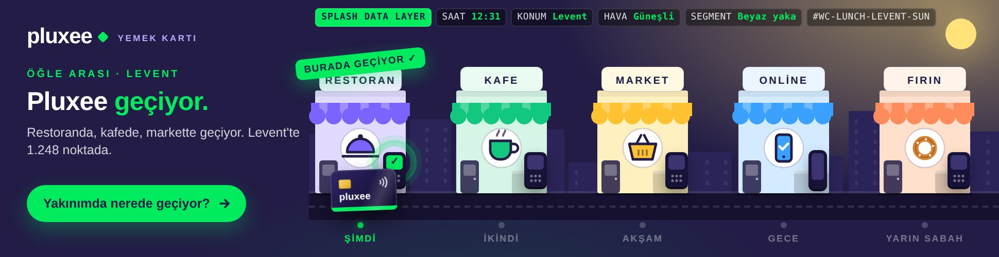
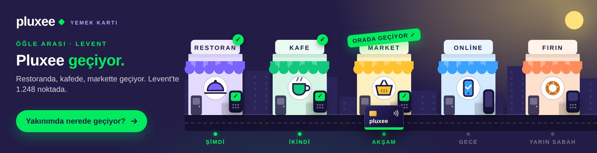
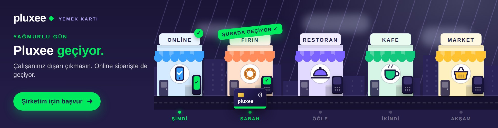

# Pluxee "Geçiyor" – Media-first interaktif masthead (970 × 250)

**Splash Digital** konsept çalışması. Kampanyanın ana fikri "Pluxee geçiyor: burada, şurada, orada, her yerde". Bu masthead o cümleyi herkese aynı şekilde söylemek yerine, **Splash'in sinyalleriyle her kullanıcının o anına, konumuna ve rolüne göre yeniden kurar**: tek HTML kreatif, 144 versiyon.

| Çıktı | Dosya |
|---|---|
| Yayına hazır kreatif (tek dosya, 44 KB, harici kaynak yok) | `dist/970x250/index.html` |
| Reklam ağı paketi | `dist/zip/pluxee-970x250.zip` |
| Sunum sayfası (kreatif gömülü, tek dosya, sinyal paneli + karar zinciri) | `preview/index.html` |
| Ekran görüntüleri | `preview/screens/` |

## Ekran görüntüleri

| Öğle · beyaz yaka · Levent – ilk dokunuş | Aynı versiyon – üçüncü durak |
|---|---|
|  |  |

| Final karesi – "Her yerde geçiyor." | Akşam 19:05 · İK · Kadıköy |
|---|---|
|  |  |

| Yağmur · işveren · Çankaya | Gece 23:45 · beyaz yaka · Alsancak |
|---|---|
|  |  |

## Kurgu

Sağdaki "gün sokağı"nda beş vitrin vardır: **Fırın, Restoran, Kafe, Market, Online**. Pluxee kartı yolda ilerler, her vitrinin POS cihazına dokunur; cihaz yeşile döner, halka yayılır ve vitrinin üstüne damga düşer: **"burada geçiyor ✓" → "şurada geçiyor ✓" → "orada geçiyor ✓" → "orada da geçiyor ✓" → "her yerde geçiyor ✓"**. Beşinci damgayla başlık **"Her yerde geçiyor."** olur ve CTA nabız atar.

- Kart **"şu an"ın durağından** başlar: 12:31'de Restoran'dan, 19:05'te Market'ten, 23:45'te Online'dan. Vitrinlerin altındaki zaman çizgisi günün kalanını gösterir (*şimdi → ikindi → akşam → gece → yarın sabah*).
- Gökyüzü ve güneş/ay saate göre değişir; yağmurda bulutlar ve yağmur çizgileri gelir, **Online** durağı öne alınır.
- Sol sütundaki üst satır, alt başlık ve CTA segmente göre yazılır (bkz. kopya matrisi).
- Otomatik oynatma: tur ≈ 13,5 sn, en fazla 2 tur (≈ 27 sn, Google Ads 30 sn kuralı), sonra final karesinde durur.

## Etkileşim

- **Fare / parmak sokağa girince** otomatik oynatma durur, kart imleci takip eder; bir vitrinin önünden geçerken dokunur ve damgalar. Tüm duraklar kullanıcı eliyle tamamlanırsa final karesi gelir.
- Sokaktan ayrılınca 1,5 sn sonra kaldığı yerden otomatik devam eder.
- **Vitrine tıklama** kartı oraya götürür. Sokaktaki hareket ve tıklamalar reklam çıkışı **değildir**; etkileşim olarak ölçülür.
- **CTA ve sol sütun** reklam çıkışıdır: `window.clickTag` varsa o, `Enabler` varsa `Enabler.exit('CTA')`, yoksa UTM'li Pluxee sayfası.
- Klavye: ← → duraklar, Enter tıklama. `prefers-reduced-motion` açıksa doğrudan final karesi.

## Sinyaller ve parametreler

| Sinyal | Parametre | Kaynak (yayında) | Kreatifte değişen |
|---|---|---|---|
| Segment | `seg=wc` (beyaz yaka) · `hr` (İK) · `emp` (işveren / karar verici) | Splash 1. parti kitle + mecra bağlamı | Üst satır, alt başlık, CTA |
| Saat | `h=0-23`, `m=0-59` | Ad server saat makrosu; yoksa cihaz saati | Başlangıç durağı, zaman çizgisi, gökyüzü |
| Konum | `geo=levent\|maslak\|kadikoy\|atasehir\|cankaya\|alsancak\|nilufer\|none` | IP / GPS → ilçe; Pluxee üye işyeri sayısı (API) | Konum adı ve nokta sayısı |
| Hava | `w=sun\|rain` | Hava durumu API | Online önceliği, atmosfer, "dışarı çıkma" kopyası |
| Sunum | `demo=1` | – | Sinyal çubuğu (sadece sunumda) |

Örnek: `dist/970x250/index.html?seg=hr&h=19&m=5&geo=kadikoy&w=sun`

- Ad server makroları doğrudan bu parametrelere bağlanır; alternatif olarak `<script>window.__PLUXEE_SIGNALS={seg:'hr',geo:'kadikoy'}</script>` ile enjekte edilebilir.
- Sözlükte olmayan bir ilçe gelirse "… civarında binlerce noktada", konum yoksa "Türkiye genelinde binlerce noktada" yazılır. Nokta sayıları **demo amaçlıdır**; yayında Pluxee verisiyle beslenir.
- Her gösterim `SEG-AN-KONUM-HAVA` biçiminde bir varyant kimliği taşır (`HR-EVENING-KADIKOY-SUN`); ölçüm etiketi olarak raporlanır.

### postMessage API (sunum ve entegrasyon)

Gelen: `{type:'pluxee:signals', signals:{seg,hour,minute,geo,weather,demo}}`, `{type:'pluxee:replay'}`, `{type:'pluxee:demo', on:true}`.
Giden: `{type:'pluxee:state', variant, moment, order, labels, visited, total, finalState, ended, copy, signals, geo}` ve gömülü modda tıklamada `{type:'pluxee:click', url}`. Sayfa içinden `window.PLUXEE.setSignals({...})`, `window.PLUXEE.replay()`, `window.PLUXEE.state()` da kullanılabilir.

## Kopya matrisi

Tüm metinler, segmentler, anlar, konum sözlüğü ve süreler **`src/data.js`** içindedir. Örnek:

```js
copy.hr.evening = { top: 'Mesai bitti', sub: 'Market alışverişinde de geçiyor. Ekibiniz için gerçek fayda.' }
segments.hr.cta = 'Ekibim için teklif al'
```

Yer tutucular: `{geo}` ilçe adı, `{loc}` bulunma hâli ("Kadıköy'de"), `{n}` nokta sayısı. Her segmentte 5 an + yağmur + final kopyası vardır. Yeni bir an ya da segment eklemek için ilgili nesneyi genişletmek yeterlidir.

## Derleme ve test

```bash
node pluxee/build.js                                   # dist/970x250/index.html, zip ve preview/index.html
NODE_PATH=$(npm root -g) node pluxee/tools/smoke.js    # sinyal, etkileşim, tıklama, API, 30 sn kontrolü (Playwright)
NODE_PATH=$(npm root -g) node pluxee/tools/capture.js  # preview/screens/*.jpg
```

Kök `package.json` içinden: `npm run pluxee:build`, `npm run pluxee:test`, `npm run pluxee:capture`.

## Teknik notlar

- 970×250 HTML5, satır içi CSS + JS + SVG; harici font ve kütüphane yok (sistem yazı tipi yığını). `<meta name="ad.size">`, `role`/`aria` etiketleri ve klavye odağı mevcuttur.
- Tarayıcı tarafı JS ES5 ile yazıldı (reklam ağı doğrulayıcıları için).
- **Google Ads / CM360:** `dist/zip/pluxee-970x250.zip` doğrudan yüklenir (`clickTag`). **DV360 / Studio:** `Enabler` algılanır; Studio'ya yüklenecekse `<head>` içine `Enabler.js` satırı eklenir. **Diğer ağlar:** `openLink()` içindeki `window.clickTag` satırı ağın makrosuna çevrilir.
- Marka varlıkları temsilidir: bu ortamın ağ politikası pluxee.com.tr'ye erişime izin vermediği için logo metin olarak, palet Pluxee'nin lacivert (#221C46) + yeşil (#00EB5E) kimliğine göre kuruldu. Resmi logo SVG'si `src/template.js` içindeki `.logo` bloğuna, marka fontu `body` yazı tipi yığınına eklenir.
- Kopyalar (özellikle "vergi avantajıyla") marka ve hukuk onayına tabidir.

## Masthead'in ötesi: aynı fikirden türeyen özel proje başlıkları

- **"Yakınımda nerede geçiyor?"** – CTA masthead içinde açılan bir liste/haritaya dönüşür; kullanıcının ilçesindeki üye işyerleri Pluxee API'sinden gelir. Reklamdan çıkmadan cevap.
- **Öğle arası senkronu** – Splash ağındaki tüm mastheadler 12:00–13:30 arasında aynı anda "öğle" moduna geçer; ortak sayaç "şu an X noktada Pluxee geçiyor" (Pluxee işlem verisiyle).
- **İK için teklif akışı** – İK / karar verici segmentinde CTA, masthead içinde iki adımlık mini form açar (çalışan sayısı → tahmini fayda); lead doğrudan Pluxee'ye düşer.

## Klasör yapısı

```
pluxee/src/data.js        Kopya matrisi, segmentler, anlar, konum sözlüğü, süreler
pluxee/src/template.js    Kreatif motoru (CSS + ES5 JS + SVG vitrinler)
pluxee/src/showcase.html  Sunum sayfası şablonu (build.js kreatifi içine gömer)
pluxee/build.js           dist/ + preview/index.html üretici
pluxee/dist/970x250/      Yayına hazır kreatif
pluxee/dist/zip/          Reklam ağı paketi
pluxee/preview/           Sunum sayfası + ekran görüntüleri
pluxee/tools/smoke.js     Duman testi (Playwright)
pluxee/tools/capture.js   Ekran görüntüleri (Playwright)
```
