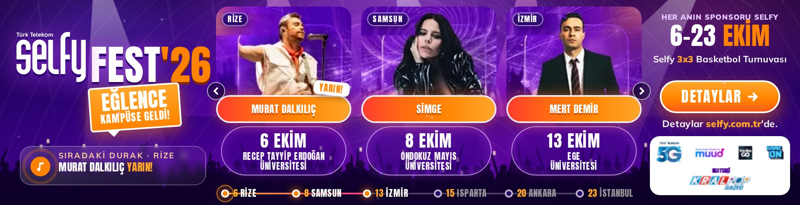
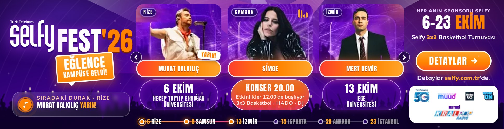
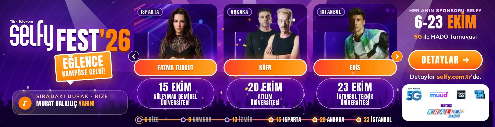

# Selfy Fest '26 – 970×250 İnteraktif Masthead

Yönlenen sayfa: [selfy.com.tr/kampanyalar/selfyfest26](https://www.selfy.com.tr/kampanyalar/selfyfest26) · Müşterinin 300×250 / 320×50 GIF'leri ve kampanya afişi (fest26.webp) temel alınmıştır.

| Dosya | Açıklama |
|---|---|
| `dist/970x250/index.html` | Yayına hazır tek dosya (120 KB; görseller + fontlar gömülü, harici istek yok) |
| `dist/selfyfest26-970x250.zip` | Google Ads / CM360 / DV360 yükleme paketi (77 KB) |
| `preview/*.jpg`, `preview/masthead.mp4` | Sunum için ekran görüntüleri ve kayıt |





## Kurgu

- **Açılış (0–2 sn):** Sahne flaşı, ışık huzmeleri yanar; Selfy FEST'26 logosu zıplayarak gelir, "EĞLENCE / KAMPÜSE GELDİ!" etiketi yapışır, sağ panel ve CTA açılır, konfeti patlar.
- **Tur slider'ı:** 6 konser 3'erli iki sayfada; kartlar sırayla 3B dönerek girer. 4,6 sn'de bir sayfa değişir; 30 sn sonra otomatik geçiş durur ve sıradaki konserin bulunduğu sayfada kalır (Google Ads 30 sn kuralı).
- **Kart tasarımı:** Afişteki düzenle birebir: şehir etiketi, sanatçı fotoğrafı, turuncu isim kapsülü, tarih + üniversite cam kutusu.

## Etkileşim

- **Karta gelince:** Sahne ışıkları o sanatçıya döner, fotoğraf yakınlaşır, ekolayzır çubukları oynar. Bilgi kutusu dönerek günün akışını gösterir: "KONSER 20.00 / Etkinlikler 12.00'de başlıyor / 3x3 Basketbol · HADO · DJ".
- **Tur rotası (alt şerit):** 6 durak (6 Rize → 23 İstanbul); tıklayınca ilgili sayfaya gider, üzerine gelince ilgili kart vurgulanır. İlerleme çizgisi turu takip eder.
- **"Sıradaki durak" sayacı:** Gerçek tarihe göre hesaplanır ("YARIN!", "BUGÜN!", "5 GÜN KALDI"). Kartlarda "SIRADAKİ / YARIN / GERÇEKLEŞTİ" rozetleri de tarihe göre değişir; kampanya boyunca kreatif güncel kalır.
- **Fare:** İmleç sahnede bir spot ışığı gibi gezer; kalabalık ve ışıklar hafif paralaks yapar. CTA'ya gelince konfeti patlar.
- **Oklar, klavye (← →, Enter), mobilde kaydırma.**
- **Tıklama:** Bannerın tamamı tıklanabilir. Sırayla `Enabler.exit` (Studio), `window.clickTag` ve UTM'li kampanya adresi kullanılır. Oklar ve rota tıklaması çıkışı tetiklemez.
- Sağ panelde dönen etkinlik bandı: 6 şehir / 6 kampüs, Selfy 3x3 Basketbol, 5G ile HADO, sürpriz hediyeli yarışmalar.

## Teknik

- Fontlar sitedekiyle aynı: **Anton** (başlık) ve **Mulish** (metin). Siteden alınıp Türkçe karakter setine indirgendi (`pyftsubset`) ve base64 gömüldü.
- Görseller kampanya afişinden (fest26.webp) kırpıldı: 6 sanatçı (WebP), arka plan halka/ışık dokusu. Afişteki büyük şehir etiketleri `tools/clean_chips.py` ile fotoğraflardan silindi (yalnızca etiket pikselleri değiştirilir, sanatçılar korunur); yerine küçük etiketler kullanıldı. Logo sitedeki `logo.svg`. Sponsor şeridi müşterinin GIF'inden alındı.
- `<meta name="ad.size">`, `clickTag`, `role="link"`, aria etiketleri, `prefers-reduced-motion` desteği.
- Kodda dış istek yok; yalnızca Chrome/Safari/Firefox'un yerleşik özellikleri kullanılır (canvas, CSS 3B).

## Düzenleme

Metinler, sanatçılar, tarihler, CTA adresi: `src/data.js`. Tasarım: `src/masthead.html`.

```bash
node selfyfest26/build.js                                     # dist/ yeniden üretir (150 KB kontrolü yapar)
NODE_PATH=$(npm root -g) node selfyfest26/tools/capture.js    # ekran görüntüleri + etkileşim testi
NODE_PATH=$(npm root -g) node selfyfest26/tools/record.js     # önizleme videosu
```

`source/` klasörü, kampanya sayfasının GitHub Actions ile alınmış kopyasıdır (`.github/workflows/selfyfest-scrape.yml`; bulut ortamı siteye doğrudan erişemediği için).

> Not: Sponsor şeridi 300×250 GIF'ten alındığı için düşük çözünürlüklü. Müşteriden sponsor logolarının vektör/PNG halleri gelirse `assets/sponsors-1.png` ve `assets/sponsors-2.png` değiştirilip `build.js` yeniden çalıştırılmalı.
