# Superonline – 1000 Mbps Masthead (970×250)

"**HIZ KADRAJA SIĞMIYOR**" fikri üzerine kurulu, media-first HTML5 masthead çalışmaları. Üç sürüm:

| Sürüm | Dosya | Konsept |
|---|---|---|
| **KADRAJ (yeni konsept)** | [`970x250-kadraj/index.html`](970x250-kadraj/index.html) | Banner bir vizördür. Sarı zemin, siyah tipografi; köşe braketleri sayacı çerçevede tutmaya çalışır, 1000'de rakam kadrajı kırar. Etkileşim: **imleci sağa kaydır = hızlan**. |
| Hız göstergesi – etkileşimli | [`970x250/index.html`](970x250/index.html) | Koyu lacivert zemin, sarı vurgu, yay göstergesi. Etkileşim: **basılı tut = hızlan**. |
| Hız göstergesi – otomatik | [`970x250-autoplay/index.html`](970x250-autoplay/index.html) | Aynı kurgu, etkileşimsiz 12 sn'lik akış. |

Hepsi tek dosya: tüm CSS ve JS içeride, Canvas yok, harici framework / CDN / görsel yok (logo base64, ikonlar satır içi SVG). Etkileşimli sürümlerde 4 sn içinde etkileşim yoksa otomatik oynatma devreye girer.

Kampanya sayfası: <https://www.superonline.net/ev-interneti/fiber-internet/onlinea-ozel-fiber-hizlari-kampanyasi/1000-mbps>

## KADRAJ konsepti (`970x250-kadraj/`)

| Durum | Ne olur |
|---|---|
| **Bekleme** | Superonline sarısı zemin. Sol üstte vizör HUD'u ("● REC · KADRAJ 970 × 250"), sağ üstte tek renk logo. Solda 132 px siyah sayaç "100 Mbps", etrafında ince siyah köşe braketleri ve orta çentikler. Altta 100 · 200 · 500 · 750 · 1000 kademeli hız rayı ve topuz; sağda "HIZLANMAK İÇİN SAĞA KAYDIR →". |
| **Kaydırma** | İmleç (veya parmak) banner üzerinde sağa gittikçe topuz onu izler, sayaç üstel eğriyle yükselir. Rakam hafifçe büyür ve öne yatar (skew), arkasında siyah motion-blur hayaletleri; braketler rakamı takip ederek genişler, %35'ten sonra titremeye başlar; beyaz/koyu hız çizgileri hızlanır. İmleç çekilirse hız geri düşer. Ok tuşları da çalışır. |
| **1000 – kadraj kırılır** | Braketler bir anda banner'ın köşelerine sıçrar (kadraj = banner), zemin siyaha döner, flaş; "1000" sarıya dönüp 3,4 kat büyüyerek dört yandan taşar, 2,75 katta üstten alta dayanarak oturur; braketler köşelerden dışarı fırlayıp kaybolur. |
| **Mesaj** | Dev rakam %12'ye söner, üzerine "Online'a Özel Fiber İnternet". |
| **Kullanım şeridi** | Ortada sarı bir şerit açılır; FİLM • OYUN • DOWNLOAD • UPLOAD • ÇOKLU CİHAZ siyah tipografiyle 1500 px/sn hızla akıp yavaşlayarak durur. |
| **Final** | Şerit tüm banner'a açılır (sarı final zemini). Logo, "ONLINE'A ÖZEL" siyah etiket, "1000 Mbps Fiber İnternet", 950 TL/ay + koşullar, siyah "HEMEN BAŞVUR" pill (hover: yükselir, ok kayar, parlama), sağ altta "TEKRAR DENE". Arkada çizgi kontur "1000". |
| **Otomatik** | 4 sn etkileşim yoksa topuz 2,4 sn'de kendiliğinden sağa kayar; etkileşimsiz izleyici için impact ≈ 6,6 sn, final ≈ 11,7 sn, 13,8 sn'de sabit. |

Tıklama: her yerde tek tıklama kampanya sayfasını açar (kaydırma tıklama gerektirmediği için çakışma yoktur). Ekran görüntüleri: [`preview-kadraj/`](preview-kadraj/)

| Bekleme | Kaydırma | Kadraj kırılır |
|---|---|---|
| 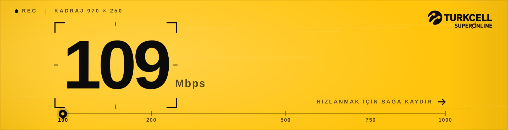 | 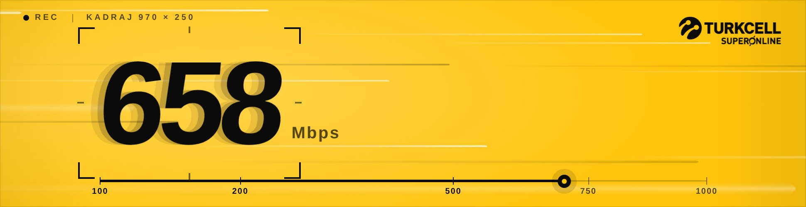 | 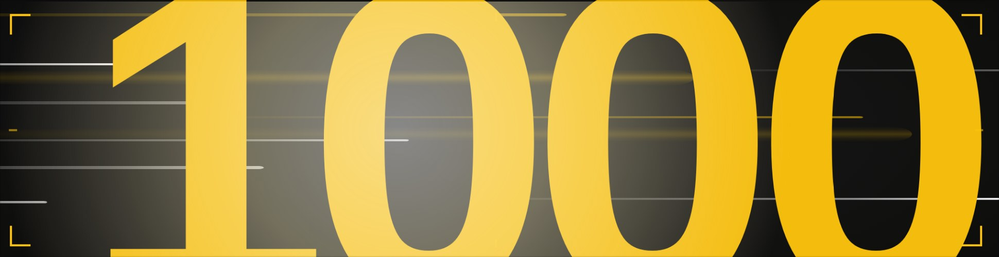 |

| Taşma | Şerit | Final |
|---|---|---|
| 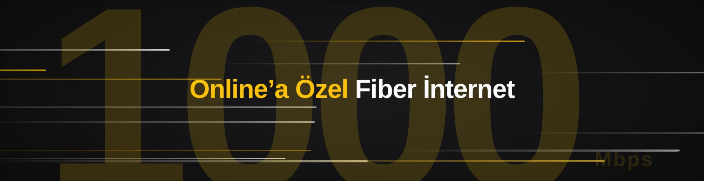 | 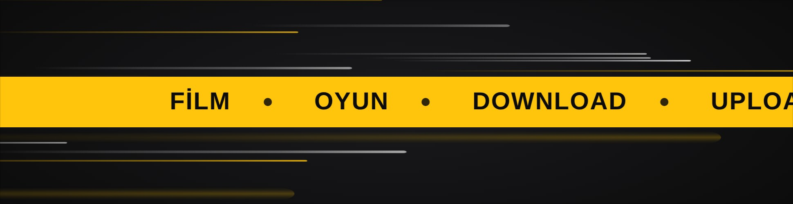 | 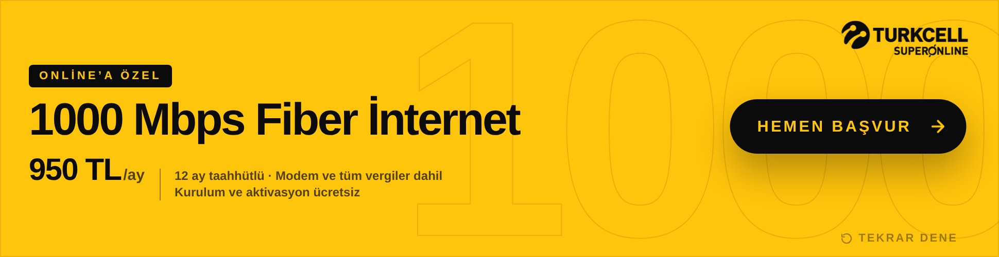 |

KADRAJ'da ayarlanabilir alanlar (`CONFIG`): `autoplayAfter`, `railX0/railX1` (ray konumu), `curve` (ray → hız eğrisi), `follow` (takip hızı), `release` (bırakınca düşüş), `autoGlide` (otomatik kaydırma süresi), `words` (şerit kelimeleri), `logoDark` (tek renk koyu logo, base64), fiyat/koşul/URL; sahne zamanları `T`, şerit hızı `TICK_V0` / `TICK_DUR`.

## Hız göstergesi konsepti – etkileşimli kurgu (`970x250/`)

| Durum | Ne olur |
|---|---|
| **Bekleme (attract)** | Logo, ortada yay biçimli hız göstergesi ve 100–112 arasında "nefes alan" sayaç; sağda nabız halkalı **"BASILI TUT · HIZLAN"** pedalı (final CTA'sının konumunda). İmleç banner üzerinde gezerken hız çizgileri hafifçe paralaks yapar. |
| **Basılı tutma** | Pedala ya da banner'ın herhangi bir yerine basılı tutulunca sayaç üstel ivmeyle yükselir (≈2 sn'de 1000). Gösterge dolar, kademeler yanar, hız çizgileri hızlanıp uzar, rakamın arkasında sarı motion-blur hayaletleri belirir, pedalın içi dolar. Boşluk / sağ ok tuşu ve dokunmatik de çalışır. |
| **Bırakma** | Hız 100'e doğru hızla düşer; 300'ün üstünde bırakılırsa pedalın üstünde kısa bir **"BIRAKMA!"** uyarısı çıkar (en fazla 3 kez). Pedala kısa dokunuşlar anlık +90 Mbps verir (hızlı tıklayarak da çıkılabilir). |
| **1000 Mbps – wow moment** | Flaş, şok halkası, ışık süpürmesi, kamera sarsıntısı; "1000" sarıya dönüp 6,6 kat büyüyerek kadrajdan **taşar**, sonra üstten alta dayanan boyuta oturur; "Mbps" sağa itilir. Pedal kaybolur. |
| **Devamı** | "Online'a Özel Fiber İnternet" → FİLM · OYUN · DOWNLOAD · UPLOAD · ÇOKLU CİHAZ → final: "1000 Mbps Fiber İnternet", "Online'a Özel", 950 TL/ay, koşullar, sarı **HEMEN BAŞVUR** (pedalın yerinde belirir) ve sağ altta küçük **TEKRAR DENE**. |
| **Otomatik oynatma** | 4 sn içinde etkileşim yoksa pedal kendiliğinden basılı görünür ve aynı fizikle hızlanır: etkileşimsiz izleyici için toplam ≈13 sn, sonra final karesi sabit. |

Tıklama kuralları: kısa tıklama (≤220 ms, hız kazanımı yok) her yerde kampanya sayfasını açar; basılı tutma sonrası bırakma tıklama sayılmaz. Pedal tıklaması sayfaya gitmez. CTA her zaman sayfaya gider.

Ekran görüntüleri: [`preview/`](preview/) (etkileşimli), [`preview-autoplay/`](preview-autoplay/) (otomatik)

| Bekleme | Basılı tutma | Hızlı |
|---|---|---|
| 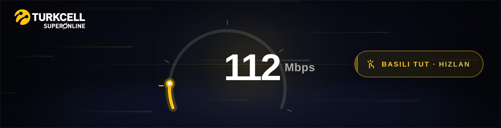 | 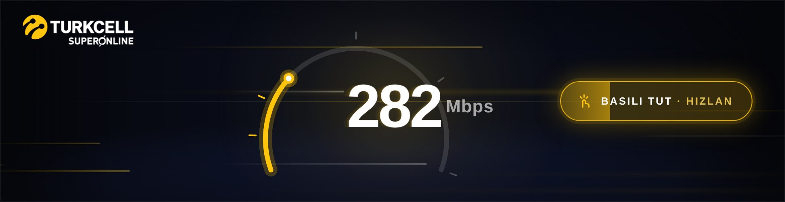 | 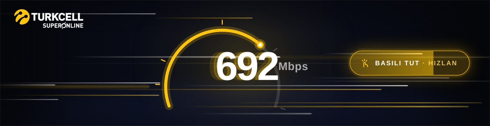 |

| Taşma (peak) | Mesaj | Final |
|---|---|---|
| 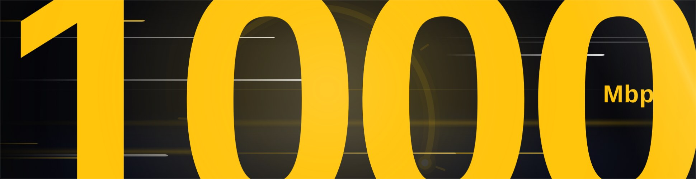 |  | 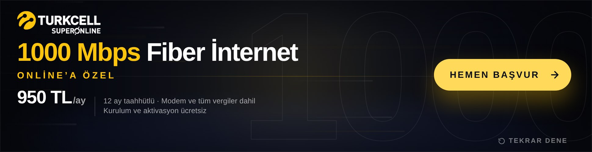 |

## Teknik

- 970×250 sabit alan, `<meta name="ad.size">` etiketi mevcut.
- Sahneler `#ad` üzerine eklenen sınıflarla (`s1`, `s3`, `s3b`, `s4`, `s4out`, `s5`, `done`, `auto`, `interacted`) CSS keyframe'lerini tetikler; sayaç fiziği, gösterge yayı, pedal dolgusu ve hız çizgileri `requestAnimationFrame` ile JS'ten sürülür (yalnızca `transform`/`opacity`, `will-change`, `contain:strict`). Final karesinde rAF durur.
- Giriş: Pointer Events (fare, dokunmatik, kalem), klavye (Boşluk / sağ ok), `touch-action:none`.
- Tıklama: tüm alan (`#exit`) ve CTA (`#cta`). `window.clickTag` / `clickTAG` tanımlıysa o URL, `Enabler` varsa `Enabler.exit('CTA', url)`, aksi hâlde `CONFIG.url` yeni sekmede açılır. `href` de kampanya URL'sini taşır.
- Hover: CTA hafif yükselir, ok kayar, parlama süpürmesi geçer; pedal parlar.
- `prefers-reduced-motion` açıksa doğrudan final karesine yakın başlar.
- Konsol hatası yok; Chromium'da Playwright ile doğrulandı: otomatik akış (impact 6,0 sn, final 10,8 sn, 12,8 sn'de sabit), basılı tutma (≈2 sn'de impact, tıklama bastırma), erken bırakma (hız düşüşü), kısa tıklama (sayfa açılır), pedal dokunuşları, klavye, Tekrar Dene, clickTag/Enabler.

## Kolay değiştirilecek alanlar (`970x250/index.html`)

| Ne | Nerede |
|---|---|
| Fiyat, birim, koşul metni, kampanya URL'si | `<script>` başındaki `CONFIG` nesnesi (`price`, `priceUnit`, `terms`, `url`) |
| Otomatik oynatma gecikmesi | `CONFIG.autoplayAfter` (sn) |
| Etkileşim fiziği | `accelBase`, `accelGain` (ivme), `decay` (bırakınca düşüş), `tapBoost` (kısa dokunuş) |
| Sayaç başlangıç / hedef değeri | `CONFIG.speedStart`, `CONFIG.speedMax` |
| Impact sonrası sahne zamanları | `T` nesnesi (`tag`, `uses`, `usesOut`, `final`, `end`) |
| Döngü (yalnızca otomatik akış) | `CONFIG.loop: true`, `loopHold`, `maxLoops` |
| Renkler | `:root` değişkenleri (`--yellow`, `--bg0`, `--bg1`, `--ink` …) |
| Logo | `CONFIG.logoWhite` (koyu zemin için negatif: yazı beyaz, işaret sarı – varsayılan) ve `CONFIG.logoColor` (orijinal renkli) base64 gömülü; kaynak: Turkcell Superonline PNG (301×88, CDN). `logoHeight`, `logoPlate` (renkli logo beyaz plakada), `logoInvert`. Yüklenemezse `#logo` içindeki tipografik yedek görünür. |
| Metinler | Pedal etiketi (`.pedal .lbl`), "BIRAKMA!" (`#hint`), `.tag`, `.use`, `.headline`, `.sub`, `.kicker`, CTA ve "TEKRAR DENE" doğrudan HTML'de |
| Gösterge kademeleri | `TICKS` dizisi |
| Hız çizgisi yoğunluğu | `makeStreaks()` içindeki `n` |

> **Doğrulama notu:** Bu banner'ın hazırlandığı ortamın ağ politikası `www.superonline.net` alan adına erişime izin vermedi. Fiyat (950 TL/ay), 12 ay taahhüt, "modem ve tüm vergiler dahil", "kurulum ve aktivasyon ücretsiz" bilgileri kampanya sayfasının arama motoru özetlerinden alındı; yayın öncesi sayfadaki güncel değerlerle karşılaştırılmalıdır. Logo, müşterinin CDN'e yüklediği Turkcell Superonline PNG'sinden alınıp base64 olarak gömüldü; koyu zemin için lacivert yazı beyaza çevrilmiş negatif sürüm üretildi (sarı işaret korundu), orijinal renkli sürüm `logoPlate` seçeneğiyle kullanılabilir.
