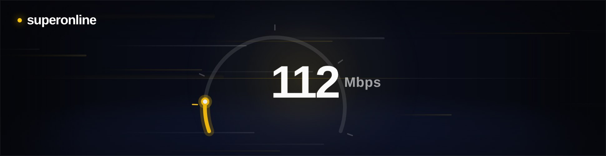
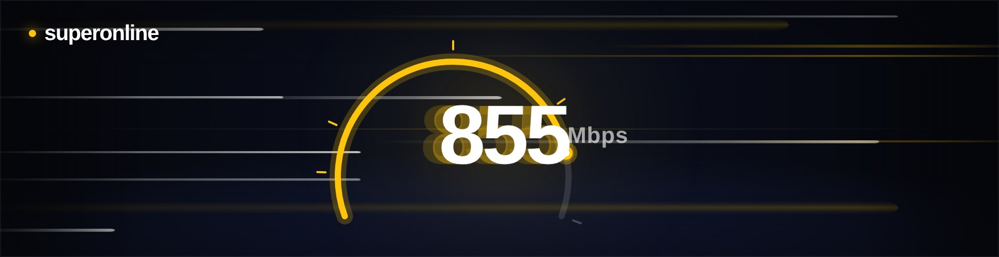
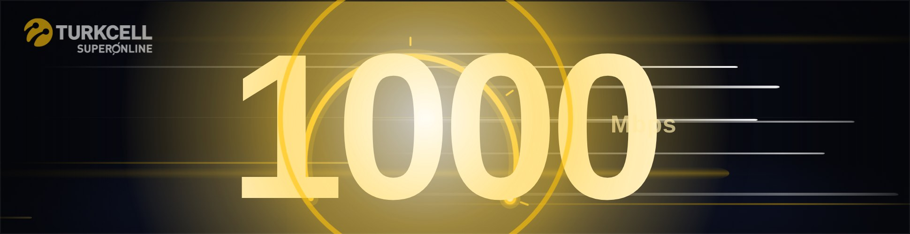
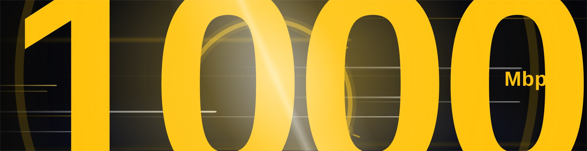
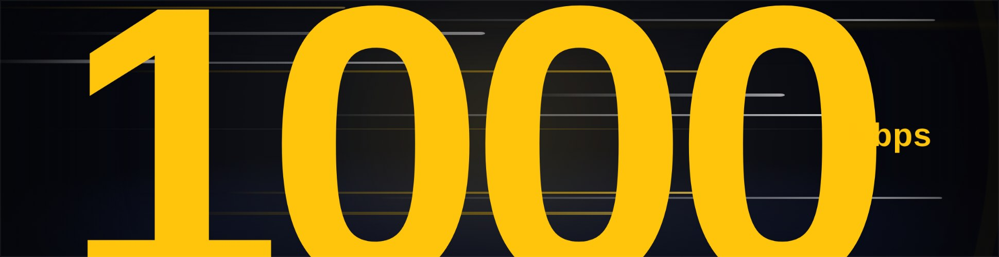
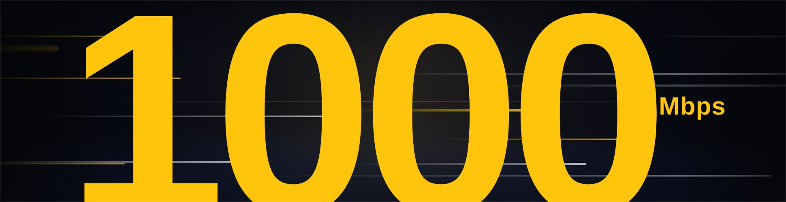
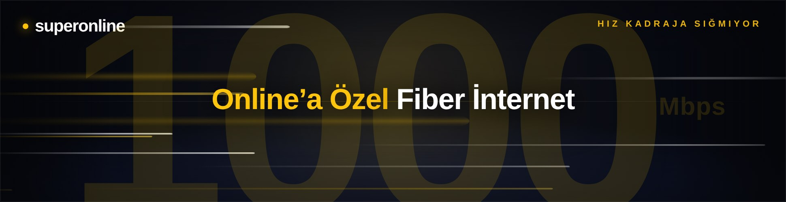
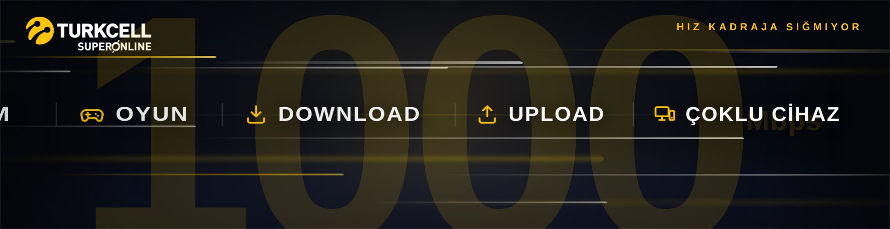
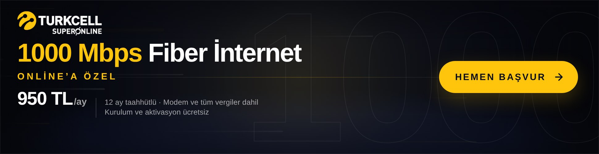

# Superonline – 1000 Mbps Masthead (970×250)

"**HIZ KADRAJA SIĞMIYOR**" fikri üzerine kurulu, media-first, animasyonlu HTML5 masthead.
Tek dosya: [`970x250/index.html`](970x250/index.html) – tüm CSS ve JS dosyanın içinde, Canvas yok, harici framework / CDN / görsel yok (logo ve ikonlar satır içi SVG/CSS).

Kampanya sayfası: <https://www.superonline.net/ev-interneti/fiber-internet/onlinea-ozel-fiber-hizlari-kampanyasi/1000-mbps>

## Kurgu (≈12 sn, sonra final karesinde sabit)

| Zaman | Sahne | Ne olur |
|---|---|---|
| 0,0 – 2,4 sn | **Giriş** | Koyu lacivert/siyah premium zemin, sol üstte logo, ortada yay biçimli hız göstergesi ve "100 Mbps" sayacı. Sayaç yavaşça ilerler (100 → 130), hız çizgileri ağır akar. |
| 2,4 – 5,2 sn | **Hızlanma** | Sayaç ivmelenerek 200 → 500 → 750 → 1000'e çıkar (küp eğrisi). Tempo değişkeni `v` sayaçla birlikte artar: hız çizgileri hızlanır, uzar ve parlar; rakamın arkasında sarı "motion blur" hayaletleri belirir; göstergedeki 100/200/500/750/1000 kademeleri geçildikçe yanar. |
| 5,2 – 6,1 sn | **Wow moment** | Flaş, genişleyen şok halkası, ışık süpürmesi ve kısa kamera sarsıntısı. "1000" sarıya dönüp 6,6 kat büyüyerek kadrajdan **taşar**, sonra 4,9 kata (üstten alta dayanacak boyuta) oturur; "Mbps" sağa itilir. |
| 6,1 – 7,7 sn | **Mesaj** | Dev rakam %13 opaklığa çekilir, üzerine "Online'a Özel Fiber İnternet" gelir; sağ üstte konsept satırı "HIZ KADRAJA SIĞMIYOR". |
| 7,7 – 9,9 sn | **Kullanım** | FİLM · OYUN · DOWNLOAD · UPLOAD · ÇOKLU CİHAZ sağdan, yatayda esneyerek (scaleX) art arda sıraya dizilir; sonra topluca sola süpürülür. |
| 9,9 – 12 sn | **Final / CTA** | Animasyon sakinleşir. Logo, "1000 Mbps Fiber İnternet", "Online'a Özel", fiyat (950 TL/ay), koşullar ve sarı "HEMEN BAŞVUR" butonu. Arka planda çizgi kontur "1000" dokusu. 12. saniyede rAF döngüsü durur, kare sabit kalır. |

Ekran görüntüleri: [`preview/`](preview/)

| Giriş | Hızlanma | Impact (flaş + halka) |
|---|---|---|
|  |  |  |

| Işık süpürmesi | Taşma (peak) | Oturmuş "1000 Mbps" |
|---|---|---|
|  |  |  |

| Mesaj | Kullanım | Final |
|---|---|---|
|  |  |  |

## Teknik

- 970×250 sabit alan, `<meta name="ad.size">` etiketi mevcut.
- Sahneler `#ad` üzerine eklenen sınıflarla (`s1`, `s3`, `s3b`, `s4`, `s4out`, `s5`, `done`) CSS keyframe'lerini tetikler; sayaç, gösterge yayı ve hız çizgileri `requestAnimationFrame` ile JS'ten sürülür (yalnızca `transform`/`opacity`, `will-change`, `contain:strict`).
- Tıklama: tüm alan (`#exit`) ve CTA (`#cta`) tıklanabilir. `window.clickTag` / `clickTAG` tanımlıysa o URL, `Enabler` varsa `Enabler.exit('CTA', url)`, aksi hâlde `CONFIG.url` yeni sekmede açılır. `href` de kampanya URL'sini taşır.
- Hover: CTA hafif yükselir, ok kayar, parlama süpürmesi geçer.
- `prefers-reduced-motion` açıksa doğrudan final karesine yakın başlar.
- Konsol hatası yok; Chromium'da Playwright ile doğrulandı (ekran görüntüleri, sabit final karesi, tıklama/clickTag/Enabler testleri).

## Kolay değiştirilecek alanlar (`970x250/index.html`)

| Ne | Nerede |
|---|---|
| Fiyat, birim, koşul metni, kampanya URL'si | `<script>` başındaki `CONFIG` nesnesi (`price`, `priceUnit`, `terms`, `url`) |
| Sayaç başlangıç / hedef değeri | `CONFIG.speedStart`, `CONFIG.speedMax` |
| Döngü | `CONFIG.loop: true`, `loopHold`, `maxLoops` (final karesinden sonra doğal fade ile başa döner) |
| Sahne zamanları | `T` nesnesi (`accel`, `impact`, `tag`, `uses`, `usesOut`, `final`, `end`) |
| Renkler | `:root` değişkenleri (`--yellow`, `--bg0`, `--bg1`, `--ink` …) |
| Logo | `CONFIG.logo` – varsayılan: `https://s.superonline.net/SiteAssets/Redesign/Superonline_2026_yeni_logo.png` (URL ya da base64 data URI verilebilir). `logoHeight` yükseklik (px), `logoPlate` koyu logo için beyaz plaka, `logoInvert` tek renkli koyu logoyu beyaza çevirir. Görsel yüklenemezse `#logo` içindeki tipografik yedek görünür. |
| Metinler | `.tag`, `.use`, `.headline`, `.sub`, `.kicker`, CTA metni doğrudan HTML'de |
| Gösterge kademeleri | `TICKS` dizisi |
| Hız çizgisi yoğunluğu | `makeStreaks()` içindeki `n` |

> **Doğrulama notu:** Bu banner'ın hazırlandığı ortamın ağ politikası `www.superonline.net` alan adına erişime izin vermedi. Fiyat (950 TL/ay), 12 ay taahhüt, "modem ve tüm vergiler dahil", "kurulum ve aktivasyon ücretsiz" bilgileri kampanya sayfasının arama motoru özetlerinden alındı; yayın öncesi sayfadaki güncel değerlerle karşılaştırılmalıdır. Logo olarak Superonline'ın kendi CDN'indeki 2026 logo PNG'si (`CONFIG.logo`) kullanılır; bu ortamdan `s.superonline.net` alan adına da erişilemediği için logonun koyu zemindeki görünümü (renk/plaka gereksinimi) doğrulanamadı, `logoPlate` / `logoInvert` seçenekleri bunun için hazırdır.
