# Superonline – 1000 Mbps Masthead (970×250)

"**HIZ KADRAJA SIĞMIYOR**" fikri üzerine kurulu, media-first HTML5 masthead çalışmaları. Üç sürüm:

| Sürüm | Dosya | Konsept |
|---|---|---|
| **SİL, NETLEŞSİN (önerilen teslim)** | [`970x250-net/index.html`](970x250-net/index.html) | Kullanıcı bugünkü internetini görür: pikselli, "yükleniyor %" diye takılan bir kadraj. İmleci sağa sürdükçe kadrajı siler; altından net, ışıklı SüperFiber dünyası çıkar, sayaç 100 → 1000. İsteğe bağlı gerçek hız ölçümü ("SENİN HIZIN ~46 Mbps") ve finalde canlı "sen bakarken inen veri" sayacı. |
| **SİNEMA – "Biri Bizi Durdursun!" (KV tabanlı)** | [`970x250-sinema/index.html`](970x250-sinema/index.html) | Kampanya görseli (oda + ışık girdabı) bulanık derinlik plakası, neon "1000 Mbps DOWNLOAD / 100 Mbps UPLOAD" lockup'ı ve "Sadece online'a özel" rozeti gömülü. Soğuk açılış, film başlığı gibi giren manşet, akan ışık şeritleri, mercek parlaması. Etkileşim: **imleç içeri girince ışık uyanır** ve sayaç 1000'e hızlanır; imleci izleyen ışık kuyruğu. |
| **KADRAJ** | [`970x250-kadraj/index.html`](970x250-kadraj/index.html) | Banner bir vizördür. Marka renkleri: lacivert zemin → sarı impact → beyaz final, sarı CTA; köşe braketleri sayacı çerçevede tutmaya çalışır, 1000'de rakam kadrajı kırar. Etkileşim: **imleci sağa kaydır = hızlan**. |
| Hız göstergesi – etkileşimli | [`970x250/index.html`](970x250/index.html) | Koyu lacivert zemin, sarı vurgu, yay göstergesi. Etkileşim: **basılı tut = hızlan**. |
| Hız göstergesi – otomatik | [`970x250-autoplay/index.html`](970x250-autoplay/index.html) | Aynı kurgu, etkileşimsiz 12 sn'lik akış. |

Hepsi tek dosya: tüm CSS ve JS içeride, Canvas yok, harici framework / CDN / görsel yok (logo ve KV sprite'ları base64, ikonlar satır içi SVG). Etkileşimli sürümlerde 4 sn içinde etkileşim yoksa otomatik oynatma devreye girer.

Kampanya sayfası: <https://www.superonline.net/ev-interneti/fiber-internet/onlinea-ozel-fiber-hizlari-kampanyasi/1000-mbps>

## SİL, NETLEŞSİN (`970x250-net/`) – hedef kitleye göre seçilen sürüm

Ev interneti müşterisinin derdi soyut Mbps değil, takılan dizi ve bulanık görüntüdür. Bu sürüm farkı okutmaz, **yaşatır**: önce kullanıcının bugünkü interneti (pikselli plaka, tarama çizgileri, takılan "YÜKLENİYOR %37" göstergesi, ara sıra glitch, kırmızı noktalı "ŞİMDİKİ İNTERNETİN · 100 Mbps" etiketi), sonra imleçle silinen kadrajın altından net ve ışıklı SüperFiber dünyası. SİNEMA altyapısı (KV plakası, ışık şeritleri, gren, lockup, rozet, final) korunur.

| Zaman | Sahne | Ne olur |
|---|---|---|
| 0 – 3,4 sn | **Açılış + soru** | Işık çizgisi, plaka; pikselli dünya belirir ve üstünde film başlığı gibi "İNTERNETİN BÖYLE Mİ GÖRÜNÜYOR?" · "Kadrajı sil, 1000 Mbps SüperFiber'le netleşsin." |
| 3,4 sn → | **Silecek** | Solda 58 px'lik net şerit açılır (manşetin ilk harfleri keskin, gerisi bulanık): tam ekran bir öncesi/sonrası. Beyaz topuzlu parlak ayırıcı, üstünde hız chip'i ("100 Mbps"), altında koçluk pili "SAĞA SÜR, NETLEŞSİN →". Hayalet el 1,3 sn'de topuzu tutup biraz siler ve bırakır, 3 sn'de bir tekrar eder. |
| Etkileşim | **Silme** | İmleç / parmak nereye giderse ayırıcı oraya kayar (izleme yumuşatılmış); chip, konuma göre üstel eğriyle 100 → 1000 arası hızı gösterir; ışık şeritleri hızlanır. Koçluk: "DEVAM ET" → "AZ KALDI!"; imleç çıkarsa ayırıcı geri kayar ve pil "GERİ GEL, BULANIKLAŞIYOR" der. Ok tuşları da çalışır. |
| %94 | **Kadraj kırılır** | Yavaş dünya tamamen silinir, flaş + mercek parlaması + sarsıntı, "1000" 4,6 kat büyüyüp taşar. |
| Devamı | **Lockup → kullanım → final** | Neon "1000 Mbps DOWNLOAD / 100 Mbps UPLOAD" sahneye çarpar, "Sadece online'a özel" rozeti, ışıklı kullanım etiketleri, KV finali: manşet, "950 TL/ay*", sarı "HEMEN BAŞVUR", dipnot, "TEKRAR İZLE". |
| Final | **Canlı sayaç** | "↓ Sen bakarken 1000 Mbps ile **2,3 GB** inerdi": banner yüklendiğinden beri geçen sürede 1000 Mbps ile inecek veri (125 MB/sn) canlı akar; 30. saniyede donar (30 sn animasyon kuralı). |
| Otomatik | | 6,2 sn içinde etkileşim yoksa hayalet el topuzu tutup 2,6 sn'de sonuna kadar siler: impact ≈ 8,8 sn, final ≈ 13 sn. |

**Gerçek hız ölçümü (isteğe bağlı, kişiselleştirme):** Yayın ortamında sayfa ya da reklam sunucusu `window.SUPERONLINE_SPEEDTEST = { url: 'https://…/speedtest-1mb.jpg', bytes: 1048576 }` tanımlarsa banner açılışta bu görseli (cache-buster ile) indirip süreyi ölçer ve 5–700 Mbps aralığındaysa yavaş dünyanın etiketini "SENİN HIZIN · ~46 Mbps" yapar; sayaç da kullanıcının hızından başlar. Kişisel veri toplanmaz, sunucuya bir şey gönderilmez; yalnızca bir görselin indirilme süresi ölçülür. Tanım yoksa özellik sessizce kapalıdır ve "100 Mbps" gösterilir. Test dosyası CDN'de (ör. müşterinin S3 kovası) barındırılabilir; 1–2 MB önerilir.

Tıklama: her yerde tek tıklama kampanya sayfasını açar. Ekran görüntüleri: [`preview-net/`](preview-net/)

| Soru (pikselli dünya) | Silecek başlangıcı | Silme ortası |
|---|---|---|
| 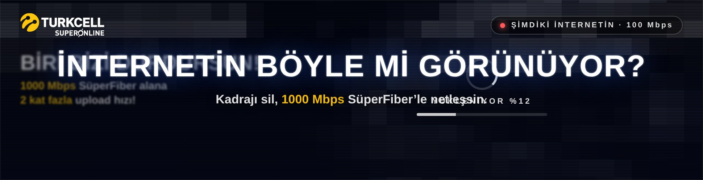 | 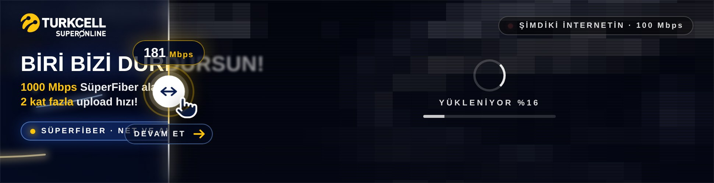 | 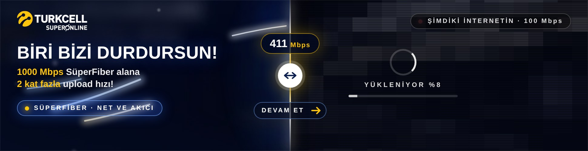 |

| Az kaldı | Kişisel hız etiketi (simülasyon) | Final + canlı sayaç |
|---|---|---|
| 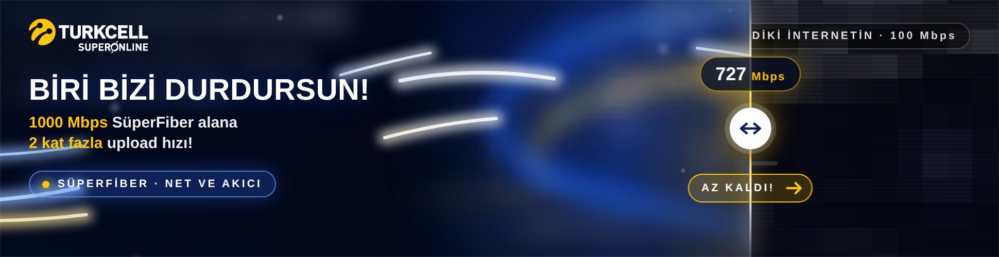 | 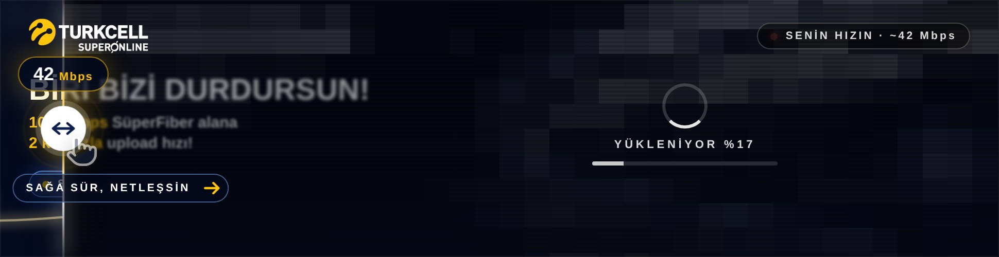 | 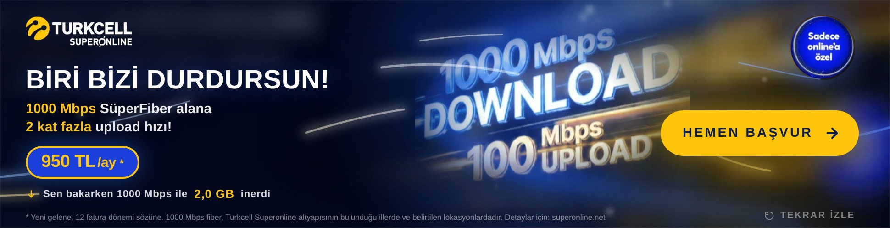 |

Ayarlanabilir alanlar (`CONFIG`): `uMin` / `uMax` (ayırıcı sınırları), `curve`, `follow`, `release`, `autoplayAfter`, `autoGlide`, hayalet el (`demoStart` / `demoPeriod` / `demoLen` / `demoReach`), `coach` metinleri, `speedTest` / `speedTestMin` / `speedTestMax`, `liveMBps` / `liveStopAt`, fiyat, dipnot, URL, görseller (`plate`, `slow`, `lockup`, `badge`, `logoWhite`); `T0` ve `T` zamanları; `RIB` ışık şeritleri. Yavaş dünya metinleri (`.slowLabel`, "YÜKLENİYOR") ve açılış sorusu HTML'de.

## SİNEMA konsepti (`970x250-sinema/`)

Kampanya KV'sinden ("BİRİ BİZİ DURDURSUN! / 1000 Mbps SüperFiber alana 2 kat fazla upload hızı! / 950 TL/ay*") türetilen, film jeneriği gibi kurgulanmış sürüm. Görsel katmanlar: KV'nin bulanıklaştırılıp karartılmış hâli (derinlik plakası, 16 sn boyunca yavaş kamera yaklaşması ve imleçle paralaks), yavaşça süzülen ışık tozu, film greni, vinyet; üstünde SVG ile çizilen ve akan üç ışık şeridi (mavi / altın, glow filtreli), keskin sprite olarak neon lockup (screen blend, kenarları yumuşatılmış) ve rozet.

| Zaman | Sahne | Ne olur |
|---|---|---|
| 0 – 1,5 sn | **Soğuk açılış** | Siyah kare; ince bir ışık çizgisi soldan sağa çizilir, plaka karanlıktan belirir, logo parıltıyla gelir, ışık şeritleri akmaya başlar. |
| 0,9 – 3,4 sn | **Başlık kartı** | "BİRİ BİZİ DURDURSUN!" harf aralığı geniş ve bulanık gelip sıkışarak netleşir (film başlığı); altında "1000 Mbps SüperFiber alana 2 kat fazla upload hızı!". |
| 3,4 sn → | **Sayaç / davet** | Başlık kaybolur, ortada "100 Mbps" ve nabız halkalı davet pili "İMLECİNLE IŞIĞI UYANDIR". |
| Etkileşim | **Işığı uyandırma** | İmleç banner'a girince ışık kuyruğu (kuyruklu yıldız) belirir, sayaç üstel ivmeyle yükselir (≈2 sn'de 1000), şeritler hızlanıp parlar, rakam büyür, mavi/altın motion-blur hayaletleri, 200 / 500 / 750'de halka, kamera mikro-titreşimi. Pil: "HIZLANIYOR" → "1000'E AZ KALDI"; imleç çıkarsa ışık söner ve pil "GERİ GEL, IŞIK SÖNÜYOR" der. Dokunmatikte basılı tutma, klavyede Boşluk / sağ ok. |
| 1000 | **Impact** | Beyaz flaş, anamorfik mercek parlaması (yatay ışık çizgisi + çekirdek), sarsıntı; "1000" 4,6 kat büyüyüp kadrajdan taşar. |
| +0,9 sn | **Lockup** | KV'nin neon "1000 Mbps DOWNLOAD / 100 Mbps UPLOAD" lockup'ı bulanık ve parlak biçimde sahneye çarpar; +1,5 sn'de "Sadece online'a özel" rozeti sağ üstte belirir. |
| +2,5 sn | **Kullanım** | FİLM · OYUN · DOWNLOAD · UPLOAD · ÇOKLU CİHAZ ışıklı etiketler olarak sağdan sıraya girer, sonra sola süpürülür. |
| +4,5 sn | **Final** | KV düzeni: solda manşet + alt satır, "950 TL/ay*" mavi-sarı fiyat pili, sağda sarı "HEMEN BAŞVUR", rozet, altta yasal dipnot; "TEKRAR İZLE". Şeritler yavaş akışa iner, imleç kuyruğu finalde de çalışır. |
| Otomatik | | 6,2 sn içinde etkileşim yoksa ışık kendiliğinden uyanır: impact ≈ 8,6 sn, final ≈ 13 sn, ≈ 15,5 sn'de sabit. |

Tıklama: her yerde tek tıklama kampanya sayfasını açar (hover tabanlı etkileşim tıklamayla çakışmaz). Ekran görüntüleri: [`preview-sinema/`](preview-sinema/)

| Başlık kartı | Işığı uyandırma | Impact |
|---|---|---|
| 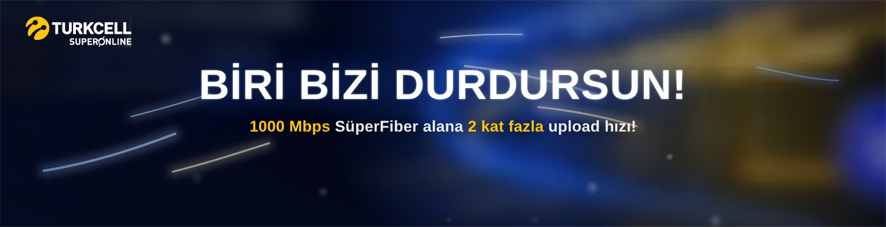 | 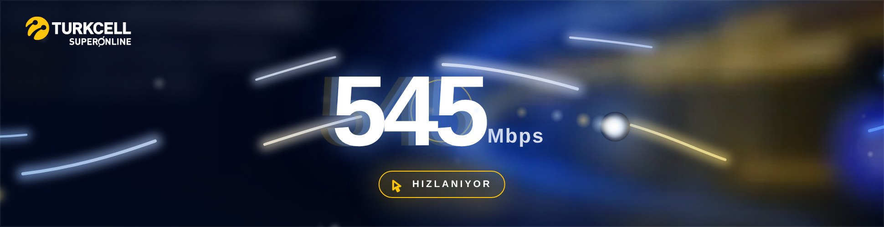 | 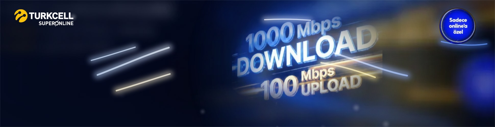 |

| Lockup | Kullanım | Final |
|---|---|---|
| 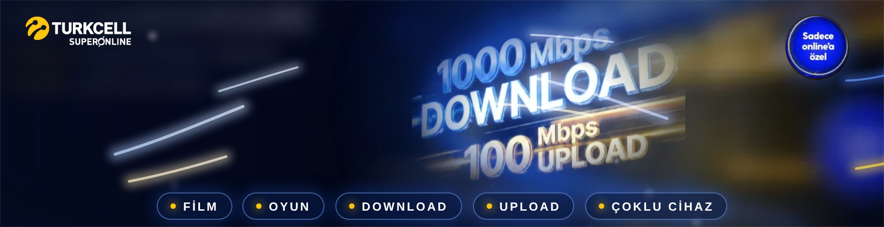 | 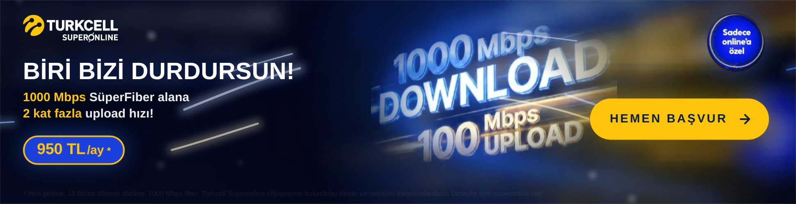 | 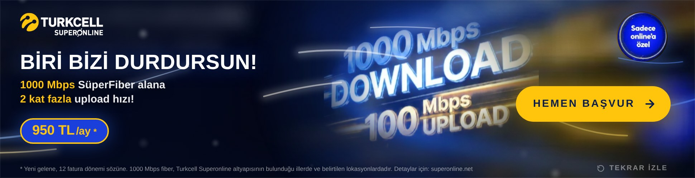 |

SİNEMA'da ayarlanabilir alanlar (`CONFIG`): `plate` / `lockup` / `badge` / `logoWhite` (base64 görseller), `price`, `foot` (dipnot), `url`, `autoplayAfter`, `accelBase` / `accelGain` (ivme), `decay` (sönme), `coach` (pil metinleri); `T0` (açılış zamanları), `T` (impact sonrası); `RIB` dizisi (şerit yolları, renkleri, kalınlıkları). Görseller `tools`'suz, kampanya KV'sinden Chromium canvas ile üretildi: plaka 970×250 (blur 9 px, %74 parlaklık), lockup 347×217 (siyah taban), rozet 160×160.

## KADRAJ konsepti (`970x250-kadraj/`)

| Durum | Ne olur |
|---|---|
| **Bekleme (davet katmanı)** | Superonline laciverti zemin (#104AA1, logodan örneklendi). Sağ üstte negatif logo. Solda 132 px beyaz sayaç "100 Mbps", etrafında sarı köşe braketleri. Altta 100 · 200 · 500 · 750 · 1000 kademeli hız rayı ve sarı topuz. Ziyaretçiyi etkileşime çeken öğeler: **hayalet el** 1,5 sn'de belirip topuzu tutar, biraz sağa çeker ve bırakır (sayaç 100 → 135 → 100 tepki verir), 3 sn'de bir tekrar eder; ray boyunca sağa akan **ışık süpürmesi** yön verir; sağda sarı çerçeveli koçluk pili **"SAĞA KAYDIR, 1000'E ÇIK →"**; imleç banner'a girince hız çizgileri kısa bir "uyanma" yapar ve **imleci izleyen sarı ışık** belirir. |
| **Kaydırma (koçluk)** | İmleç (veya parmak) banner üzerinde sağa gittikçe topuz onu izler, sayaç üstel eğriyle yükselir. Rakam hafifçe büyür ve öne yatar (skew), arkasında sarı motion-blur hayaletleri; braketler rakamı takip ederek genişler, %35'ten sonra titremeye başlar; hız çizgileri hızlanır. Koçluk pili ilerlemeye göre değişir: "DEVAM ET" (%22+) → "AZ KALDI!" (%62+, pil sarıya döner, ok hızlanır); 200 / 500 / 750 kademeleri geçilince etiket büyüyüp halka yayar (ödül). İmleç çekilirse hız düşer ve pil 1,4 sn "BIRAKMA, SONUNA KADAR" der. Ok tuşları da çalışır. |
| **1000 – kadraj kırılır** | Braketler bir anda banner'ın köşelerine sıçrar (kadraj = banner), zemin Superonline sarısına (#FFC40C) döner, flaş; "1000" lacivert olup 3,4 kat büyüyerek dört yandan taşar, 2,75 katta üstten alta dayanarak oturur; braketler köşelerden dışarı fırlayıp kaybolur. |
| **Mesaj** | Dev rakam %12'ye söner, üzerine lacivert "Online'a Özel Fiber İnternet" ("Online'a Özel" beyaz kart üzerinde). |
| **Kullanım şeridi** | Ortada beyaz bir şerit açılır; FİLM • OYUN • DOWNLOAD • UPLOAD • ÇOKLU CİHAZ lacivert tipografi ve sarı noktalarla 1500 px/sn hızla akıp yavaşlayarak durur. |
| **Final** | Şerit tüm banner'a açılır (beyaz final zemini, sitedeki içerik alanı gibi). Orijinal renkli logo, sarı "ONLINE'A ÖZEL" etiketi, lacivert "1000 Mbps Fiber İnternet", 950 TL/ay + koşullar, sarı "HEMEN BAŞVUR" pill lacivert yazıyla (sitedeki buton gibi; hover: yükselir, ok kayar, parlama), sağ altta "TEKRAR DENE". Arkada çizgi kontur "1000". |
| **Otomatik** | 4 sn etkileşim yoksa hayalet el topuzu tutup 2,4 sn'de sağa kaydırır (hareket bir kez daha gösterilmiş olur); etkileşimsiz izleyici için impact ≈ 6,6 sn, final ≈ 11,7 sn, 13,8 sn'de sabit. |

Tıklama: her yerde tek tıklama kampanya sayfasını açar (kaydırma tıklama gerektirmediği için çakışma yoktur). Ekran görüntüleri: [`preview-kadraj/`](preview-kadraj/)

| Davet (hayalet el) | Kaydırma (koçluk) | Kadraj kırılır |
|---|---|---|
| 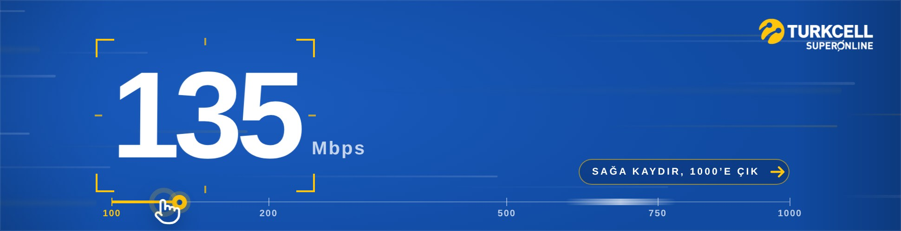 |  |  |

| Taşma | Şerit | Final |
|---|---|---|
| 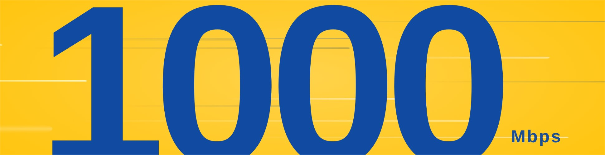 |  |  |

KADRAJ'da ayarlanabilir alanlar (`CONFIG`): `autoplayAfter`, `railX0/railX1` (ray konumu), `curve` (ray → hız eğrisi), `follow` (takip hızı), `release` (bırakınca düşüş), `autoGlide` (otomatik kaydırma süresi), davet katmanı `demoStart` / `demoPeriod` / `demoLen` / `demoReach` (hayalet el zamanlaması ve mesafesi), `coach` (koçluk metinleri: start / go / almost / release), `words` (şerit kelimeleri), `logoWhite` / `logoColor` (base64 logo sürümleri), fiyat/koşul/URL; renkler `:root` içinde `--navy` (#104AA1) ve `--yellow` (#FFC40C); sahne zamanları `T`, şerit hızı `TICK_V0` / `TICK_DUR`.

## Hız göstergesi konsepti – etkileşimli kurgu (`970x250/`)

| Durum | Ne olur |
|---|---|
| **Bekleme (attract)** | Logo, ortada yay biçimli hız göstergesi ve 100–112 arasında "nefes alan" sayaç; sağda nabız halkalı **"BASILI TUT · HIZLAN"** pedalı (final CTA'sının konumunda). İmleç banner üzerinde gezerken hız çizgileri hafifçe paralaks yapar. |
| **Basılı tutma** | Pedala ya da banner'ın herhangi bir yerine basılı tutulunca sayaç üstel ivmeyle yükselir (≈2 sn'de 1000). Gösterge dolar, kademeler yanar, hız çizgileri hızlanıp uzar, rakamın arkasında sarı motion-blur hayaletleri belirir, pedalın içi dolar. Boşluk / sağ ok tuşu ve dokunmatik de çalışır. |
| **Bırakma** | Hız 100'e doğru hızla düşer; 300'ün üstünde bırakılırsa pedalın üstünde kısa bir **"BIRAKMA!"** uyarısı çıkar (en fazla 3 kez). Pedala kısa dokunuşlar anlık +90 Mbps verir (hızlı tıklayarak da çıkılabilir). |
| **1000 Mbps – wow moment** | Flaş, şok halkası, ışık süpürmesi, kamera sarsıntısı; "1000" sarıya dönüp 6,6 kat büyüyerek kadrajdan **taşar**, sonra üstten alta dayanan boyuta oturur; "Mbps" sağa itilir. Pedal kaybolur. |
| **Devamı** | "Online'a Özel Fiber İnternet" → FİLM · OYUN · DOWNLOAD · UPLOAD · ÇOKLU CİHAZ → final: "1000 Mbps Fiber İnternet", "Online'a Özel", 950 TL/ay, koşullar, sarı **HEMEN BAŞVUR** (pedalın yerinde belirir) ve sağ altta küçük **TEKRAR DENE**. |
| **Otomatik oynatma** | 4 sn içinde etkileşim yoksa pedal kendiliğinden basılı görünür ve aynı fizikle hızlanır: etkileşimsiz izleyici için toplam ≈13 sn, sonra final karesi sabit. |

Tıklama kuralları: kısa tıklama (≤220 ms, hız kazanımı yok) her yerde kampanya sayfasını açar; basılı tutma sonrası bırakma tıklama sayılmaz. Pedal tıklaması sayfaya gitmez. CTA her zaman sayfaya gider.

Ekran görüntüleri: [`preview/`](preview/) (etkileşimli), [`preview-autoplay/`](preview-autoplay/) (otomatik)

| Bekleme | Basılı tutma | Hızlı |
|---|---|---|
|  |  |  |

| Taşma (peak) | Mesaj | Final |
|---|---|---|
|  |  |  |

## Teknik

- 970×250 sabit alan, `<meta name="ad.size">` etiketi mevcut.
- Sahneler `#ad` üzerine eklenen sınıflarla (`s1`, `s3`, `s3b`, `s4`, `s4out`, `s5`, `done`, `auto`, `interacted`) CSS keyframe'lerini tetikler; sayaç fiziği, gösterge yayı, pedal dolgusu ve hız çizgileri `requestAnimationFrame` ile JS'ten sürülür (yalnızca `transform`/`opacity`, `will-change`, `contain:strict`). Final karesinde rAF durur.
- Giriş: Pointer Events (fare, dokunmatik, kalem), klavye (Boşluk / sağ ok), `touch-action:none`.
- Tıklama: tüm alan (`#exit`) ve CTA (`#cta`). `window.clickTag` / `clickTAG` tanımlıysa o URL, `Enabler` varsa `Enabler.exit('CTA', url)`, aksi hâlde `CONFIG.url` yeni sekmede açılır. `href` de kampanya URL'sini taşır.
- Hover: CTA hafif yükselir, ok kayar, parlama süpürmesi geçer; pedal parlar.
- `prefers-reduced-motion` açıksa doğrudan final karesine yakın başlar.
- Konsol hatası yok; Chromium'da Playwright ile doğrulandı: otomatik akış (impact 6,0 sn, final 10,8 sn, 12,8 sn'de sabit), basılı tutma (≈2 sn'de impact, tıklama bastırma), erken bırakma (hız düşüşü), kısa tıklama (sayfa açılır), pedal dokunuşları, klavye, Tekrar Dene, clickTag/Enabler.

## Kolay değiştirilecek alanlar (`970x250/index.html`)

| Ne | Nerede |
|---|---|
| Fiyat, birim, koşul metni, kampanya URL'si | `<script>` başındaki `CONFIG` nesnesi (`price`, `priceUnit`, `terms`, `url`) |
| Otomatik oynatma gecikmesi | `CONFIG.autoplayAfter` (sn) |
| Etkileşim fiziği | `accelBase`, `accelGain` (ivme), `decay` (bırakınca düşüş), `tapBoost` (kısa dokunuş) |
| Sayaç başlangıç / hedef değeri | `CONFIG.speedStart`, `CONFIG.speedMax` |
| Impact sonrası sahne zamanları | `T` nesnesi (`tag`, `uses`, `usesOut`, `final`, `end`) |
| Döngü (yalnızca otomatik akış) | `CONFIG.loop: true`, `loopHold`, `maxLoops` |
| Renkler | `:root` değişkenleri (`--yellow`, `--bg0`, `--bg1`, `--ink` …) |
| Logo | `CONFIG.logoWhite` (koyu zemin için negatif: yazı beyaz, işaret sarı – varsayılan) ve `CONFIG.logoColor` (orijinal renkli) base64 gömülü; kaynak: Turkcell Superonline PNG (301×88, CDN). `logoHeight`, `logoPlate` (renkli logo beyaz plakada), `logoInvert`. Yüklenemezse `#logo` içindeki tipografik yedek görünür. |
| Metinler | Pedal etiketi (`.pedal .lbl`), "BIRAKMA!" (`#hint`), `.tag`, `.use`, `.headline`, `.sub`, `.kicker`, CTA ve "TEKRAR DENE" doğrudan HTML'de |
| Gösterge kademeleri | `TICKS` dizisi |
| Hız çizgisi yoğunluğu | `makeStreaks()` içindeki `n` |

> **Doğrulama notu:** Bu banner'ın hazırlandığı ortamın ağ politikası `www.superonline.net` alan adına erişime izin vermedi; kampanya sayfasının renkleri doğrudan okunamadığı için KADRAJ paleti resmi logodan örneklenen lacivert (#104AA1) ve Superonline sarısı (#FFC40C) ile kuruldu (sayfa erişilebilir olduğunda `:root` değişkenleri birebir güncellenebilir). Fiyat (950 TL/ay), 12 ay taahhüt, "modem ve tüm vergiler dahil", "kurulum ve aktivasyon ücretsiz" bilgileri kampanya sayfasının arama motoru özetlerinden alındı; yayın öncesi sayfadaki güncel değerlerle karşılaştırılmalıdır. Logo, müşterinin CDN'e yüklediği Turkcell Superonline PNG'sinden alınıp base64 olarak gömüldü; koyu zemin için lacivert yazı beyaza çevrilmiş negatif sürüm üretildi (sarı işaret korundu), orijinal renkli sürüm `logoPlate` seçeneğiyle kullanılabilir.
