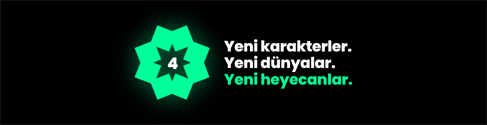
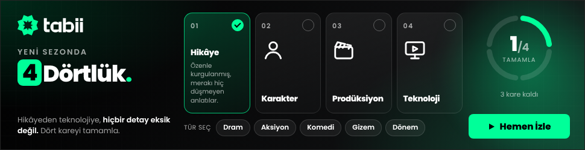
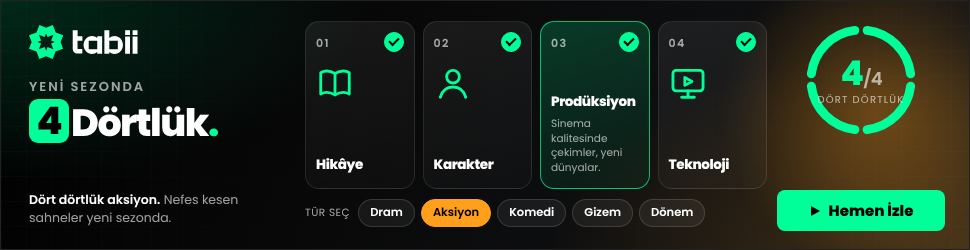
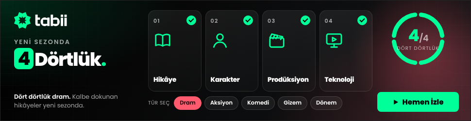

# tabii – "yeni sezonda 4Dörtlük" · 970×250 interaktif masthead

Dosya: `970x250/index.html` (tek dosya, satır içi CSS/JS/SVG, görsel yok, ~20 KB).

| Açılış | Kareler (1/4) | Üzerine gelme | 4/4 + tür seçimi |
|---|---|---|---|
|  |  |  |  |

## Araştırma özeti

**tabii.com/tr'den çekilenler** (`assets/site/`, GitHub Actions ile; bulut oturumu siteye erişemiyor):
- Logo: `tabii-logo.svg` (resmî Illustrator çıktısı; sekiz köşeli yıldız + "tabii" yazısı). Bannerda satır içi SVG olarak kullanılıyor.
- Renkler: marka yeşili **#00FF99**, zemin **#000000** / **#151618**, metin **#FAFAFA**. Site CTA'sı ("Başla") yeşil zemin, koyu metin, 8 px köşe.
- Font: **Poppins** (sitenin tek fontu, 400–800). Bannerda Google Fonts'tan yükleniyor.
- Site başlıkları: "Benzersiz Türkçe Orijinaller, Sınırsız Eğlence", "Bizi Birleştiren Hikayeler". Öne çıkan orijinaller: Persona, Gassal, Siyah Bere, Yüzde İki, Yankı: İkinci Perde, Çırak, Marnalı, Cihangir Cumhuriyeti, Mevlânâ Celâleddîn-i Rûmî.
- Yeniden çekmek için: `.github/workflows/tabii-fetch.yml` (Actions sekmesinden çalıştırılabilir).

**Genel:**

- **Marka:** tabii, TRT'nin uluslararası dijital platformu. Logo, 8 kareden oluşan kaleydoskop deseni ve yeşil rengi; küçük harfli "tabii" yazımı. Motto: "bizi birleştiren hikâyeler".
- **Katalog:** 60+ orijinal yapım, 600+ film/dizi, 22 bin saati aşkın içerik; çoklu dil, altyazı ve dublaj.
- **Güncel orijinaller:** Gassal, Marnalı, Çırak, Cihangir Cumhuriyeti, Muhabir (komedi); yeni sezonlarıyla Mevlana Celaleddin-i Rumi, Hay Sultan, Yeşil Deniz Milenyum, Küçük Dahi İbn-i Sina, Mahsusa: Trablusgarb.
- **Format:** IAB Billboard 970×250. İlk yükleme için önerilen sınır 200 KB (Google Ads HTML5 için 150 KB), animasyon en fazla 30 sn, ses yalnızca kullanıcı başlatırsa.

## Konsept: "Dört kareyi tamamla"

Açılışta tabii'nin sekiz köşeli yıldızı dönerek gelir, ortasında "4" belirir. Ardından dört kart mekaniği başlar. Briefteki dört sütun (**hikâye, karakter, prodüksiyon, teknoloji**) dört kart oluyor. Kullanıcı kartların üzerine geldikçe her kart tamamlanıyor, sağdaki halka 0/4'ten 4/4'e doluyor. Dört kart da tamamlanınca halka "dört dörtlük" durumuna geçiyor, ana mesaj damgalanıyor ve CTA nabız atıyor.

İkinci katman **tür seçici**: Dram, Aksiyon, Komedi, Gizem, Dönem. Her tür, arka plan ışığını ve alt metni değiştiriyor ("Dört dörtlük gizem. Her bölümde yeni bir sır.").

### Akış (etkileşim olmazsa)

| Zaman | Olay |
|---|---|
| 0–2,2 sn | Açılış: tabii yıldızı dönerek gelir, içinde "4" belirir. "Yeni karakterler. Yeni dünyalar. Yeni heyecanlar." |
| 2,2 sn | Ana yerleşim: tabii, "yeni sezonda 4Dörtlük.", kartlar, halka, CTA |
| 3,6–7,8 sn | Kartlar sırayla açılıp tamamlanır (1/4 → 4/4) |
| 7,8 sn | 4/4 anı: halka dalgası, kare konfeti, başlık damgası, CTA nabzı |
| ~10–29 sn | Türler 2,4 sn arayla döner; 30. saniyede durur |

Kullanıcı bir karta dokunduğu anda otomatik akış durur ve kontrol kullanıcıya geçer.

## Etkileşim ve teknik

- Kartlar: üzerine gelme, odaklanma veya dokunma (mobil) ile açılır ve tamamlanır.
- Tıklama: alanın tamamı çıkış yapar. Önce `Enabler.exit` (Studio/DV360) denenir, sonra `window.clickTag` (Google Ads/CM360). Kartlar ve tür çipleri tıklamayı yutar.
- Klavye: Tab ile kartlar ve çipler gezilir, Enter ile çıkış yapılır. `prefers-reduced-motion` açıksa animasyonlar kapanır.
- Font: Google Fonts üzerinden *Poppins* (sitenin fontu; yüklenmezse sistem fontu).
- Renkler `:root` içinde (`--green`, `--ink`), tür renkleri `GENRES` dizisinde.

## Yayın öncesi yapılacaklar

1. **clickTag:** Varsayılan hedef `tabii.com/tr` (UTM'li). Kampanya URL'si ile güncellenmeli.
2. **"4. yaş" ifadesi:** tabii Türkiye'de 7 Mayıs 2023'te yayına başladı. Ekim 2026 itibarıyla platform 3 yaşını doldurmuş, 4. yılında. Briefteki "4. yaşını geride bırakırken" ifadesi teyit edilmeli. Bannerda yaş vurgusu yok, yalnızca "4Dörtlük" kullanıldı.
3. İstenirse kartlara dizi görselleri (key art) eklenebilir. Her kart bir türün öne çıkan yapımını gösterebilir, ancak dosya boyutu 150 KB sınırına dikkat edilerek.
