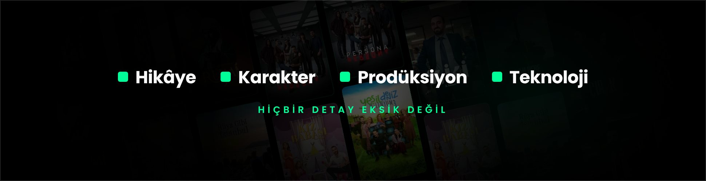
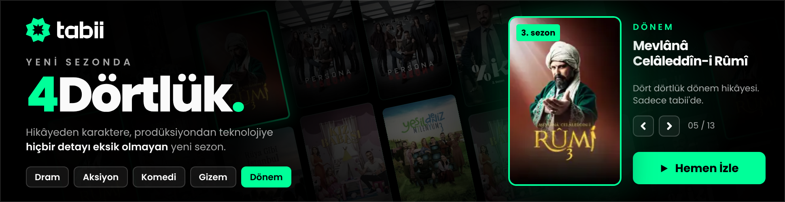

# tabii – "yeni sezonda 4Dörtlük" · 970×250 interaktif masthead

Teslim dosyası: `970x250/index.html`. Tek dosya; 13 afiş içine gömülü, toplam ~108 KB (Google Ads 150 KB sınırının altında).

| Açılış | Ana kare | Tür seçimi (Dönem) |
|---|---|---|
|  |  |  |

## Kurgu

**Arka plan: afiş duvarı.** tabii.com ana sayfasındaki kolaj dilinden yola çıkıldı. 13 orijinal yapımın afişi, 12° eğik ve sütunlar ters yönde ağır ağır kayan bir duvarda yer alıyor. Solda metin için koyu geçiş, sağda öne çıkan kartın arkasında yeşil ışık var.

1. **Açılış (0–3 sn):** Briefteki dört sütun sırayla belirir: Hikâye · Karakter · Prodüksiyon · Teknoloji. Her birinin yanında yeşil bir kare çıkar, altında "hiçbir detay eksik değil" yazar.
2. **Ana kare:** Solda tabii logosu, "yeni sezonda **4Dörtlük.**" ana mesajı ve tür çipleri. Sağda öne çıkan yapım kartı yer alır: afiş, sezon rozeti, tür, ad, "Dört dörtlük gizem. Sadece tabii'de." ve "Hemen İzle" butonu.
3. **Döngü:** Yapımlar 2,6 sn arayla değişir, 30. saniyede ilk yapımda durur. Duvar da 30. saniyede durur (IAB kuralı).

## Etkileşim

- **Tür çipleri** (Dram, Aksiyon, Komedi, Gizem, Dönem): Seçilen türün yapımı karta gelir. Duvarda o türün afişleri yeşil çerçeveyle öne çıkar, diğerleri kararır.
- **Duvardaki afişler:** Üzerine gelinen afiş öne çıkan karta taşınır.
- **Kart:** Fareyle 3B eğim ve parlama efekti. Kart tıklanınca `Enabler.exitOverride` ile o dizinin tabii sayfasına gider (Studio/DV360). Google Ads'te clickTag kullanılır.
- **Oklar, ← → tuşları ve mobilde kaydırma:** Yapımlar arasında gezinme.
- **Kullanıcı devraldığında** otomatik döngü durur.
- **Çıkış:** Alanın geri kalanına veya CTA'ya tıklanınca `clickTag` / `Enabler.exit` çalışır.
- `prefers-reduced-motion` açıksa hareketler kapanır.

## Yapımlar ve türler

`tools/build.py` içindeki `SHOWS` listesi gösterim sırasını, türü ve rozeti belirler:

| Tür | Yapımlar |
|---|---|
| Dram | Gassal (3. sezon), Çırak, Rüya Gibi İstanbul |
| Aksiyon | Siyah Bere, Marnalı, Yankı: İkinci Perde |
| Komedi | Kız Babası, Yeşil Deniz Milenyum (3. sezon), Yüzde İki (2. sezon) |
| Gizem | Persona, Son Gün |
| Dönem | Mevlânâ Celâleddîn-i Rûmî (3. sezon), Hay Sultan |

> Tür eşleşmeleri ve sezon rozetleri afişlerden ve genel bilgiden çıkarıldı; yayın öncesi tabii ekibiyle teyit edilmeli.

## Marka (tabii.com/tr'den)

- **Logo:** resmî `tabii.svg` (`assets/site/tabii-logo.svg`), satır içi SVG.
- **Renkler:** yeşil `#00FF99`, zemin `#000` / `#151618`, metin `#FAFAFA`.
- **Font:** Poppins (Google Fonts).
- **CTA:** yeşil zemin, siyah metin, 8 px köşe (sitedeki "Başla" butonu gibi).
- **Afişler:** `assets/site/posters/` (600×901 orijinaller, `posters.json` içinde ad ve sayfa adresi).

## Derleme

```bash
python3 tabii-4dortluk/tools/build.py          # src/masthead.html + afişler → 970x250/index.html
python3 tabii-4dortluk/tools/build.py --w=160 --q=55   # daha küçük dosya gerekirse
```

Bu bulut oturumu tabii.com'a erişemiyor; varlıklar GitHub Actions'ta `.github/workflows/tabii-fetch.yml` ile çekiliyor (`tools/fetch-site.js`, `tools/fetch-posters.js`). Afişleri güncellemek için iş akışını Actions sekmesinden çalıştırıp ardından `build.py`'yi çalıştırmak yeterli.

## Yayın öncesi

1. **clickTag:** Varsayılan `tabii.com/tr` (UTM'li); kampanya URL'si girilmeli.
2. **Tür/sezon bilgileri:** Yukarıdaki tablo teyit edilmeli.
3. **"4. yaş" ifadesi:** tabii 7 Mayıs 2023'te yayına başladı; Ekim 2026'da 3 yaşında, 4. yılında. Briefteki ifade teyit edilmeli. Bannerda yaş vurgusu yok.
4. **Yayıncı kuralları:** Font Google Fonts'tan yükleniyor. Harici kaynak kabul etmeyen yayıncılar için Poppins `@font-face` ile gömülebilir (~+25 KB).
