# TV+ – "Hepsi TV+'ta!" İnteraktif Masthead (970 × 250)

İki alternatif konsept var:

| | Konsept | Dosya | Paket |
|---|---|---|---|
| **A** | Kumanda sende (kanal zapping) | `dist/index.html` | `dist/tvplus-masthead-970x250.zip` |
| **B** | 150+ ekranlık mozaik | `dist/mozaik/index.html` | `dist/tvplus-masthead-mozaik-970x250.zip` |

Konsept B aşağıda, [ayrı bölümde](#konsept-b--150-ekranlık-mozaik) anlatılıyor.

## Konsept A – Kumanda sende

Konsept: **"Kumanda sende."** Masthead'in ortasında bir ekran var, solunda kumanda tuşları. Kullanıcı kanal değiştirdikçe TV paraziti ve kanal göstergesi (OSD) ile TV+'ın dört dünyası arasında geçiş yapıyor. Sağdaki QR, TV spotundaki QR ile aynı görsel dili taşıyor. Cihaz seçici aynı yayını TV, tablet ve mobil arasında "kaldığın yerden" taşıyor.

| Dosya | Açıklama |
|---|---|
| `dist/index.html` | Yayına hazır tek dosya (satır içi CSS/JS/SVG, görsel dosyası yok) – **35 KB** |
| `dist/tvplus-masthead-970x250.zip` | Reklam ağına yüklenecek paket |
| `src/index.html` | Kaynak (QR yolu derlemede eklenir) |
| `screens/` | Durum ekran görüntüleri |

```bash
node build.js                                   # src → dist + zip
NODE_PATH=$(npm root -g) node tools/capture.js  # ekran görüntüleri + konsol hatası kontrolü (Playwright)
```

## Ekranlar

| Spor | Dizi & Film | Canlı TV |
|---|---|---|
| 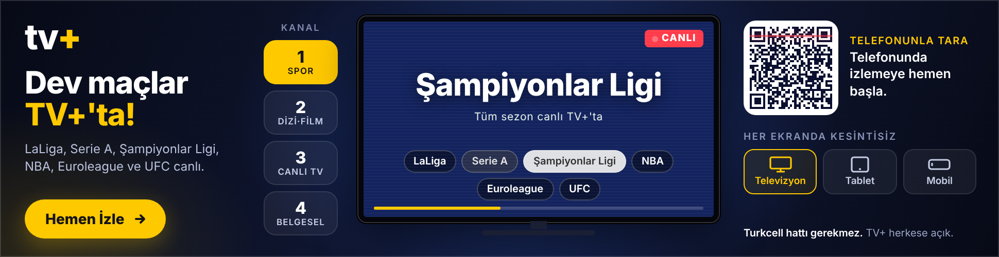 | 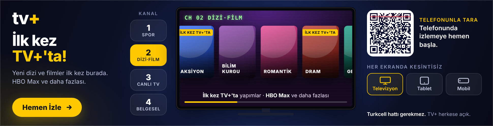 | 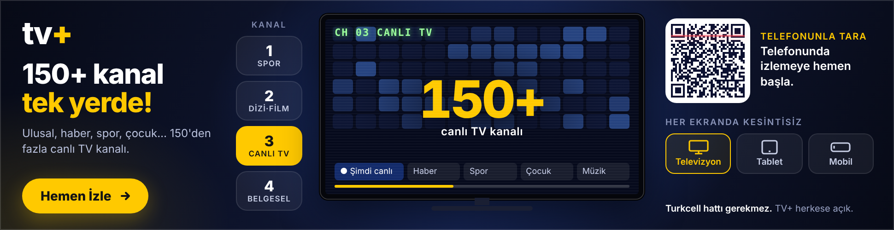 |

| Belgesel | Kapanış | TV-sync modu |
|---|---|---|
| 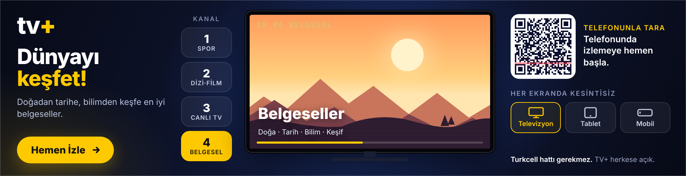 | 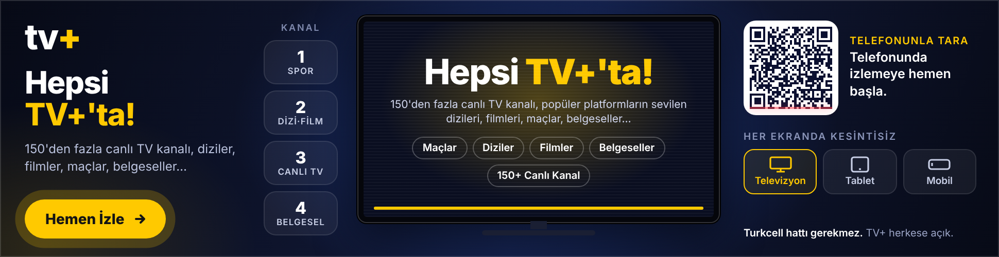 | 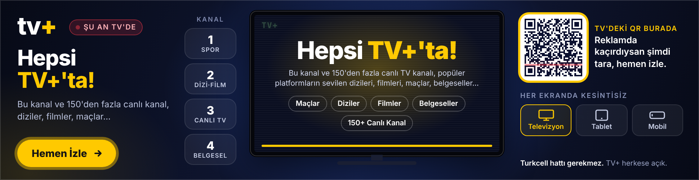 |

| UFC / Mobil cihaz | Tablet + paralaks |
|---|---|
| 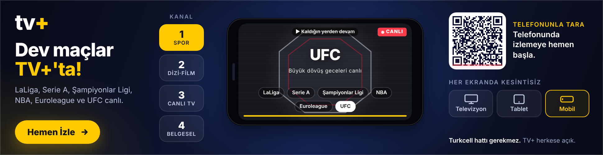 | 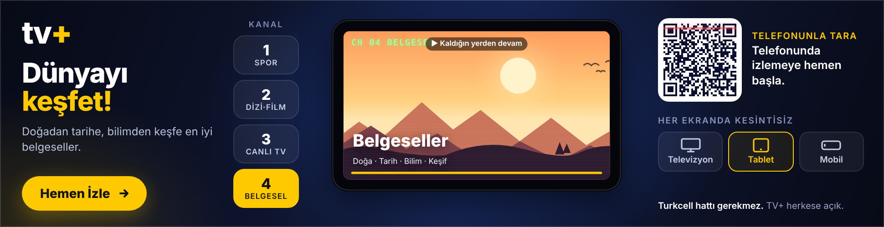 |

## Akış (~18 sn, 30 sn sınırının altında)

1. **Açılış:** Ekran eski tüplü TV gibi tek çizgiden açılır.
2. **CH 01 Spor (5,6 sn):** Saha zemini lige göre değişir: LaLiga, Serie A ve Şampiyonlar Ligi'nde futbol sahası, NBA ve Euroleague'de parke, UFC'de oktagon.
3. **CH 02 Dizi·Film:** Poster şeridi akar. "İlk kez TV+'ta" bantları ve HBO Max iş birliği vurgusu.
4. **CH 03 Canlı TV:** Kanal ızgarası yanarken sayaç 0'dan **150+**'ya çıkar.
5. **CH 04 Belgesel:** Katmanlı manzara.
6. **Kapanış:** "Hepsi TV+'ta!" ana söylemi, kategori etiketleri ve nabız efektli CTA. Reklam bu karede durur.

## Etkileşimler

- **Kanal tuşları 1–4:** Üzerine gelince hızlı zapping yapar, tıklayınca o kanalda kalır. Klavyede 1–4 tuşları ve ↑/↓ ile kanal değişir.
- **Lig çipleri:** Spor kanalında lige göre saha, parke ya da oktagon gelir (← / → ile de değişir).
- **Belgesel:** Fare hareketiyle manzarada paralaks oluşur.
- **Poster şeridi:** Üzerine gelince durur, kart büyür.
- **Cihaz seçici (Televizyon / Tablet / Mobil):** Çerçeve dönüşür, yayın ve ilerleme çubuğu kesilmez ("▶ Kaldığın yerden devam"). "Her ekranda kesintisiz" mesajını kullanıcı kendi eliyle deneyimler.
- **Kapanış etiketleri:** Maçlar, Diziler gibi etiketler ilgili kanala geri götürür.
- **Mobil dokunmatik:** Ekranda sağa/sola kaydırınca kanal değişir.
- **Tıklama:** Reklamın tamamı, CTA ve QR tıklanabilir. Çıkış adresi **o an açık olan kanala göre** derin bağlantı alır (`/spor`, `/dizi-film`…). Kontroller tıklamayı yutar, yani kanal değiştirmek reklamdan çıkarmaz. `clickTag` (Google Ads / CM360) ve `Enabler.exitOverride` (Studio) desteklenir. UTM: `utm_source=masthead&utm_medium=display&utm_campaign=hepsi-tvplusta&utm_content=<kanal>`.
- `prefers-reduced-motion` açıksa parazit ve sürekli animasyonlar kapanır.

## TV-tetiklemeli mod (TV-sync)

Masthead aynı kreatifle iki modda çalışır. TV spotu yayına girdiğinde ad server/TV-sync sağlayıcısı (yayın akışı veya ses parmak izi tetiklemeli) tıklama adresine parametre ekler:

```
index.html?tvsync=1&kanal=<kanal adı>       // veya window.TVPLUS_TVSYNC = true; window.TVPLUS_CHANNEL = "…"
```

- Logonun yanında **"● ŞU AN TV'DE"** rozeti çıkar.
- Kapanış metni TV spotundaki söylemle birebir eşleşir: **"<Kanal adı> ve 150'den fazla canlı TV kanalı, popüler platformların sevilen dizileri, filmleri, maçlar, belgeseller… Hepsi TV+'ta!"** Kanal adı gelmezse "Bu kanal ve…" kullanılır.
- QR çerçevesi vurgulanır: "TV'deki QR burada – reklamda kaçırdıysan şimdi tara."
- UTM'e `-tvsync` eki düşer. Böylece TV ile eş zamanlı gösterimin katkısı ayrıca ölçülür.

## TV × Dijital fikirleri (brief'teki talep için)

1. **"Bu kanal" dinamik kreatifi:** TV spotundaki "Bu kanal ve 150'den fazla…" cümlesi dijitalde de kişiselleşir. Spot hangi kanalda yayındaysa, sonraki 5–15 dakika içinde aynı bölgede ve aynı hane tipinde gösterilen masthead, YouTube ve sosyal kreatifleri kanal adını dinamik yazar ("Az önce X'te gördün, X ve 150+ kanal TV+'ta"). Bu sürümde altyapısı hazır (`kanal` parametresi).
2. **Kanal ve kuşak bazlı QR:** Her kanal ve kuşak için ayrı kısa link veya QR (`utm_content=kanal_kusak`) kullanılır. QR tarayan cihaz algılanır: uygulama yüklüyse ilgili içeriğe derin bağlantı açılır, yüklü değilse mağaza ve deneme teklifi gösterilir. Hangi kanal ve saatin taramaya dönüştüğü ölçülür. Masthead'deki QR, TV'deki ile aynı görünümde olduğu için tanınırlık sürer.
3. **Maç arası ikinci ekran:** Spot, LaLiga, Şampiyonlar Ligi veya NBA yayınlarının devre arasında döndüğünde aynı anda mobilde "Maçın devamı ve dahası TV+'ta" kreatifi çıkar (canlı skor ya da fikstür widget'ı ile). Spor izleyicisi TV-sync ile hedeflenir.
4. **QR tarayanlara kategoriye göre yeniden hedefleme:** Spor spotundan gelenlere spor, dizi spotundan gelenlere "İlk kez TV+'ta" yapımları gösterilir. Masthead'in kanal yapısı bu segmentlere doğrudan uyar; segment başına açılış kanalı değiştirilerek varyasyon üretilebilir.
5. **Media First / CTV:** Akıllı TV ana ekranı (Samsung/LG ads) ve YouTube CTV mastheadinde aynı "kumanda" kurgusu kullanılır. Kumandanın sayı tuşları gerçekten çalışır, QR "telefonda devam et" köprüsü kurar. CTV'de "duraklatma reklamı" olarak QR'lı statik kapanış karesi kullanılabilir.
6. **Ölçüm:** TV-sync gösterimleri ile kontrol grubu karşılaştırılır. Spot sonrası dakikalardaki marka araması ve site trafiği sıçraması ile kanal bazlı QR taramaları tek panoda izlenir; TV planlamasına geri beslenir.

## Teslim öncesi kontrol listesi

- [ ] **Logo:** `tv+` yazısı şu an Outfit fontuyla yazılmış yer tutucu. Resmi logo SVG'si `.logo` alanına konmalı.
- [ ] **Renkler:** `:root` değişkenleri (`--accent`, `--bg`…) TV+ marka kılavuzuna göre güncellenmeli.
- [ ] **QR adresi:** Şu an `https://tvplus.com.tr/?utm_source=masthead&utm_medium=qr&utm_campaign=hepsi-tvplusta`. Kampanya kısa linkiyle değiştirmek için `npx qrcode -t svg "<adres>"` çıktısındaki `path d="…"` değerini `tools/qr-path.txt` dosyasına yazıp `node build.js` çalıştırın.
- [ ] **Derin bağlantılar:** `/spor`, `/dizi-film`, `/canli-tv`, `/belgesel` yolları gerçek kategori sayfalarıyla eşleştirilmeli (`CHANNELS[].path`).
- [ ] **Hak kullanımı:** Lig ve platform adları yalnızca metin olarak geçiyor; logo, poster veya maç görüntüsü kullanılmadı. Gerçek içerik görseli eklenecekse hak onayı alınmalı.
- [ ] **Font:** Google Fonts (Outfit) kullanılıyor. Harici kaynağı kabul etmeyen ağlar için sistem fontuna düşer.

---

## Konsept B – 150+ ekranlık mozaik

`dist/mozaik/index.html` · 25 KB · tek dosya. Görsel dosyası yok; mozaik canvas ile çiziliyor.

Fikir: **"Her kare bir kanal."** Yüzlerce küçük ekran karesi (her biri bir kategorinin renginde ve TV gibi hafifçe titreyerek) uçuşup TV+ logosunu oluşturuyor. Sonra kareler kategorilere ayrılıyor ve yeniden logoda birleşiyor. "Hepsi TV+'ta" mesajı, içeriklerin tek bir markada toplanmasıyla görselleşiyor.

| Toplanma | Logo | Kategoriler |
|---|---|---|
| 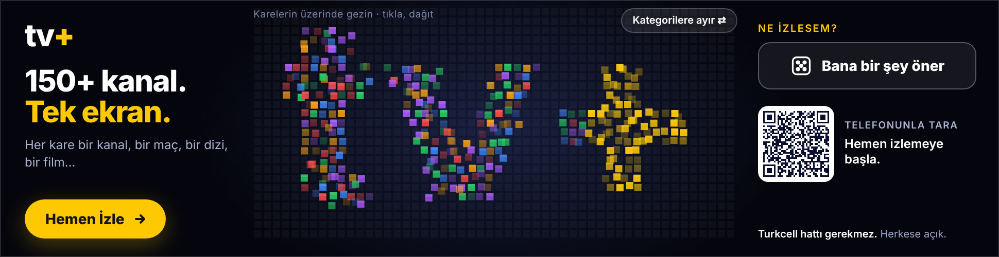 | 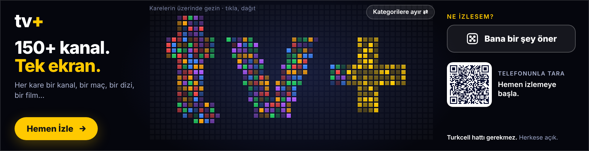 | 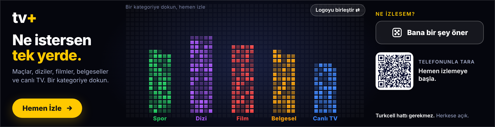 |

| Kategori üzerine gelme | "Bana bir şey öner" | TV-sync modu |
|---|---|---|
| 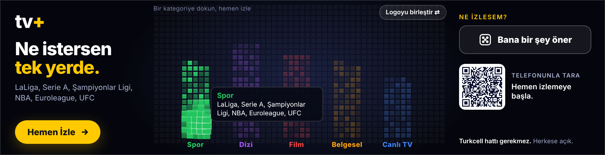 | 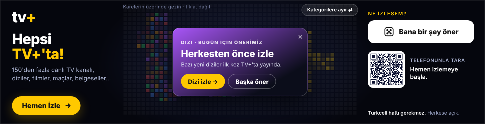 | 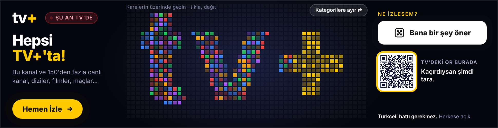 |

### Akış (~11 sn)
1. Dağınık kareler uçuşarak **tv+** logosunu oluşturur ("150+ kanal. Tek ekran.").
2. Kareler renklerine göre beş sütuna ayrılır: Spor, Dizi, Film, Belgesel, Canlı TV ("Ne istersen tek yerde.").
3. Yeniden logoda birleşir: "Hepsi TV+'ta!". CTA ve öneri düğmesi nabız atar.

### Etkileşimler
- **Mercek:** Fare karelerin üzerinde gezdikçe yakındaki kareler büyür ve parlar. Kareye gelince hangi kategoriden olduğu görünür.
- **Dağıt:** Logo modunda tıklayınca kareler şok dalgasıyla dağılır ve kendiliğinden yeniden birleşir.
- **Kategorilere ayır / Logoyu birleştir:** Düğmeyle iki görünüm arasında geçilir. Kategori sütununun üzerine gelince sol metin o kategorinin içeriğini yazar (ör. "LaLiga, Serie A, Şampiyonlar Ligi, NBA, Euroleague, UFC"); tıklayınca o kategori sayfası açılır.
- **"Bana bir şey öner" ruleti:** Vurgu kareler arasında yavaşlayarak dolaşır, bir karede durur ve o kategoriden bir öneri kartı açılır. Kartta "<Kategori> izle →" ve "Başka öner" var. Klavyede `R`/boşluk ile de çalışır.
- QR, TV-sync modu (`?tvsync=1&kanal=…`), `clickTag`/`Enabler` ve kategoriye göre UTM (`utm_content=mozaik-<kategori>`) Konsept A ile aynı şekilde çalışır.

### Not
Öneri kartları gerçek yapım adı içermiyor; genel ifadeler kullanılıyor ("Şampiyonlar Ligi heyecanı canlı yayınla TV+'ta"). Kampanya döneminin gerçek içerikleri (hak onayıyla) `CATS[].recs` dizisine yazılabilir. Yayın takvimine bağlı bir veri akışından da doldurulabilir; o zaman "Bu akşam: …" gibi güncel öneriler çıkar.
